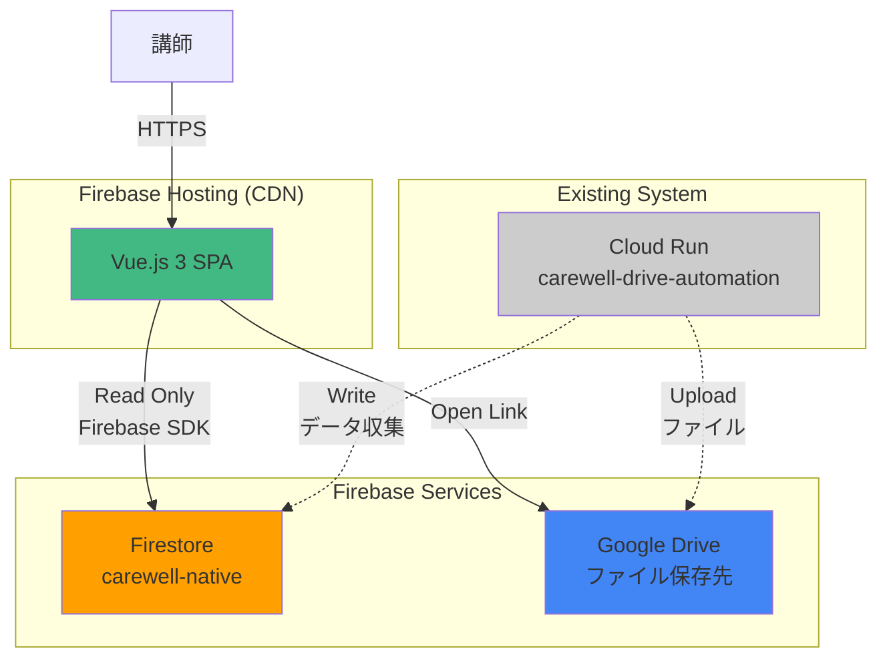
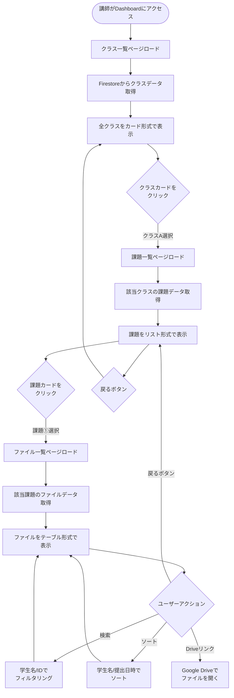
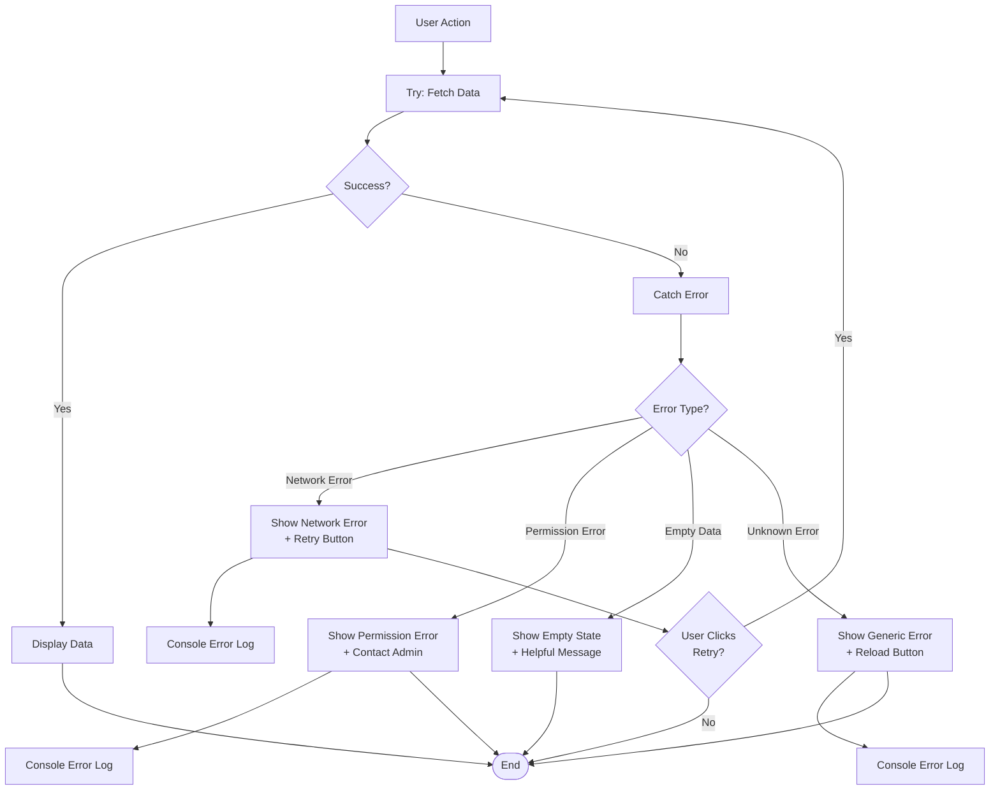

# Technical Design Document

## Overview

Carewell Dashboardは、講師がFirestoreに蓄積された学生の提出ファイルメタ情報を直感的に確認できるWebベース

の可視化ダッシュボードです。既存システム（carewell-drive-automation）が自動収集したデータを、講師向けに最適化された3段階ドリルダウンUI（クラス一覧 → 課題一覧 → ファイル一覧）で提供します。

**Purpose**: 講師がFirestoreコンソールやGoogle Driveを直接操作することなく、学生の提出状況を視覚的に把握できる使いやすいインターフェースを提供する。

**Users**: Carewellシステムを利用する講師が、自分の担当クラスの提出ファイル状況を確認するために使用する。各講師は、クラス一覧から自分の担当クラスを選択し、課題別の提出状況を段階的に絞り込んで確認する。

**Impact**: 既存のcarewell-drive-automationシステムには一切影響を与えず、Firestoreに保存されたデータを読み取り専用で参照する完全に独立したフロントエンドアプリケーションとして動作する。

### Goals

- 講師が3クリック以内で目的のファイル一覧にアクセスできる直感的なUI
- Firestoreデータの効率的な取得とリアルタイム表示
- PC・タブレット・スマホ全てで快適に使用できるレスポンシブデザイン
- 月額$1未満で運用可能なコスト効率の高いアーキテクチャ
- Phase 2で認証機能を追加できる拡張性のある設計

### Non-Goals

- ファイルのアップロード・編集・削除機能（読み取り専用）
- Firestoreデータの変更・更新（既存システムがデータ管理を担当）
- 統計分析・レポート生成機能（Phase 1では除外、将来的に検討）
- リアルタイム通知機能（Phase 1では除外）
- Phase 1での認証・認可機能（Phase 2で追加予定）

---

## Architecture

### Existing Architecture Analysis

**既存システム（carewell-drive-automation）のデータ構造**:
- **Firestoreコレクション階層**: `{class_name}/{task_id}/documents/{composite_key}`
- **複合キー形式**: `{student_id}_{filename}_{submit_date}`
- **ドキュメントフィールド**:
  - `composite_key`: 一意識別子
  - `student_id`: 学生ID（例: N9902913）
  - `student_name`: 学生名（例: 森平 直樹）
  - `filename`: ファイル名
  - `submit_date`: 提出日時
  - `drive_file_id`: Google DriveファイルID
  - `drive_url`: Google Drive閲覧URL
  - `uploaded_at`: システムアップロード日時

**統合ポイント**:
- Dashboardは既存のFirestoreデータ構造を完全に尊重し、読み取り専用でアクセスする
- データの書き込み・更新は一切行わず、既存システムのデータ整合性を保証する
- Google Drive URLはそのまま利用し、新しいタブで開くリンクとして提供する

### High-Level Architecture



**Architecture Integration**:
- **Existing patterns preserved**: Firestoreのコレクション構造とドキュメントスキーマは既存システムのまま
- **New components rationale**: Vue.js SPAは完全に独立したフロントエンドアプリケーションとして、既存バックエンドに影響を与えない
- **Technology alignment**: Firebase Hosting + Firebase SDKのサーバーレス構成で、既存のGCPエコシステムに自然に統合
- **Steering compliance**: シンプルで保守しやすいアーキテクチャ、最小限の依存関係、明確な責任分離

---

## Technology Stack and Design Decisions

### Frontend Layer

**Framework: Vue.js 3 (Composition API)**
- **選定理由**:
  - 学習曲線が緩やかで、小規模チームでも保守しやすい
  - Composition APIによる型安全性とコードの再利用性
  - 軽量なバンドルサイズ（Reactより約30%小さい）
  - 優れたTypeScriptサポート
- **代替案**: React + Vite、Svelte、Vanilla JavaScript
- **選定根拠**: プロジェクト規模が小さく、日本語ドキュメントが豊富なVue.jsが最適

**Build Tool: Vite 5**
- **選定理由**:
  - 高速なHMR（Hot Module Replacement）で開発体験が向上
  - ESM nativeで最適化されたビルド
  - Vue.js公式の推奨ツール
- **代替案**: Webpack、Parcel
- **選定根拠**: 開発速度とビルドパフォーマンスを重視

**Routing: Vue Router 4**
- **選定理由**:
  - Vue.js公式ルーター、Composition APIネイティブ対応
  - History API対応のSPAルーティング
  - ネステッドルートとパラメータ対応
- **代替案**: なし（Vue.jsのデファクトスタンダード）

**Styling: Tailwind CSS 3**
- **選定理由**:
  - ユーティリティファーストで高速な開発
  - レスポンシブデザインが容易
  - 未使用CSSの自動削除でバンドルサイズ最小化
  - JIT（Just-In-Time）コンパイルで開発時のパフォーマンス向上
- **代替案**: Bootstrap、Material UI、CSS Modules
- **選定根拠**: 柔軟性と保守性のバランスが最適

**Type Safety: TypeScript**
- **選定理由**:
  - 型安全性による実行時エラーの削減
  - IDEサポートによる開発効率向上
  - Firebase SDKの型定義を活用
- **代替案**: JavaScript（型チェックなし）
- **選定根拠**: 中長期的な保守性を考慮

### Backend/Infrastructure Layer

**Hosting: Firebase Hosting**
- **選定理由**:
  - グローバルCDNで高速配信
  - 自動SSL証明書
  - 無料枠10GB/月で十分（プロジェクト要件に合致）
  - デプロイが簡単（`firebase deploy`）
- **代替案**: Vercel、Netlify、Cloud Storage + Cloud CDN
- **選定根拠**: Firebaseとの統合性とコストパフォーマンス

**Database: Firestore (読み取り専用)**
- **選定理由**:
  - 既存システムで使用中（データ移行不要）
  - Firebase SDK v9+ Modular APIで軽量
  - リアルタイム更新対応（将来的な拡張性）
- **代替案**: なし（既存インフラに依存）

**Authentication: なし（Phase 1）**
- **Phase 1**: リンクを知っている人全員がアクセス可能
- **Phase 2計画**: Firebase Authentication (Google Sign-in)
- **選定根拠**: Phase 1は迅速なリリースを優先、Phase 2で認証を追加

### Key Design Decisions

#### Decision 1: コンポーネント構成（ページコンポーネント vs 再利用可能コンポーネント）

**Decision**: 3つのページコンポーネント（ClassList, TaskList, FileList）と、再利用可能なプレゼンテーショナルコンポーネント（Card, Table, SearchBox）を分離する設計

**Context**: SPAでは、ページレベルのロジックとUI部品を適切に分離することで、保守性と再利用性を高める必要がある

**Alternatives**:
1. 全てを単一のコンポーネントに統合（モノリシック）
2. Atomic Design（Atoms/Molecules/Organisms/Templates/Pages）
3. Feature-based分割（各機能ごとにディレクトリを分離）

**Selected Approach**: ページコンポーネント + 再利用可能コンポーネント
- **Pages/**: ルーティングと対応し、データ取得・状態管理を担当
- **Components/**: UIロジックのみを持つプレゼンテーショナルコンポーネント
- **Composables/**: ビジネスロジックと状態管理の再利用可能な関数

**Rationale**:
- プロジェクト規模が小さい（3画面のみ）ため、Atomic Designは過剰
- ページ単位の責任分離が明確で理解しやすい
- Composablesでロジックを分離することで、テストが容易

**Trade-offs**:
- **Gain**: シンプルで理解しやすい構造、迅速な開発
- **Sacrifice**: 大規模化した際の拡張性（現時点では不要）

#### Decision 2: Firestoreクエリ戦略（コレクショングループクエリ vs 階層クエリ）

**Decision**: 階層的なクエリ（`collection()` → `doc()` → `collection()`）を使用し、コレクショングループクエリは使用しない

**Context**: Firestoreのコレクション一覧を取得する公式APIは存在しないため、クラス一覧取得に工夫が必要

**Alternatives**:
1. コレクショングループクエリで全ドキュメントを取得してクラス名を抽出
2. 別途クラスマスターコレクションを作成（既存システムの変更が必要）
3. Cloud Functionsで中間APIを作成してクラス一覧を返す

**Selected Approach**: Admin SDKではない通常のFirebase SDKを使用するため、`listCollections()`は利用不可。代わりに、既知のクラス名リストをフロントエンドに持つか、または初回アクセス時に課題データから動的にクラス一覧を構築する

**実装方針**:
- クラス名リストを`src/config/classes.ts`に定義し、管理しやすくする
- 将来的にFirestoreに`/metadata/classes`ドキュメントを追加してクラス一覧を管理する拡張パスを残す

**Rationale**:
- 既存システムの変更を避けることでリスクを最小化
- フロントエンドでのクラスリスト管理は、クラス数が少ない（7クラス）ため実用的
- Phase 2で認証を追加する際に、担当クラスフィルタリングも容易に実装可能

**Trade-offs**:
- **Gain**: 既存システムへの影響ゼロ、シンプルな実装
- **Sacrifice**: クラス追加時にフロントエンドの設定ファイル更新が必要（運用コスト小）

#### Decision 3: 状態管理ライブラリ（Pinia vs Composables）

**Decision**: Piniaなどの状態管理ライブラリを使用せず、Vue 3 Composition APIのComposablesで状態管理を行う

**Context**: 小規模SPAでは、状態管理ライブラリの導入がオーバーヘッドになる可能性がある

**Alternatives**:
1. Pinia（Vue公式推奨の状態管理ライブラリ）
2. Vuex（Vue 2時代のレガシーライブラリ）
3. Zustand、Jotai（React向けだが移植可能）

**Selected Approach**: Composablesパターン
- `useFirestore.ts`: Firestoreクエリのロジックをカプセル化
- `useClassList.ts`: クラス一覧の状態管理
- `useTaskList.ts`: 課題一覧の状態管理
- `useFileList.ts`: ファイル一覧の状態管理

**Rationale**:
- 3画面のみの小規模SPAでは、グローバルステートストアは不要
- Composition APIのreactive/refで十分な状態管理が可能
- 依存関係を減らすことでバンドルサイズを削減
- 将来的にPiniaへの移行も容易（Composablesパターンと互換性あり）

**Trade-offs**:
- **Gain**: シンプルな依存関係、軽量なバンドル、学習コストの低減
- **Sacrifice**: 画面間の複雑なデータ共有が必要になった場合の拡張性（現時点では不要）

---

## System Flows

### User Interaction Flow



### Data Flow Diagram

```mermaid
graph LR
    subgraph "Frontend (Vue.js SPA)"
        UI[UI Components]
        Composables[Composables<br/>useFirestore]
        Router[Vue Router]
    end

    subgraph "Firebase Services"
        FS[Firestore<br/>carewell-native]
    end

    subgraph "External"
        Drive[Google Drive]
    end

    UI -->|User Action| Router
    Router -->|Route Change| UI
    UI -->|Data Request| Composables
    Composables -->|Query| FS
    FS -->|Data| Composables
    Composables -->|State Update| UI
    UI -->|Click Link| Drive

    style UI fill:#42b983
    style Composables fill:#35495e
    style FS fill:#ffa000
    style Drive fill:#4285f4
```



---

## Requirements Traceability

| 要件 | 要件概要 | コンポーネント | インターフェース | フロー |
|------|---------|--------------|----------------|--------|
| 1 | クラス一覧表示 | ClassListView, ClassCard, useClassList | getClassList() | User Interaction Flow |
| 2 | 課題一覧表示 | TaskListView, TaskCard, useTaskList | getTaskList(className) | User Interaction Flow |
| 3 | ファイル一覧表示 | FileListView, FileTable, useFileList | getFileList(className, taskId) | User Interaction Flow |
| 4 | 検索・フィルター | SearchBox, useFileList | filterFiles(query) | User Interaction Flow |
| 5 | ソート | FileTable, useFileList | sortFiles(column, order) | User Interaction Flow |
| 6 | ナビゲーション | AppHeader, BackButton, Vue Router | router.push(), router.back() | User Interaction Flow |
| 7 | Drive連携 | DriveLink | openDrive(driveUrl) | User Interaction Flow |
| 8 | Firestoreデータ取得 | useFirestore | Firestore SDK (getDocs, collection) | Data Flow Diagram |
| 9 | レスポンシブUI | 全コンポーネント | Tailwind CSS breakpoints | - |
| 10 | パフォーマンス | 全コンポーネント | Lazy loading, code splitting | - |
| 11 | セキュリティ | firestore.rules | Security Rules (read: true, write: false) | - |
| 12 | エラーハンドリング | ErrorBoundary, useFirestore | try-catch, error state | - |
| 13 | ブラウザ互換性 | 全コンポーネント | Vite browser targets | - |
| 14 | 拡張性 | アーキテクチャ設計 | Composables pattern, Phase 2対応 | - |
| 15 | コスト | Firebase設定 | Efficient queries, CDN caching | - |

---

## Components and Interfaces

### Presentation Layer

#### ClassListView (Page Component)

**Responsibility & Boundaries**
- **Primary Responsibility**: クラス一覧画面の表示とナビゲーション制御
- **Domain Boundary**: プレゼンテーション層（ページレベル）
- **Data Ownership**: クラス一覧の表示状態（ローディング、エラー、データ）
- **Transaction Boundary**: なし（読み取り専用）

**Dependencies**
- **Inbound**: Vue Router（ルートエントリポイント）
- **Outbound**: ClassCard, useClassList, AppHeader
- **External**: なし

**Service Interface**

```typescript
// src/views/ClassListView.vue
interface ClassListViewProps {
  // No props (root route)
}

interface ClassListViewEmits {
  // No custom events
}

// Composable usage
const { classes, loading, error, fetchClasses } = useClassList();
```

**State Management**:
- **Local State**: 検索フィルタ状態（将来実装）
- **Computed State**: フィルタリングされたクラス一覧
- **Side Effects**: 初回マウント時にfetchClasses()を実行

#### TaskListView (Page Component)

**Responsibility & Boundaries**
- **Primary Responsibility**: 選択されたクラスの課題一覧表示とナビゲーション
- **Domain Boundary**: プレゼンテーション層（ページレベル）
- **Data Ownership**: 課題一覧の表示状態
- **Transaction Boundary**: なし（読み取り専用）

**Dependencies**
- **Inbound**: Vue Router（className パラメータ）
- **Outbound**: TaskCard, useTaskList, AppHeader, BackButton
- **External**: なし

**Service Interface**

```typescript
// src/views/TaskListView.vue
interface TaskListViewProps {
  className: string; // Route param
}

interface TaskListViewEmits {
  // No custom events
}

const { tasks, loading, error, fetchTasks } = useTaskList(props.className);
```

**State Management**:
- **Route Param**: classNameをpropsとして受け取る
- **Computed State**: 課題数、最終提出日時などの統計情報
- **Side Effects**: className変更時にfetchTasks()を再実行

#### FileListView (Page Component)

**Responsibility & Boundaries**
- **Primary Responsibility**: 選択された課題のファイル一覧表示、検索、ソート
- **Domain Boundary**: プレゼンテーション層（ページレベル）
- **Data Ownership**: ファイル一覧の表示状態、検索・ソート状態
- **Transaction Boundary**: なし（読み取り専用）

**Dependencies**
- **Inbound**: Vue Router（className, taskId パラメータ）
- **Outbound**: FileTable, SearchBox, useFileList, AppHeader, BackButton
- **External**: Google Drive（リンク開く）

**Service Interface**

```typescript
// src/views/FileListView.vue
interface FileListViewProps {
  className: string; // Route param
  taskId: string;    // Route param
}

interface FileListViewEmits {
  // No custom events
}

const {
  files,
  loading,
  error,
  searchQuery,
  sortColumn,
  sortOrder,
  filteredFiles,
  fetchFiles,
  setSearch,
  setSortColumn
} = useFileList(props.className, props.taskId);
```

**State Management**:
- **Route Params**: className, taskIdをpropsとして受け取る
- **Local State**: searchQuery（検索文字列）、sortColumn/sortOrder（ソート状態）
- **Computed State**: filteredFiles（検索・ソート適用後のファイル一覧）
- **Side Effects**: className/taskId変更時にfetchFiles()を再実行

---

### Reusable Components

#### ClassCard

**Responsibility**: クラス情報を1枚のカードとして表示

**Contract**:

```typescript
interface ClassCardProps {
  className: string;
  taskCount: number;
  fileCount: number;
  lastUpdated: string | null;
}

interface ClassCardEmits {
  click: () => void;
}
```

#### TaskCard

**Responsibility**: 課題情報を1枚のカードとして表示

**Contract**:

```typescript
interface TaskCardProps {
  taskId: string;
  fileCount: number;
  studentCount: number;
  lastSubmit: string | null;
}

interface TaskCardEmits {
  click: () => void;
}
```

#### FileTable

**Responsibility**: ファイル一覧をテーブル形式で表示、ソート機能

**Contract**:

```typescript
interface FileTableProps {
  files: FileData[];
  sortColumn: 'student_name' | 'submit_date';
  sortOrder: 'asc' | 'desc';
}

interface FileTableEmits {
  sort: (column: 'student_name' | 'submit_date') => void;
  openDrive: (driveUrl: string) => void;
}

interface FileData {
  composite_key: string;
  student_id: string;
  student_name: string;
  filename: string;
  submit_date: string;
  drive_url: string;
}
```

#### SearchBox

**Responsibility**: 検索入力欄の表示と入力処理

**Contract**:

```typescript
interface SearchBoxProps {
  modelValue: string;
  placeholder?: string;
}

interface SearchBoxEmits {
  'update:modelValue': (value: string) => void;
}
```

---

### Business Logic Layer (Composables)

#### useClassList

**Responsibility & Boundaries**
- **Primary Responsibility**: クラス一覧データの取得と状態管理
- **Domain Boundary**: データ取得ロジック
- **Data Ownership**: クラス一覧の状態（data, loading, error）
- **Transaction Boundary**: 読み取り専用クエリ

**Dependencies**
- **Inbound**: ClassListView
- **Outbound**: useFirestore
- **External**: Firestore SDK

**Contract Definition**:

```typescript
// src/composables/useClassList.ts
interface ClassData {
  name: string;
  taskCount: number;
  fileCount: number;
  lastUpdated: string | null;
}

interface UseClassListReturn {
  classes: Ref<ClassData[]>;
  loading: Ref<boolean>;
  error: Ref<Error | null>;
  fetchClasses: () => Promise<void>;
}

export function useClassList(): UseClassListReturn {
  const classes = ref<ClassData[]>([]);
  const loading = ref(false);
  const error = ref<Error | null>(null);

  const fetchClasses = async () => {
    loading.value = true;
    error.value = null;
    try {
      // クラス一覧取得ロジック
      // 実装方針: src/config/classes.tsから既知のクラス名リストを読み込み
      // 各クラスの統計情報（課題数、ファイル数）をFirestoreから集計
      //
      // 親ドキュメント活用による効率的な集計:
      // - 各クラスの親ドキュメント（collection(db, className)）を列挙
      // - 親ドキュメントのfile_countを合計してクラス全体のファイル数を算出
      // - 親ドキュメントのlast_updatedから最新日時を取得
      // - サブコレクションをスキャンする必要なし（パフォーマンス向上）
    } catch (e) {
      error.value = e as Error;
    } finally {
      loading.value = false;
    }
  };

  return { classes, loading, error, fetchClasses };
}
```

**Preconditions**: Firestore接続が確立されていること
**Postconditions**: クラス一覧データが取得され、classes配列に格納される
**Invariants**: loading中はerrorがnull、fetchClasses完了後はloadingがfalse

#### useTaskList

**Responsibility & Boundaries**
- **Primary Responsibility**: 指定されたクラスの課題一覧データの取得と状態管理
- **Domain Boundary**: データ取得ロジック
- **Data Ownership**: 課題一覧の状態
- **Transaction Boundary**: 読み取り専用クエリ

**Dependencies**
- **Inbound**: TaskListView
- **Outbound**: useFirestore
- **External**: Firestore SDK

**Contract Definition**:

```typescript
// src/composables/useTaskList.ts
interface TaskData {
  taskId: string;
  fileCount: number;
  studentCount: number;
  lastSubmit: string | null;
}

interface UseTaskListReturn {
  tasks: Ref<TaskData[]>;
  loading: Ref<boolean>;
  error: Ref<Error | null>;
  fetchTasks: () => Promise<void>;
}

export function useTaskList(className: string): UseTaskListReturn {
  const tasks = ref<TaskData[]>([]);
  const loading = ref(false);
  const error = ref<Error | null>(null);

  const fetchTasks = async () => {
    loading.value = true;
    error.value = null;
    try {
      // Firestore query: collection(db, className).getDocs()
      // 親ドキュメントを取得し、メタデータを直接利用（効率的）
      //
      // 親ドキュメントメタデータの活用:
      // - file_count: 親ドキュメントから直接取得（サブコレクションスキャン不要）
      // - last_updated: 親ドキュメントから直接取得（最終提出日時）
      // - task_pattern: 親ドキュメントから課題表示名を取得
      //
      // studentCount算出のみサブコレクションから計算が必要:
      // - collection(db, className, taskId, 'documents')から
      //   ユニークなstudent_idの数を計算
      //
      // パフォーマンス向上: ファイル数と最終更新日時はメタデータから即座に取得可能
    } catch (e) {
      error.value = e as Error;
    } finally {
      loading.value = false;
    }
  };

  return { tasks, loading, error, fetchTasks };
}
```

**Preconditions**: classNameが有効なFirestoreコレクション名であること
**Postconditions**: 課題一覧データが取得され、tasks配列に格納される
**Invariants**: className変更時にfetchTasksが再実行される

#### useFileList

**Responsibility & Boundaries**
- **Primary Responsibility**: 指定された課題のファイル一覧データの取得、検索、ソート機能
- **Domain Boundary**: データ取得ロジック、フィルタリング・ソートロジック
- **Data Ownership**: ファイル一覧の状態、検索・ソート状態
- **Transaction Boundary**: 読み取り専用クエリ

**Dependencies**
- **Inbound**: FileListView
- **Outbound**: useFirestore
- **External**: Firestore SDK

**Contract Definition**:

```typescript
// src/composables/useFileList.ts
interface FileData {
  composite_key: string;
  student_id: string;
  student_name: string;
  filename: string;
  submit_date: string;
  drive_url: string;
}

type SortColumn = 'student_name' | 'submit_date';
type SortOrder = 'asc' | 'desc';

interface UseFileListReturn {
  files: Ref<FileData[]>;
  loading: Ref<boolean>;
  error: Ref<Error | null>;
  searchQuery: Ref<string>;
  sortColumn: Ref<SortColumn>;
  sortOrder: Ref<SortOrder>;
  filteredFiles: ComputedRef<FileData[]>;
  fetchFiles: () => Promise<void>;
  setSearch: (query: string) => void;
  setSortColumn: (column: SortColumn) => void;
}

export function useFileList(className: string, taskId: string): UseFileListReturn {
  const files = ref<FileData[]>([]);
  const loading = ref(false);
  const error = ref<Error | null>(null);
  const searchQuery = ref('');
  const sortColumn = ref<SortColumn>('submit_date');
  const sortOrder = ref<SortOrder>('desc');

  const filteredFiles = computed(() => {
    let result = files.value;

    // 検索フィルタ
    if (searchQuery.value) {
      const query = searchQuery.value.toLowerCase();
      result = result.filter(file =>
        file.student_name.toLowerCase().includes(query) ||
        file.student_id.toLowerCase().includes(query)
      );
    }

    // ソート
    result = [...result].sort((a, b) => {
      const aVal = a[sortColumn.value];
      const bVal = b[sortColumn.value];
      const compare = aVal < bVal ? -1 : aVal > bVal ? 1 : 0;
      return sortOrder.value === 'asc' ? compare : -compare;
    });

    return result;
  });

  const fetchFiles = async () => {
    loading.value = true;
    error.value = null;
    try {
      // Firestore query: collection(db, className, taskId, 'documents')
    } catch (e) {
      error.value = e as Error;
    } finally {
      loading.value = false;
    }
  };

  const setSearch = (query: string) => {
    searchQuery.value = query;
  };

  const setSortColumn = (column: SortColumn) => {
    if (sortColumn.value === column) {
      sortOrder.value = sortOrder.value === 'asc' ? 'desc' : 'asc';
    } else {
      sortColumn.value = column;
      sortOrder.value = 'asc';
    }
  };

  return {
    files,
    loading,
    error,
    searchQuery,
    sortColumn,
    sortOrder,
    filteredFiles,
    fetchFiles,
    setSearch,
    setSortColumn
  };
}
```

**Preconditions**: className, taskIdが有効なFirestoreパスであること
**Postconditions**: ファイル一覧データが取得され、検索・ソートが適用されたfilteredFilesが提供される
**Invariants**: searchQueryまたはsortColumn/sortOrderが変更されるとfilteredFilesが再計算される

#### useFirestore

**Responsibility & Boundaries**
- **Primary Responsibility**: Firestore接続の初期化と共通クエリ関数の提供
- **Domain Boundary**: データアクセス層
- **Data Ownership**: Firestore接続インスタンス
- **Transaction Boundary**: 読み取り専用クエリ

**Dependencies**
- **Inbound**: useClassList, useTaskList, useFileList
- **Outbound**: なし
- **External**: Firebase SDK v9+ (firebase/firestore)

**External Dependencies Investigation**:
- **Firebase JavaScript SDK v9+**:
  - 公式ドキュメント: https://firebase.google.com/docs/web/setup
  - Modular API使用（tree-shakable）
  - 主要機能: initializeApp, getFirestore, collection, getDocs, query
  - 認証不要のFirestore読み取り: Security Rulesで`allow read: if true`を設定
  - バンドルサイズ: Firestoreのみで約80KB (gzipped)
- **Version**: ^10.0.0（最新安定版）
- **Rate Limits**: 読み取りクエリは1秒あたり10,000回まで（無料枠）
- **Best Practices**:
  - 必要な機能のみをimportしてバンドルサイズを最小化
  - onSnapshotではなくgetDocsを使用してリアルタイム更新コストを削減
  - 効率的なクエリ設計（必要なフィールドのみ取得）

**Contract Definition**:

```typescript
// src/composables/useFirestore.ts
import { initializeApp } from 'firebase/app';
import { getFirestore, collection, getDocs, Firestore } from 'firebase/firestore';

interface FirebaseConfig {
  apiKey: string;
  authDomain: string;
  projectId: string;
  storageBucket: string;
  messagingSenderId: string;
  appId: string;
}

let db: Firestore | null = null;

export function initializeFirestore(config: FirebaseConfig): Firestore {
  if (!db) {
    const app = initializeApp(config);
    db = getFirestore(app);
  }
  return db;
}

export function getDb(): Firestore {
  if (!db) {
    throw new Error('Firestore not initialized. Call initializeFirestore first.');
  }
  return db;
}

// Timestamp変換ヘルパー
function convertTimestampsToStrings(obj: any): any {
  if (obj === null || obj === undefined) return obj;
  if (obj.toDate && typeof obj.toDate === 'function') {
    return obj.toDate().toISOString();
  }
  if (Array.isArray(obj)) {
    return obj.map((item) => convertTimestampsToStrings(item));
  }
  if (typeof obj === 'object') {
    const converted: any = {};
    for (const key in obj) {
      if (Object.prototype.hasOwnProperty.call(obj, key)) {
        converted[key] = convertTimestampsToStrings(obj[key]);
      }
    }
    return converted;
  }
  return obj;
}

// 汎用クエリヘルパー
export async function getDocuments<T>(
  collectionPath: string,
  ...pathSegments: string[]
): Promise<T[]> {
  const db = getDb();
  const colRef = collection(db, collectionPath, ...pathSegments);
  const snapshot = await getDocs(colRef);
  return snapshot.docs.map(doc => {
    const data = doc.data();
    // Firestore TimestampをISO 8601文字列に自動変換
    const convertedData = convertTimestampsToStrings(data);
    return { id: doc.id, ...convertedData } as T;
  });
}
```

**Preconditions**: Firebase config（APIキー等）が提供されること
**Postconditions**: Firestore接続が確立され、クエリ可能な状態になる
**Invariants**: 一度初期化されたdbインスタンスは再利用される（シングルトン）

---

## Data Models

### Domain Model

**Core Concepts**:

#### File Submission (Entity)
- **Identity**: composite_key（{student_id}_{filename}_{submit_date}）
- **Attributes**:
  - `student_id`: 学生ID
  - `student_name`: 学生名
  - `filename`: ファイル名
  - `submit_date`: 提出日時
  - `drive_file_id`: Google DriveファイルID
  - `drive_url`: Google Drive閲覧URL
  - `uploaded_at`: システムアップロード日時
- **Lifecycle**: 既存システム（carewell-drive-automation）によって作成・管理される。Dashboardは読み取り専用。

#### Class (Value Object)
- **Attributes**:
  - `name`: クラス名（例: "令和7年度 デジタル中核人材養成研修 №01"）
  - `taskCount`: 課題数
  - `fileCount`: 提出ファイル総数
  - `lastUpdated`: 最終更新日時
- **Immutability**: クラス情報はFirestoreから取得された時点でイミュータブル

#### Task (Value Object)
- **Attributes**:
  - `taskId`: 課題ID（例: "課題①"）
  - `fileCount`: 提出ファイル数
  - `studentCount`: 提出学生数
  - `lastSubmit`: 最終提出日時
- **Immutability**: 課題情報はFirestoreから取得された時点でイミュータブル

**Business Rules & Invariants**:
- 各File Submissionのcomposite_keyは一意である（既存システムで保証）
- student_idはNで始まる7桁の数字（例: N9902913）
- submit_dateはYYYY/MM/DD HH:MM:SS形式
- drive_urlは有効なGoogle Drive URLである

### Physical Data Model (Firestore)

**Existing Firestore Structure** (Read-Only):

```
Firestore Database: carewell-native
├─ {class_name} (Collection)
│  └─ {task_id} (Parent Document)
│     ├─ task_id: string               # タスクID（例: "課題①"）
│     ├─ task_pattern: string          # タスク表示名
│     ├─ file_count: number            # ファイル数（アトミックインクリメント管理）
│     ├─ created_at: timestamp         # 作成日時
│     ├─ last_updated: timestamp       # 最終更新日時
│     └─ documents/ (Subcollection)
│        └─ {composite_key} (Document)
│           ├─ composite_key: string
│           ├─ student_id: string
│           ├─ student_name: string
│           ├─ filename: string
│           ├─ submit_date: string
│           ├─ drive_file_id: string
│           ├─ drive_url: string
│           └─ uploaded_at: string (ISO 8601)
```

**Example Data**:

```json
{
  "令和7年度 デジタル中核人材養成研修 №01": {
    "課題①": {
      "task_id": "課題①",
      "task_pattern": "課題①",
      "file_count": 20,
      "created_at": "2025-10-10T10:00:00Z",
      "last_updated": "2025-10-11T15:30:00Z",
      "documents": {
        "N9902913_report.pdf_20251010183000": {
          "composite_key": "N9902913_report.pdf_20251010183000",
          "student_id": "N9902913",
          "student_name": "森平 直樹",
          "filename": "report.pdf",
          "submit_date": "2025/10/10 18:30:00",
          "drive_file_id": "1abc...xyz",
          "drive_url": "https://drive.google.com/file/d/1abc...xyz/view",
          "uploaded_at": "2025-10-11T09:00:00Z"
        }
      }
    }
  }
}
```

**Query Patterns**:
- **クラス一覧**: 既知のクラス名リストから構築（Firestore listCollections() は Admin SDK のみ）
  - 各クラスの統計情報: 親ドキュメント（`{task_id}`）を列挙してメタデータ集計
- **課題一覧**: `collection(db, className).getDocs()` → 親ドキュメント取得
  - `file_count`フィールドから提出ファイル数を直接取得（効率的）
  - `last_updated`フィールドから最終提出日時を取得
  - サブコレクションをスキャンする必要なし（パフォーマンス向上）
- **ファイル一覧**: `collection(db, className, taskId, 'documents').getDocs()` → 全ドキュメント取得
  - 提出者総数: ユニークな`student_id`の数を計算
  - 最終提出日時: `submit_date`フィールドから最新を取得

**Index Requirements**: なし（既存インデックスを使用）

**Performance Benefits**:
- 親ドキュメントのメタデータ活用により、課題一覧のクエリコストを大幅削減
- サブコレクション全体をスキャンせずに統計情報を取得可能

### Frontend Data Types

```typescript
// src/types/models.ts

export interface ClassData {
  name: string;
  taskCount: number;
  fileCount: number;
  lastUpdated: string | null;
}

export interface TaskData {
  taskId: string;
  fileCount: number;
  studentCount: number;
  lastSubmit: string | null;
}

export interface FileData {
  composite_key: string;
  student_id: string;
  student_name: string;
  filename: string;
  submit_date: string;
  drive_url: string;
}

export interface FirestoreDocument {
  composite_key: string;
  student_id: string;
  student_name: string;
  filename: string;
  submit_date: string;
  drive_file_id: string;
  drive_url: string;
  uploaded_at: string;
}

// 親ドキュメント（タスクメタデータ）の型定義
export interface FirestoreTaskDocument {
  task_id: string;
  task_pattern: string;
  file_count: number;
  created_at: string; // Firestore Timestamp (ISO 8601)
  last_updated: string; // Firestore Timestamp (ISO 8601)
}
```

---

## Error Handling

### Error Strategy

Dashboardは以下の3層エラーハンドリング戦略を採用：

1. **Composablesレベル**: Firestoreクエリエラーをキャッチし、error状態として公開
2. **Componentレベル**: error状態を監視し、ユーザーフレンドリーなメッセージを表示
3. **Globalレベル**: 予期しないエラーはコンソールにログ出力し、汎用エラーメッセージを表示

### Error Categories and Responses

#### User Errors (4xx equivalent)

**Empty Data State**:
- **Trigger**: Firestoreクエリが0件を返す
- **Response**: 状況に応じた空状態メッセージ
  - クラス一覧: 「クラスがありません」
  - 課題一覧: 「この クラスには課題がありません」
  - ファイル一覧: 「この課題には提出ファイルがありません」
- **UI**: EmptyState コンポーネントでアイコンとメッセージを表示
- **Recovery**: 自動リトライなし（データが存在しない状態）

**Invalid Route Parameters**:
- **Trigger**: 存在しないclassNameまたはtaskIdでアクセス
- **Response**: 404エラーページまたはクラス一覧へリダイレクト
- **UI**: 「指定されたクラス/課題が見つかりません」+ 「クラス一覧へ戻る」ボタン
- **Recovery**: ユーザーを有効なページへ誘導

#### System Errors (5xx equivalent)

**Firestore Connection Error**:
- **Trigger**: ネットワーク障害、Firestore API障害
- **Response**: 「データの取得に失敗しました。ネットワーク接続を確認してください」
- **UI**: ErrorAlert コンポーネントでエラーメッセージと「再試行」ボタンを表示
- **Recovery**: ユーザーが「再試行」ボタンをクリックしてfetchXXX()を再実行
- **Logging**: `console.error('Firestore error:', error)`

**Firebase Initialization Error**:
- **Trigger**: Firebase config不正、APIキー無効
- **Response**: 「システムの初期化に失敗しました。管理者に連絡してください」
- **UI**: 全画面エラー表示
- **Recovery**: ページリロードを促す
- **Logging**: `console.error('Firebase init error:', error)`

**Permission Denied (Security Rules)**:
- **Trigger**: Firestore Security Rulesでアクセス拒否
- **Response**: 「アクセス権限がありません」
- **UI**: ErrorAlert コンポーネント
- **Recovery**: Phase 2で認証を追加することで解決予定
- **Logging**: `console.error('Permission denied:', error)`

#### Business Logic Errors

**Invalid Drive URL**:
- **Trigger**: Firestoreに保存されたdrive_urlが無効または削除済み
- **Response**: リンクボタンを無効化し、「リンクが無効です」ツールチップを表示
- **UI**: DriveLink コンポーネントがdisabled状態
- **Recovery**: なし（データの問題）
- **Logging**: `console.warn('Invalid drive URL:', driveUrl)`

### Error Handling Flow



### Monitoring

**Client-Side Logging**:
- **Console Logging**: 全エラーをconsole.errorでログ出力
- **Error Context**: エラー発生箇所（Composable名、コンポーネント名）を含める
- **User Context**: className, taskIdなどのコンテキスト情報をログに含める

**Error Tracking (Phase 2検討)**:
- Sentry、Firebase Crashlyticsなどのエラートラッキングツールの導入を検討
- ユーザー影響範囲の把握とエラー頻度の監視

**Health Monitoring**:
- Firebase Consoleでのクエリ成功率監視
- パフォーマンス監視（Firebase Performance Monitoring）

---

## Testing Strategy

### Unit Tests

**対象**: Composables（ビジネスロジック）、ユーティリティ関数

**テストフレームワーク**: Vitest（Viteネイティブ、高速）

**主要テストケース**:

1. **useClassList**:
   - クラス一覧取得成功時、classes配列が正しく設定される
   - Firestoreエラー発生時、error状態が設定される
   - loading状態が正しく切り替わる
   - fetchClasses()呼び出し時、既知のクラスリストが読み込まれる

2. **useTaskList**:
   - 課題一覧取得成功時、tasks配列が正しく設定される
   - className変更時、fetchTasks()が再実行される
   - 空のコレクション取得時、tasks配列が空になる

3. **useFileList**:
   - ファイル一覧取得成功時、files配列が正しく設定される
   - setSearch()実行時、filteredFilesが正しくフィルタリングされる
   - setSortColumn()実行時、filteredFilesが正しくソートされる
   - ソートカラム再クリック時、ソート順序が反転する

4. **useFirestore**:
   - initializeFirestore()が正しくFirestore インスタンスを初期化する
   - getDb()がFirestore未初期化時にエラーをスローする
   - getDocuments()がFirestoreクエリを正しく実行し、データを返す

**Mocking Strategy**:
- Firebase SDKは`vi.mock('firebase/firestore')`でモック化
- Firestoreクエリ結果は固定のモックデータを返す
- Vue Router は`vue-router/auto-mock`でモック化

### Integration Tests

**対象**: ページコンポーネントとComposablesの連携

**テストフレームワーク**: Vitest + @vue/test-utils

**主要テストケース**:

1. **ClassListView Integration**:
   - マウント時にfetchClasses()が呼ばれる
   - クラスカードクリック時に正しいルートへ遷移する
   - ローディング中はスケルトンが表示される
   - エラー発生時にエラーメッセージが表示される

2. **TaskListView Integration**:
   - className propsが変更されるとfetchTasks()が再実行される
   - 課題カードクリック時に正しいルートへ遷移する
   - 戻るボタンクリック時にクラス一覧へ遷移する

3. **FileListView Integration**:
   - className/taskId propsが変更されるとfetchFiles()が再実行される
   - 検索ボックス入力時にfilteredFilesが更新される
   - テーブルヘッダークリック時にソート状態が更新される
   - Driveリンククリック時に新しいタブでDriveが開く

4. **Vue Router Navigation**:
   - / → /class/:className → /class/:className/task/:taskId のナビゲーションフロー
   - ブラウザ戻るボタン動作
   - 無効なルートパラメータ時のエラーハンドリング

**Mocking Strategy**:
- Firestore SDKは完全にモック化
- Vue RouterはmemoryHistoryでモック化
- window.openはvi.fn()でモック化

### E2E Tests

**対象**: ユーザーフロー全体

**テストフレームワーク**: Playwright（クロスブラウザ対応）

**主要テストケース**:

1. **Happy Path: クラス一覧 → 課題一覧 → ファイル一覧**:
   - クラス一覧が正しく表示される
   - クラスカードをクリックして課題一覧へ遷移する
   - 課題カードをクリックしてファイル一覧へ遷移する
   - ファイルテーブルが正しく表示される

2. **Search and Sort**:
   - 検索ボックスに学生名を入力してフィルタリングされる
   - 学生名カラムヘッダーをクリックしてソートされる
   - 提出日時カラムヘッダーをクリックしてソートされる

3. **Navigation**:
   - 戻るボタンをクリックして前画面へ遷移する
   - ブラウザの戻るボタンで前画面へ遷移する
   - パンくずリストをクリックして目的の画面へ遷移する

4. **Drive Link**:
   - Driveリンクボタンをクリックして新しいタブが開く（実際のDriveページは開かない、window.openのモック確認）

5. **Responsive Design**:
   - モバイルビューポート（375px）で正しく表示される
   - タブレットビューポート（768px）で正しく表示される
   - デスクトップビューポート（1280px）で正しく表示される

**Test Environment**:
- Firebase Emulator Suiteを使用してFirestoreをローカルでエミュレート
- テストデータはsetup scriptで自動投入
- テスト終了後はデータをクリーンアップ

### Performance Tests (Optional)

**対象**: 大量データ時のパフォーマンス

**テストフレームワーク**: Lighthouse CI、WebPageTest

**主要テストケース**:

1. **Initial Load Performance**:
   - クラス一覧の初回表示が3秒以内に完了する
   - First Contentful Paint (FCP) が1.5秒以内
   - Largest Contentful Paint (LCP) が2.5秒以内

2. **Large Data Rendering**:
   - 100件のファイルを含むテーブル表示が1秒以内
   - 検索・ソート操作が即座に完了（100ms以内）

3. **Bundle Size**:
   - 初期バンドルサイズが200KB以下（gzipped）
   - 各ルートの遅延ロードチャンクが50KB以下

**Optimization Strategy**:
- 100件を超えるファイル一覧には仮想スクロールまたはページネーションを実装
- Code splittingでルートごとにバンドルを分割
- Tree shakingで未使用コードを削除

---

## Security Considerations

### Phase 1 Security Model

**Access Control**:
- **認証**: なし（リンクを知っている全員がアクセス可能）
- **認可**: なし（全ユーザーが全データを閲覧可能）
- **リスク軽減策**:
  - Google Driveファイル自体には共有権限が必要（Firestore URLを知っていてもファイルを開けない）
  - 短期運用（約1年間）
  - 小規模利用（月間1000アクセス未満）
  - 内部利用のみ（パブリックなリンク共有なし）

### Firestore Security Rules (Phase 1)

```javascript
// firestore.rules
rules_version = '2';
service cloud.firestore {
  match /databases/{database}/documents {
    // Phase 1: 全ユーザー読み取り許可、書き込み完全禁止
    match /{document=**} {
      allow read: if true;   // 誰でも読み取り可能
      allow write: if false;  // フロントエンドからの書き込みは完全禁止
    }

    // Phase 2: 認証ユーザーのみ読み取り許可（将来実装）
    // match /{document=**} {
    //   allow read: if request.auth != null;
    //   allow write: if false;
    // }
    //
    // Phase 3: 講師別の担当クラスフィルタリング（将来実装）
    // match /{className}/{document=**} {
    //   allow read: if request.auth != null &&
    //                  request.auth.token.email in get(/databases/$(database)/documents/teachers/$(request.auth.uid)).data.assignedClasses;
    //   allow write: if false;
    // }
  }
}
```

### Data Protection

**Sensitive Data Handling**:
- **学生名・学生ID**: Firestoreに既に保存されているデータをそのまま表示（新たな収集なし）
- **ファイルコンテンツ**: Dashboardはファイル本体を扱わず、Google Drive URLのみを表示
- **個人情報保護**: Google Driveの共有権限でファイルアクセスを制御

**Client-Side Security**:
- Firebase APIキーはpublicでOK（Security Rulesで保護されている）
- 環境変数（`.env`）にFirebase configを保存し、`.gitignore`で除外
- XSS対策: Vue.jsのデフォルトエスケープ機能を使用
- CSRF対策: 不要（書き込み操作なし）

### Network Security

**HTTPS Enforcement**:
- Firebase HostingはデフォルトでHTTPSを強制
- HTTPリクエストは自動的にHTTPSへリダイレクト

**CORS Policy**:
- Firebase SDKはFirebase Hostingドメインからのアクセスを許可
- カスタムCORS設定は不要

### Compliance Considerations

**GDPR/プライバシー**:
- クッキーは使用しない（Firebase SDKのローカルストレージのみ）
- 個人情報の新たな収集なし（既存データの表示のみ）
- データ削除要求: 既存システム（carewell-drive-automation）で対応

**Audit Log**:
- Phase 1ではaudit logなし
- Phase 2でFirebase Analytics導入を検討（ページビュー、クリックイベント）

---

## Performance & Scalability

### Target Metrics

| メトリック | 目標値 | 測定方法 |
|-----------|--------|---------|
| 初回表示時間 | 3秒以内 | Lighthouse |
| 画面遷移時間 | 1秒以内 | Performance API |
| ファイル一覧レンダリング（100件） | 1秒以内 | Performance API |
| バンドルサイズ（gzipped） | 200KB以下 | webpack-bundle-analyzer |
| Firestore読み取りクエリ | 月間50,000回以下 | Firebase Console |
| 月間コスト | $1未満 | Firebase Billing |

### Performance Optimization Strategies

#### Frontend Optimization

**Code Splitting**:
- Vue Routerの`component: () => import()`で各ルートを遅延ロード
- 初期バンドルには共通コンポーネントとComposablesのみ含める
- FirebaseSDKもtree-shaking可能なModular API使用

**Asset Optimization**:
- 画像は使用しない（アイコンはSVGまたはFont Awesome）
- CSSはTailwind CSSのJIT + PurgeCSS で未使用スタイルを自動削除
- フォントはシステムフォントを使用（Web Fontダウンロード不要）

**Rendering Optimization**:
- 100件を超えるファイル一覧には仮想スクロール（vue-virtual-scroller）導入検討
- ローディングスケルトンでユーザー体験向上
- debounce検索入力（300ms）で不要な再レンダリング防止

#### Backend/Infrastructure Optimization

**Firestore Query Optimization**:
- 必要なフィールドのみ取得（select projection）は不要（全フィールド必要）
- limit()クエリでページネーション実装（将来的に）
- onSnapshot()ではなくgetDocs()使用でリアルタイム更新コストを削減

**Caching Strategy**:
- Firebase HostingのCDNキャッシュを活用（静的アセット）
- Service Workerでオフライン対応（将来検討）
- ブラウザキャッシュ: `Cache-Control: public, max-age=31536000, immutable`（静的アセット）

### Scalability Considerations

#### Current Scale (Phase 1)
- **クラス数**: 7クラス
- **課題数**: 14課題（2課題/クラス）
- **ファイル数**: 推定200-500件
- **月間アクセス**: 1000回未満
- **同時ユーザー**: 最大10名

#### Growth Projections (Phase 2+)
- **クラス数**: 最大20クラス
- **課題数**: 最大80課題（4課題/クラス）
- **ファイル数**: 最大5000件
- **月間アクセス**: 5000回
- **同時ユーザー**: 最大50名

#### Scaling Strategy

**Horizontal Scaling**:
- Firebase Hostingは自動スケール（CDN）
- Firestoreは自動スケール（読み取りクエリは1秒あたり10,000回まで）
- ボトルネックなし（サーバーレスアーキテクチャ）

**Vertical Scaling**:
- 不要（クライアントサイドレンダリング）

**Data Partitioning**:
- Firestoreのコレクション構造は既に階層化されている（`{class_name}/{task_id}/documents`）
- クラスごとにクエリが分離されるため、データ増加の影響は限定的

**Cost Management**:
- Firestore読み取りクエリ数を監視（Firebase Console）
- 月間50,000読み取り以下で無料枠内（$0）
- Firebase Hosting 10GB転送/月以下で無料枠内（$0）
- 合計コスト: **$0/月**（Phase 1想定）

**Cost Alert**:
- Firebase Billing Alertを設定（$0.50超過時にメール通知）
- 異常なクエリ増加を早期検知

### Load Testing (Optional)

**Test Scenarios**:
1. 同時10ユーザーがクラス一覧を閲覧
2. 100件のファイル一覧を表示
3. 検索・ソート操作を連続実行

**Tools**: Artillery、k6

**Success Criteria**:
- 95パーセンタイルのレスポンスタイムが3秒以内
- エラー率が1%以下

---

## Implementation Notes

### Development Environment Setup

1. **Node.js**: v18以上
2. **Package Manager**: npm または yarn
3. **IDE**: VS Code + Volar (Vue.js extension)
4. **Browser**: Chrome DevTools + Vue DevTools

### Project Structure

```
carewell-dashboard/
├── public/
│   └── index.html
├── src/
│   ├── assets/
│   │   └── styles/
│   │       └── main.css          # Tailwind CSS import
│   ├── components/
│   │   ├── ClassCard.vue
│   │   ├── TaskCard.vue
│   │   ├── FileTable.vue
│   │   ├── SearchBox.vue
│   │   ├── BackButton.vue
│   │   ├── AppHeader.vue
│   │   ├── LoadingSkeleton.vue
│   │   ├── ErrorAlert.vue
│   │   └── EmptyState.vue
│   ├── composables/
│   │   ├── useClassList.ts
│   │   ├── useTaskList.ts
│   │   ├── useFileList.ts
│   │   └── useFirestore.ts
│   ├── config/
│   │   ├── firebase.ts           # Firebase config
│   │   └── classes.ts            # Known class list
│   ├── router/
│   │   └── index.ts              # Vue Router config
│   ├── types/
│   │   └── models.ts             # TypeScript interfaces
│   ├── views/
│   │   ├── ClassListView.vue
│   │   ├── TaskListView.vue
│   │   └── FileListView.vue
│   ├── App.vue
│   └── main.ts                   # Application entry point
├── .env                          # Environment variables (Firebase config)
├── .gitignore
├── firebase.json                 # Firebase Hosting config
├── firestore.rules               # Firestore Security Rules
├── index.html
├── package.json
├── tailwind.config.js
├── tsconfig.json
├── vite.config.ts
└── vitest.config.ts
```

### Deployment Pipeline

1. **Development**: `npm run dev` → Vite dev server
2. **Build**: `npm run build` → `dist/` directory
3. **Deploy**: `firebase deploy --only hosting` → Firebase Hosting

### Configuration Management

**Firebase Config** (`.env`):
```
VITE_FIREBASE_API_KEY=your-api-key
VITE_FIREBASE_AUTH_DOMAIN=carewell-automation.firebaseapp.com
VITE_FIREBASE_PROJECT_ID=carewell-automation
VITE_FIREBASE_STORAGE_BUCKET=carewell-automation.appspot.com
VITE_FIREBASE_MESSAGING_SENDER_ID=your-sender-id
VITE_FIREBASE_APP_ID=your-app-id
```

**Known Class List** (`src/config/classes.ts`):
```typescript
export const KNOWN_CLASSES = [
  '令和7年度 デジタル中核人材養成研修 №01',
  '令和7年度 デジタル中核人材養成研修 №02',
  '令和7年度 デジタル中核人材養成研修 №03',
  '令和7年度 デジタル中核人材養成研修 №04',
  '令和7年度 デジタル中核人材養成研修 №05',
  '令和7年度 デジタル中核人材養成研修 №08',
  '令和7年度 デジタル中核人材養成研修 №09',
];
```

### Phase 2 Migration Strategy

**Authentication Integration**:
1. Firebase Authentication設定（Google Sign-in）
2. `src/composables/useAuth.ts` 追加
3. Firestore Security Rules更新（`request.auth != null`）
4. ログイン画面追加（`src/views/LoginView.vue`）
5. Vue Routerにナビゲーションガード追加

**Teacher-Class Mapping**:
1. Firestoreに`/teachers`コレクション追加
2. 各講師ドキュメントに`assignedClasses`配列を保存
3. `useClassList`で担当クラスのみフィルタリング
4. Security Rulesで担当クラスのみ読み取り許可

---

---

## Phase 2: Group View Architecture (2025-11-10)

### Overview

Phase 2では、グループ別の受講生管理機能を追加し、講師がクラス内のグループ単位で受講生を確認できるようにしました。既存の3段階ドリルダウン（クラス → 課題 → ファイル）に並行して、グループ経由のナビゲーションパス（クラス → 課題 → グループ → 受講生）を追加しました。

### Component Architecture

#### 1. GroupCard.vue (39 lines)

**Purpose**: グループ統計を表示するカードコンポーネント

**Design Decisions**:
- TaskCard.vueと同じデザインパターンを踏襲（一貫性）
- クリック可能カード全体（`cursor-pointer`、`@click`）
- アクセシビリティ対応（`role="button"`, `tabindex="0"`, `aria-label`, Enter key対応）

**Props**:
```typescript
interface Props {
  className: string;
  taskId: string;
  group: string;
  studentCount: number;
}
```
**Navigation**: `/class/:className/task/:taskId/group/:group/students`

#### 2. GroupListView.vue (63 lines)

**Purpose**: グループ一覧を表示するページコンポーネント

**Design Decisions**:
- ClassListView.vueと同じレイアウトパターン（グリッドカード表示）
- レスポンシブグリッド: `grid-cols-1 md:grid-cols-2 lg:grid-cols-3`
- Breadcrumb統合: ホーム → クラス → 課題 → グループ一覧
- Loading/Error/Empty 3状態管理

**Route Parameters**:
- `className`: フィルタリング対象のクラス名
- `taskId`: パンくずリスト表示用（データフィルタリングには未使用）

**State Management**:
- `useGroupStats(className)` composable でデータ取得
- グループリストは `groupStats.value` から取得

#### 3. GroupStudentsView.vue (250 lines)

**Purpose**: 特定グループの受講生一覧を表示するページコンポーネント

**Design Decisions**:
- StudentsView.vueの設計を参考（コピペではなく設計参照）
- 3段フィルタリング: `status === 'active' && class_name === className && group === groupName`
- 検索・ソート機能を完全実装（StudentsViewと同等）
- 5階層Breadcrumb: ホーム → クラス → 課題 → グループ一覧 → {グループ名}グループ

**Route Parameters**:
```typescript
const className = route.params.className as string;
const taskId = route.params.taskId as string;
const groupName = route.params.groupName as string;
```

**Filtering Logic**:
```typescript
const filteredStudents = computed(() => {
  return students.value.filter((student) => {
    if (student.status !== 'active') return false;
    if (student.class_name !== className) return false;
    if (student.group !== groupName) return false;
    // 検索クエリによるフィルタリング
    if (searchQuery.value) {
      const query = searchQuery.value.toLowerCase();
      return student.name.toLowerCase().includes(query) ||
             student.furigana.toLowerCase().includes(query);
    }
    return true;
  });
});
```

**Sorting Logic**:
- Dual-column sorting: furigana (Japanese locale), serial_number (numeric)
- 3-state sort: null → asc → desc → null

### Composable Architecture

#### useGroupStats.ts (70 lines)

**Purpose**: グループごとの受講生統計を取得するcomposable

**Design Decisions**:

**クライアント側集計を選択**:
- **理由**: Firestoreコスト最適化
- **比較**: サーバー側集計（N回のクエリ）vs クライアント側集計（1回のクエリ）
- **トレードオフ**: ネットワーク転送量増加 vs クエリ回数削減
- **判断**: 受講生数が少ない（< 100人/クラス）ため、クライアント側集計が有利

**単一getDocs()クエリ**:
```typescript
const q = query(
  collection(db, 'students'),
  where('class_name', '==', className),
  where('status', '==', 'active')
);
const snapshot = await getDocs(q);
```
- **コスト**: 1回のクエリ（N documents read）
- **代替案**: グループごとにクエリ（M groups × 1 query = M reads）
- **削減効果**: O(N) vs O(N + M) のクエリコスト

**Map集計パターン**:
```typescript
const groupCounts = new Map<string, number>();
snapshot.docs.forEach((doc) => {
  const group = doc.data().group || '未分類';
  groupCounts.set(group, (groupCounts.get(group) || 0) + 1);
});
```
- **時間計算量**: O(N)
- **空間計算量**: O(M) where M = number of groups

**日本語ソート**:
```typescript
.sort((a, b) => a.group.localeCompare(b.group, 'ja'))
```
- **理由**: グループ名（「A」「B」「C」等）の自然な順序

**Return Type**:
```typescript
export interface GroupStat {
  group: string;
  studentCount: number;
}
```
- **Future Extensibility**: 提出状況統計（submitted, passed, failed）の追加が容易

### Routing Architecture

**New Routes**:
```typescript
{
  path: '/class/:className/task/:taskId/groups',
  name: 'GroupList',
  component: () => import('../views/GroupListView.vue'),
}
{
  path: '/class/:className/task/:taskId/group/:groupName/students',
  name: 'GroupStudents',
  component: () => import('../views/GroupStudentsView.vue'),
}
```

**Design Decisions**:
- RESTful URL構造（階層的、予測可能）
- 遅延ロード（`() => import()`）によるコード分割
- パラメータ命名: `groupName`（`group`ではなく、予約語回避）

### Navigation Flow

**Old Flow (Phase 1)**:
```
クラス一覧 → 課題一覧 → ファイル一覧
```

**New Flow (Phase 2)**:
```
クラス一覧
    ↓
課題一覧 ──┬→ ファイル一覧（既存）
          │
          └→ [👥 受講生一覧] → グループ一覧 → グループ別受講生一覧（新規）
```

**Non-Destructive Design**:
- 既存のTaskCardクリック動作を完全に維持
- 新しいリンクを `absolute positioning + @click.stop` で追加
- 既存ユーザーのワークフローに影響なし

### Performance Considerations

**Firestore Reads**:
- GroupListView: 1 query × N students (worst case: N = 全受講生数)
- GroupStudentsView: 1 query × N students (フィルタリングはクライアント側)

**Optimization Potential**:
- Future: Firestore Indexで `(class_name, group)` 複合インデックス追加
- Future: Server-side aggregation (Firebase Extensions or Cloud Functions)

### Testing Strategy

**Manual Testing Checklist (未実施)**:

- [ ] グループ一覧表示（複数グループ、空グループ）
- [ ] グループカードクリック→受講生一覧遷移
- [ ] Breadcrumbナビゲーション（戻る動作）
- [ ] 検索機能（氏名、ふりがな）
- [ ] ソート機能（通し番号、ふりがな、3状態）
- [ ] レスポンシブデザイン（モバイル、タブレット）
- [ ] アクセシビリティ（キーボード操作、スクリーンリーダー）

**E2E Test Coverage (未実装)**:
- GroupListView: グループカード表示、クリック遷移
- GroupStudentsView: フィルタリング、検索、ソート

### Cost Analysis

**Estimated Firestore Reads per Month**:
- Assumption: 10 instructors × 5 classes × 10 accesses/month = 500 accesses
- GroupListView: 500 accesses × 50 students/class = 25,000 reads
- GroupStudentsView: 500 accesses × 50 students/class = 25,000 reads
- Total: ~50,000 reads/month (~$0.001/1000 reads = $0.05/month)
- **Within Budget**: Phase 1 budget ($1/month) is sufficient

### Known Limitations

**No Server-Side Aggregation**:
- All grouping happens on client
- Not scalable to 1000+ students per class

**No Caching**:
- Every page visit triggers full query
- Future: Consider Vue Query or Pinia for caching

**No Real-time Updates**:
- Uses `getDocs()` (one-time read)
- Future: Consider `onSnapshot()` for real-time

### Related Documentation

- **Requirements**: `.kiro/specs/carewell-dashboard/requirements.md` (R-16, R-17, R-18)
- **Implementation**: `.kiro/specs/carewell-dashboard/tasks.md` (Task 12-16)
- **Code**:
  - `dashboard/src/composables/useGroupStats.ts`
  - `dashboard/src/components/GroupCard.vue`
  - `dashboard/src/views/GroupListView.vue`
  - `dashboard/src/views/GroupStudentsView.vue`

---

## Summary

Carewell Dashboardは、Vue.js 3 + Firebase Hostingのサーバーレス構成により、講師が直感的にFirestoreデータを閲覧できる軽量SPAです。既存システムに一切影響を与えず、読み取り専用でデータを参照し、3段階ドリルダウンUIで必要な情報へ素早くアクセスできます。Phase 1では認証なしで迅速にリリースし、Phase 2で認証機能を追加する拡張性のある設計を採用しています。

**Next Steps**: `/kiro:spec-tasks carewell-dashboard -y` を実行して実装タスクを生成
