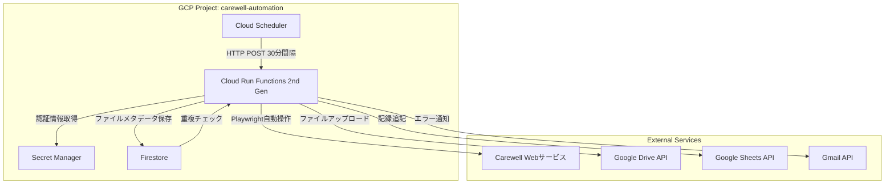
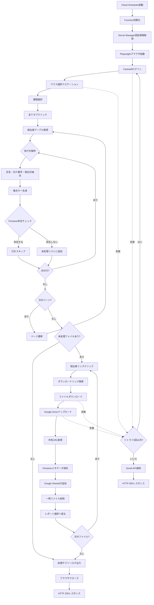
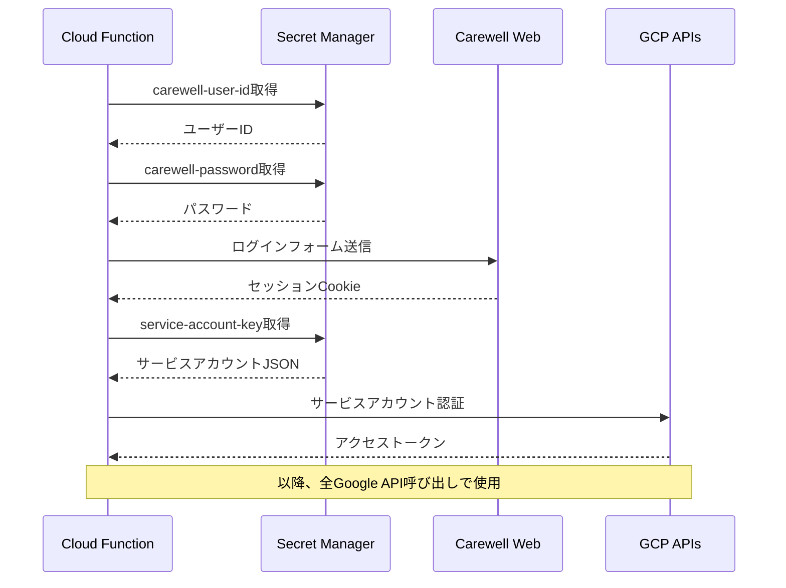
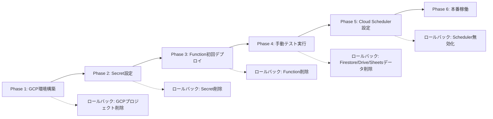

# 技術設計ドキュメント

## 概要

**目的**: 本機能は、Carewell Webサービスから提出ファイルを自動取得し、Google DriveおよびGoogle Sheetsに保存・記録することで、手動ファイル収集作業を削減し、教育管理業務の効率化を実現する。

**対象ユーザー**: 日本介護福祉士会（JACCW）の教育研修担当者が、複数クラス・複数課題の提出物管理業務において本システムを利用する。

**影響**: 現在の手動によるファイルダウンロード・整理作業を、30分間隔の自動実行に置き換え、7クラス×複数課題の組み合わせに対応する完全自動化システムを構築する。

### ゴール
- Carewell Webサービスからの提出ファイル自動取得（重複排除機能付き）
- Google Driveへのファイル保存とFirestoreでのメタデータ管理
- Google Sheetsへの処理履歴記録と可視化
- Cloud Schedulerによる定期実行（30分間隔、7クラス×複数課題対応）
- Secret Managerを用いたセキュアな認証情報管理
- エラー発生時のメール通知と詳細ログ記録

### 非ゴール（スコープ外）
- Carewell Webサービスの採点機能や成績管理機能との統合
- ファイル内容の自動解析や評価機能
- リアルタイム通知システム（定期実行のみ）
- 複数のWebサービスへの拡張（Carewell専用設計）
- 過去データの一括移行機能

## アーキテクチャ

### 既存アーキテクチャ分析
本プロジェクトは完全な新規開発（greenfield）であり、既存システムは存在しない。

### 全体アーキテクチャ



**アーキテクチャ統合**:
- **既存パターン**: なし（新規プロジェクト）
- **新規コンポーネント理由**:
  - Cloud Run Functions 2nd Gen: Playwrightのような重量級ブラウザ自動化ライブラリをコンテナ化して実行するために必要
  - Firestore: 重複チェック用の高速キーバリューストアとして、複合キーによる効率的な検索が可能
  - Secret Manager: 認証情報の安全な管理とローテーション対応
- **技術スタック整合性**: GCPネイティブサービスで統一し、サービスアカウント認証による統合を実現
- **ステアリング準拠**: ステアリングドキュメント未作成のため、本設計が今後の基準となる

### 技術スタックと設計判断

#### バックエンド/サーバーレス実行環境
- **選択**: Cloud Run Functions (2nd Generation) + Python 3.11+
- **理由**:
  - Playwright実行に必要なコンテナ化サポート（1st genでは不可）
  - メモリ割り当て最大16GB、タイムアウト最大60分対応
  - Dockerfileによるカスタムビルドが可能
- **代替案**:
  - Cloud Run: より柔軟だが、HTTP長期接続管理が必要で過剰
  - Compute Engine: 常時起動コストが高く、スケーラビリティに欠ける

#### ブラウザ自動化
- **選択**: Playwright for Python (playwright-core) + Chromium
- **理由**:
  - フレーム操作とページ遷移待機の強力なサポート
  - ヘッドレスモード安定性が高い
  - 明示的な待機戦略（waitForSelector等）
- **代替案**:
  - Selenium: 古い技術スタック、Cloud Run統合が複雑
  - Puppeteer: Node.js専用でPythonエコシステムと不整合

#### データストレージ
- **選択**:
  - Firestore (重複チェック用メタデータストア)
  - Google Drive (ファイル実体保存)
  - Google Sheets (人間可読な記録)
- **理由**:
  - Firestore: 複合キーによる高速な存在チェック、スキーマレス設計
  - Google Drive: 大容量ファイル保存、共有機能、バージョン管理
  - Google Sheets: 非技術者による閲覧・検索・フィルタリング
- **代替案**:
  - Cloud Storage: ファイル保存には適切だが、共有UI/検索機能が弱い
  - Cloud SQL: 構造化データには適切だが、オーバーヘッドが大きい

#### 認証・シークレット管理
- **選択**: Secret Manager + サービスアカウント
- **理由**:
  - バージョン管理とローテーション機能
  - IAMベースのアクセス制御
  - 環境変数よりも高セキュリティ
- **代替案**:
  - 環境変数: ローテーション不可、ログ漏洩リスク
  - KMS: シークレット管理には過剰（暗号化専用）

#### 主要設計判断

##### 判断1: Cloud Run Functions 2nd GenとDockerベースビルド

**決定**: Cloud Run Functions 2nd GenでカスタムDockerfileを使用し、Playwright + Chromiumをコンテナイメージに含める

**コンテキスト**: PlaywrightはChromiumバイナリ（約200MB）をインストール時にダウンロードする必要があり、Cloud Functions 1st Genのデプロイサイズ制限（500MB）とビルド環境の制約に抵触する。

**代替案**:
1. **Cloud Functions 1st Gen + playwright-core + 外部Chromiumバイナリ**: デプロイパッケージサイズ制限に抵触
2. **Cloud Run（フルマネージドコンテナ）**: HTTP長期接続管理が必要で複雑化
3. **Browserless等のサードパーティサービス**: 外部依存とコスト増加

**選択したアプローチ**:
- Dockerfileで`playwright install chromium`を実行
- `requirements.txt`に`playwright`を含める
- メモリ割り当て: 2GB（Chromium起動とPlaywright実行に必要）
- タイムアウト: 540秒（9分、複数ページ処理を考慮）

**理由**:
- GCP内で完結し、外部依存なし
- コンテナビルド時にブラウザバイナリを含めることでデプロイ後の起動時間短縮
- Cloud Run Functions 2nd Genは実質的にCloud Runと同等のコンテナサポート

**トレードオフ**:
- 獲得: セキュリティ、低レイテンシ、GCP統合
- 犠牲: 初回デプロイ時間増加（コンテナビルド）、コールドスタート時間（~10秒）

##### 判断2: Firestoreの複合キー設計（日介番号 + 提出日）

**決定**: FirestoreドキュメントIDに`{日介番号}_{提出日}`形式の複合キーを使用

**コンテキスト**: 同一学生が複数回提出する可能性があり、単一の日介番号では重複判定が不正確。提出日時を含めた一意性保証が必要。

**代替案**:
1. **日介番号のみをキーに使用**: 再提出を検出できない
2. **UUIDを生成**: 重複チェックに複雑なクエリが必要（パフォーマンス低下）
3. **Cloud SQLで正規化**: オーバーヘッドが大きく、サーバーレスと相性が悪い

**選択したアプローチ**:
```python
composite_key = f"{care_number}_{submitted_at}"  # 例: "N9903754_20251002095045"
doc_ref = db.collection(class_name).document(task_name).collection("documents").document(composite_key)
exists = doc_ref.get().exists
```

**理由**:
- O(1)の高速な存在チェック（`document().get().exists`）
- 再提出の自動検出と記録
- コレクション階層（`{クラス名}/{課題名}/documents`）による論理的な整理

**トレードオフ**:
- 獲得: 高速な重複チェック、シンプルなデータモデル
- 犠牲: 複合キーの文字列連結ロジックが必要、日時フォーマット統一の必要性

##### 判断3: ページネーション処理の同期的シーケンシャル実行

**決定**: 提出者一覧の複数ページを順次処理し、各ページで重複チェック後に未処理ファイルをダウンロード

**コンテキスト**: Carewell Webサービスはページネーション付きテーブルで提出者を表示し、1ページあたり最大数十件。全提出者を取得するには全ページを巡回する必要がある。

**代替案**:
1. **全ページ情報を一度に収集してから一括ダウンロード**: メモリ使用量増加、タイムアウトリスク
2. **並列ページ処理**: Carewell側のセッション管理とレート制限に抵触する可能性
3. **ページ単位で別々のFunction呼び出し**: Cloud Scheduler管理が複雑化

**選択したアプローチ**:
```
FOR each page IN pagination:
    提出者リスト取得 → Firestore重複チェック → 未処理ファイルダウンロード → 次ページへ遷移
```

**理由**:
- Carewell Webサービスのセッション維持が容易
- エラー発生時の部分的成功（一部ページ処理済み）
- メモリ使用量の平準化

**トレードオフ**:
- 獲得: セッション安定性、メモリ効率、エラーハンドリング容易性
- 犠牲: 処理時間の増加（並列化不可）、Function実行時間の延長

## システムフロー

### メイン処理フローチャート



### 認証フロー



## 要件トレーサビリティ

| 要件 | 要件概要 | コンポーネント | インターフェース | フロー |
|------|----------|----------------|------------------|--------|
| 1 | Carewell認証とナビゲーション | PlaywrightAutomationEngine | `navigate_to_task()` | メイン処理フロー（Login → NavTask） |
| 2 | 提出ファイル一覧取得と重複チェック | SubmissionCollector, DuplicationChecker | `collect_submissions()`, `is_duplicate()` | メイン処理フロー（GetTable → CheckFS） |
| 3 | ファイルダウンロードとGoogle Drive保存 | FileDownloader, DriveUploader | `download_file()`, `upload_to_drive()` | メイン処理フロー（Download → UploadGD） |
| 4 | Firestoreメタデータ記録 | MetadataStore | `save_metadata()` | メイン処理フロー（SaveFS） |
| 5 | Google Sheetsデータ反映 | SheetsRecorder | `append_row()` | メイン処理フロー（AppendGS） |
| 6 | セキュリティとシークレット管理 | SecretManagerClient | `get_secret()` | 認証フロー（SM取得） |
| 7 | エラーハンドリングと通知 | ErrorHandler, EmailNotifier | `handle_error()`, `send_notification()` | メイン処理フロー（ErrorRetry → SendEmail） |
| 8 | Cloud Run Functions実行とパラメータ管理 | FunctionEntrypoint | `main(request)` | - |
| 9 | トレーサビリティと監査ログ | StructuredLogger | `log()`, `log_summary()` | 全フロー（各ステップでログ出力） |

## コンポーネントとインターフェース

### 実行制御層

#### FunctionEntrypoint

**責務と境界**
- **主要責務**: Cloud SchedulerからのHTTPリクエストを受け取り、パラメータ検証と処理フロー全体のオーケストレーションを実行
- **ドメイン境界**: GCP Functions実行環境とアプリケーションロジックの境界
- **データ所有権**: HTTPリクエストパラメータの検証と正規化
- **トランザクション境界**: 1回のFunction呼び出し = 1クラス×1課題の処理

**依存関係**
- **インバウンド**: Cloud Scheduler（HTTPリクエスト送信元）
- **アウトバウンド**: PlaywrightAutomationEngine, StructuredLogger, ErrorHandler
- **外部依存**: なし（エントリポイント）

**コントラクト定義**

**API Contract**:
| Method | Endpoint | Request | Response | Errors |
|--------|----------|---------|----------|--------|
| POST | / | `{"class_name": str, "task_name": str, "drive_folder_id": str, "spreadsheet_id": str}` | `{"status": "success", "processed": int, "skipped": int, "failed": int}` | 400 (パラメータ不足), 500 (処理失敗) |

**リクエストスキーマ**:
```typescript
interface FunctionRequest {
  class_name: string;        // 例: "令和7年度 デジタル中核人材養成研修 №01"
  task_name: string;         // 例: "課題①業務分析　※～11/3〆切"
  drive_folder_id: string;   // Google DriveフォルダID
  spreadsheet_id: string;    // Google SheetsスプレッドシートID
}
```

**レスポンススキーマ**:
```typescript
interface FunctionResponse {
  status: "success" | "partial_success" | "error";
  processed: number;   // 処理したファイル数
  skipped: number;     // スキップしたファイル数（重複）
  failed: number;      // 失敗したファイル数
  execution_time_ms: number;
  error_details?: string;  // エラー時のみ
}
```

**事前条件**:
- Cloud SchedulerからのHTTPリクエストにContent-Type: application/jsonヘッダーが含まれる
- 全必須パラメータが存在する

**事後条件**:
- 成功時: HTTP 200とサマリーレスポンス
- 失敗時: HTTP 400/500とエラー詳細

**不変条件**:
- 1回のFunction呼び出しは1つのクラス×課題の組み合わせのみを処理
- 処理中のログは全て実行IDで紐付け可能

---

### ブラウザ自動化層

#### PlaywrightAutomationEngine

**責務と境界**
- **主要責務**: Playwright経由でCarewell Webサービスを操作し、ログイン、ナビゲーション、ページ遷移を実行
- **ドメイン境界**: ブラウザ操作の抽象化層
- **データ所有権**: ブラウザセッション管理、Cookie、ページコンテキスト
- **トランザクション境界**: ブラウザインスタンスのライフサイクル

**依存関係**
- **インバウンド**: FunctionEntrypoint, SubmissionCollector
- **アウトバウンド**: SecretManagerClient（認証情報取得）, StructuredLogger
- **外部依存**:
  - Playwright Python (playwright-core)
  - Chromium browser binary

**外部依存関係の調査結果**:
- **Playwright Python**:
  - バージョン: 1.40+ 推奨
  - インストール: `pip install playwright` + `playwright install chromium`
  - Cloud Run Functions対応: Dockerfileで`RUN playwright install --with-deps chromium`実行
  - ヘッドレスモード: `browser = playwright.chromium.launch(headless=True, args=['--no-sandbox', '--disable-dev-shm-usage'])`
  - メモリ要件: 最低512MB、推奨2GB
  - タイムアウト設定: デフォルト30秒（`page.set_default_timeout(60000)`で調整可能）
  - フレーム操作: `page.frame(name="target_frame")`でフレーム内要素にアクセス

**コントラクト定義**

**Service Interface**:
```typescript
interface PlaywrightAutomationEngineService {
  initialize(): Result<BrowserContext, InitializationError>;
  navigate_to_task(class_name: string, task_name: string): Result<Page, NavigationError>;
  close(): Result<void, CleanupError>;
}

interface BrowserContext {
  browser: Browser;
  page: Page;
  session_cookies: Cookie[];
}

type InitializationError = "SECRET_FETCH_FAILED" | "BROWSER_LAUNCH_FAILED" | "LOGIN_FAILED";
type NavigationError = "CLASS_NOT_FOUND" | "TASK_NOT_FOUND" | "TIMEOUT" | "FRAME_NOT_FOUND";
type CleanupError = "BROWSER_CLOSE_FAILED";
```

**事前条件**:
- Secret Managerにcarewell-user-id、carewell-passwordが存在
- Chromiumバイナリがコンテナイメージに含まれている

**事後条件**:
- 成功時: 課題ページに遷移済みのPageオブジェクトを返す
- 失敗時: 詳細なエラー情報を含むNavigationErrorを返す

**不変条件**:
- ブラウザインスタンスは処理完了後必ずクローズされる
- ログイン後のセッションCookieは処理中保持される

**State Management**:
- **状態モデル**: UNINITIALIZED → LAUNCHING → LOGGED_IN → NAVIGATED → CLOSED
- **永続化**: なし（インメモリのみ）
- **並行制御**: シングルスレッド実行（GCF実行モデル）

---

#### SubmissionCollector

**責務と境界**
- **主要責務**: 課題ページの提出者一覧テーブルからデータを抽出し、全ページを巡回して未処理提出者リストを構築
- **ドメイン境界**: Webスクレイピングとデータ抽出
- **データ所有権**: 提出者一覧の抽出データ（氏名、日介番号、提出日、リンクURL）
- **トランザクション境界**: 1ページ分のテーブル解析

**依存関係**
- **インバウンド**: FunctionEntrypoint
- **アウトバウンド**: PlaywrightAutomationEngine（ページ操作）, DuplicationChecker（重複判定）
- **外部依存**: なし

**コントラクト定義**

**Service Interface**:
```typescript
interface SubmissionCollectorService {
  collect_all_submissions(page: Page, class_name: string, task_name: string): Result<Submission[], CollectionError>;
}

interface Submission {
  name: string;              // 氏名
  care_number: string;       // 日介番号（例: "N9903754"）
  submitted_at: string;      // 提出日時（ISO 8601形式）
  submitter_link_url: string; // 提出者詳細ページURL
  composite_key: string;     // 複合キー（care_number + submitted_at）
}

type CollectionError = "TABLE_NOT_FOUND" | "PAGINATION_ERROR" | "PARSE_ERROR";
```

**事前条件**:
- Pageオブジェクトが課題の「全て」タブ表示状態
- テーブル要素（class="standard_grid_item"）が存在

**事後条件**:
- 全ページの未処理提出者リストを返す
- 各Submissionオブジェクトに複合キーが生成済み

**不変条件**:
- 複合キーは`{care_number}_{submitted_at}`形式
- 提出日時はISO 8601形式（`20251002095045`）

---

### データ管理層

#### DuplicationChecker

**責務と境界**
- **主要責務**: Firestoreを使用して複合キーの存在チェックを実行し、重複ファイルをスキップ
- **ドメイン境界**: 重複検出ロジック
- **データ所有権**: なし（Firestoreへの読み取り専用アクセス）
- **トランザクション境界**: 1件の複合キー検証

**依存関係**
- **インバウンド**: SubmissionCollector
- **アウトバウンド**: Firestore Client
- **外部依存**: Firebase Admin SDK for Python

**外部依存関係の調査結果**:
- **Firebase Admin SDK**:
  - パッケージ: `firebase-admin`
  - バージョン: 6.0+
  - 初期化:
    ```python
    import firebase_admin
    from firebase_admin import firestore
    app = firebase_admin.initialize_app()
    db = firestore.client()
    ```
  - ドキュメント存在チェック: `doc_ref.get().exists`
  - コレクション階層: `db.collection(class_name).document(task_name).collection("documents")`

**コントラクト定義**

**Service Interface**:
```typescript
interface DuplicationCheckerService {
  is_duplicate(composite_key: string, class_name: string, task_name: string): Result<boolean, CheckError>;
}

type CheckError = "FIRESTORE_CONNECTION_FAILED" | "COLLECTION_NOT_FOUND";
```

**事前条件**:
- Firestoreクライアントが初期化済み
- composite_keyが`{care_number}_{submitted_at}`形式

**事後条件**:
- 複合キーが存在する場合はtrue、存在しない場合はfalseを返す

**不変条件**:
- コレクション階層は常に`{class_name}/{task_name}/documents`

---

#### FileDownloader

**責務と境界**
- **主要責務**: Playwright経由で提出者詳細ページからファイルをダウンロードし、一時ディレクトリに保存
- **ドメイン境界**: ファイルダウンロード処理
- **データ所有権**: 一時ディレクトリのファイル管理
- **トランザクション境界**: 1ファイルのダウンロード

**依存関係**
- **インバウンド**: FunctionEntrypoint
- **アウトバウンド**: PlaywrightAutomationEngine（ダウンロードリンククリック）
- **外部依存**: なし

**コントラクト定義**

**Service Interface**:
```typescript
interface FileDownloaderService {
  download_file(submission: Submission, page: Page): Result<DownloadedFile, DownloadError>;
}

interface DownloadedFile {
  file_path: string;      // 一時ファイルパス（例: /tmp/report_N9903754.pdf）
  file_name: string;      // 元のファイル名
  file_size_bytes: number;
  mime_type: string;
}

type DownloadError = "DOWNLOAD_LINK_NOT_FOUND" | "DOWNLOAD_TIMEOUT" | "FILE_SAVE_FAILED";
```

**事前条件**:
- Pageオブジェクトが提出者詳細ページに遷移済み
- ダウンロードリンク（download.aspx?id=*）が存在

**事後条件**:
- ファイルが`/tmp/`ディレクトリに保存される
- DownloadedFileオブジェクトにファイル情報が含まれる

**不変条件**:
- ダウンロードファイルは処理完了後に削除される
- ファイルパスは一時ディレクトリ内

---

#### DriveUploader

**責務と境界**
- **主要責務**: Google Drive APIを使用してファイルをアップロードし、共有URLを取得
- **ドメイン境界**: Google Drive統合
- **データ所有権**: なし（Driveへの書き込み専用）
- **トランザクション境界**: 1ファイルのアップロード

**依存関係**
- **インバウンド**: FunctionEntrypoint
- **アウトバウンド**: Google Drive API, SecretManagerClient（サービスアカウント認証）
- **外部依存**: google-api-python-client, google-auth

**外部依存関係の調査結果**:
- **Google Drive API**:
  - パッケージ: `google-api-python-client`, `google-auth`
  - バージョン: google-api-python-client==2.97.0, google-auth==2.22.0
  - スコープ: `https://www.googleapis.com/auth/drive.file`
  - 認証:
    ```python
    from google.oauth2 import service_account
    from googleapiclient.discovery import build

    credentials = service_account.Credentials.from_service_account_info(
        service_account_json, scopes=['https://www.googleapis.com/auth/drive.file'])
    service = build('drive', 'v3', credentials=credentials)
    ```
  - アップロード:
    ```python
    from googleapiclient.http import MediaFileUpload

    file_metadata = {'name': 'report.pdf', 'parents': [folder_id]}
    media = MediaFileUpload('file.pdf', mimetype='application/pdf', resumable=True)
    file = service.files().create(body=file_metadata, media_body=media, fields='id,webViewLink').execute()
    ```
  - 共有URL取得: レスポンスの`webViewLink`フィールド
  - レート制限: 1000 requests/100 seconds/user（通常は問題なし）

**コントラクト定義**

**Service Interface**:
```typescript
interface DriveUploaderService {
  upload_to_drive(file: DownloadedFile, folder_id: string): Result<UploadedFile, UploadError>;
}

interface UploadedFile {
  file_id: string;        // Google DriveファイルID
  file_url: string;       // 共有URL（webViewLink）
  uploaded_at: string;    // アップロード日時（ISO 8601）
}

type UploadError = "AUTH_FAILED" | "UPLOAD_FAILED" | "QUOTA_EXCEEDED";
```

**事前条件**:
- サービスアカウントがDriveフォルダへの書き込み権限を持つ
- DownloadedFileが存在する

**事後条件**:
- ファイルが指定フォルダにアップロードされる
- 共有URLが取得される

**不変条件**:
- アップロードされたファイルはサービスアカウントが所有者
- 共有URLは公開設定されない（フォルダ共有設定に依存）

---

#### MetadataStore

**責務と境界**
- **主要責務**: Firestoreにファイルメタデータを保存し、重複チェック用のインデックスを構築
- **ドメイン境界**: メタデータ永続化
- **データ所有権**: Firestoreドキュメントの作成・更新
- **トランザクション境界**: 1ドキュメントの書き込み

**依存関係**
- **インバウンド**: FunctionEntrypoint
- **アウトバウンド**: Firestore Client
- **外部依存**: Firebase Admin SDK for Python

**コントラクト定義**

**Service Interface**:
```typescript
interface MetadataStoreService {
  save_metadata(submission: Submission, uploaded_file: UploadedFile, class_name: string, task_name: string): Result<void, SaveError>;
}

interface FileMetadata {
  composite_key: string;
  name: string;
  care_number: string;
  submitted_at: string;    // ISO 8601
  file_name: string;
  file_url: string;
  downloaded_at: string;   // ISO 8601
}

type SaveError = "FIRESTORE_WRITE_FAILED" | "VALIDATION_ERROR";
```

**事前条件**:
- ファイルがGoogle Driveにアップロード済み
- composite_keyが生成済み

**事後条件**:
- Firestoreに`{class_name}/{task_name}/documents/{composite_key}`ドキュメントが作成される
- 全フィールドが保存される

**不変条件**:
- ドキュメントIDは常に複合キー
- コレクション階層は`{class_name}/{task_name}/documents`

---

#### SheetsRecorder

**責務と境界**
- **主要責務**: Google Sheets APIを使用してスプレッドシートに処理履歴を追記
- **ドメイン境界**: スプレッドシート統合
- **データ所有権**: なし（Sheetsへの書き込み専用）
- **トランザクション境界**: 1行の追記

**依存関係**
- **インバウンド**: FunctionEntrypoint
- **アウトバウンド**: Google Sheets API, SecretManagerClient（サービスアカウント認証）
- **外部依存**: google-api-python-client, google-auth

**外部依存関係の調査結果**:
- **Google Sheets API**:
  - パッケージ: `google-api-python-client`, `google-auth`（Driveと共通）
  - スコープ: `https://www.googleapis.com/auth/spreadsheets`
  - 認証: Drive APIと同じサービスアカウント認証パターン
  - シート作成:
    ```python
    # シート存在チェック
    spreadsheet = service.spreadsheets().get(spreadsheetId=spreadsheet_id).execute()
    sheets = {s['properties']['title']: s for s in spreadsheet['sheets']}

    # 存在しない場合は作成
    if task_name not in sheets:
        request = {'addSheet': {'properties': {'title': task_name}}}
        service.spreadsheets().batchUpdate(spreadsheetId=spreadsheet_id, body={'requests': [request]}).execute()
        # ヘッダー行追加
        values = [['複合キー', '氏名', '日介番号', '提出日', 'ファイル名', 'ファイルURL', 'ダウンロード日時']]
        service.spreadsheets().values().update(
            spreadsheetId=spreadsheet_id, range=f'{task_name}!A1:G1',
            valueInputOption='RAW', body={'values': values}).execute()
    ```
  - データ追記:
    ```python
    values = [[composite_key, name, care_number, submitted_at, file_name, file_url, downloaded_at]]
    service.spreadsheets().values().append(
        spreadsheetId=spreadsheet_id,
        range=f'{task_name}!A:G',
        valueInputOption='USER_ENTERED',
        insertDataOption='INSERT_ROWS',
        body={'values': values}
    ).execute()
    ```
  - レート制限: 100 requests/100 seconds/user

**コントラクト定義**

**Service Interface**:
```typescript
interface SheetsRecorderService {
  append_row(submission: Submission, uploaded_file: UploadedFile, spreadsheet_id: string, task_name: string): Result<void, AppendError>;
}

type AppendError = "AUTH_FAILED" | "SPREADSHEET_NOT_FOUND" | "SHEET_CREATE_FAILED" | "APPEND_FAILED";
```

**事前条件**:
- サービスアカウントがスプレッドシートへの編集権限を持つ
- スプレッドシートIDが有効

**事後条件**:
- 課題名シートが存在しない場合は作成される
- データ行が追記される

**不変条件**:
- ヘッダー行は常に1行目に存在
- カラム順序は固定（複合キー、氏名、日介番号、提出日、ファイル名、ファイルURL、ダウンロード日時）

---

### 共通基盤層

#### SecretManagerClient

**責務と境界**
- **主要責務**: GCP Secret Managerから認証情報を取得
- **ドメイン境界**: シークレット管理
- **データ所有権**: なし（Secret Managerへの読み取り専用）
- **トランザクション境界**: 1シークレットの取得

**依存関係**
- **インバウンド**: PlaywrightAutomationEngine, DriveUploader, SheetsRecorder
- **アウトバウンド**: Secret Manager API
- **外部依存**: google-cloud-secret-manager

**外部依存関係の調査結果**:
- **Secret Manager API**:
  - パッケージ: `google-cloud-secret-manager`
  - バージョン: 2.16+
  - 認証: Cloud Functions実行環境のデフォルト認証（Application Default Credentials）
  - シークレット取得:
    ```python
    from google.cloud import secretmanager

    client = secretmanager.SecretManagerServiceClient()
    name = f"projects/{project_id}/secrets/{secret_id}/versions/latest"
    response = client.access_secret_version(request={"name": name})
    secret_value = response.payload.data.decode("UTF-8")
    ```
  - 必要なIAMロール: `roles/secretmanager.secretAccessor`

**コントラクト定義**

**Service Interface**:
```typescript
interface SecretManagerClientService {
  get_secret(secret_id: string): Result<string, SecretError>;
}

type SecretError = "SECRET_NOT_FOUND" | "ACCESS_DENIED" | "NETWORK_ERROR";
```

**事前条件**:
- サービスアカウントがSecret Managerへのアクセス権限を持つ
- シークレットが存在する

**事後条件**:
- シークレット値（latest version）を返す

**不変条件**:
- 取得したシークレットはログに出力されない
- シークレット値はメモリ内でのみ保持

---

#### ErrorHandler

**責務と境界**
- **主要責務**: エラー発生時のリトライロジック、エラーログ出力、通知トリガー
- **ドメイン境界**: エラー処理統括
- **データ所有権**: エラーコンテキスト情報
- **トランザクション境界**: 1エラーの処理

**依存関係**
- **インバウンド**: 全コンポーネント
- **アウトバウンド**: StructuredLogger, EmailNotifier
- **外部依存**: なし

**コントラクト定義**

**Service Interface**:
```typescript
interface ErrorHandlerService {
  handle_error(error: Error, context: ErrorContext, retry_count: number): Result<RetryDecision, FatalError>;
}

interface ErrorContext {
  component: string;
  operation: string;
  class_name: string;
  task_name: string;
  execution_id: string;
}

interface RetryDecision {
  should_retry: boolean;
  delay_seconds: number;
}

type FatalError = "MAX_RETRIES_EXCEEDED" | "CRITICAL_ERROR";
```

**事前条件**:
- エラーオブジェクトとコンテキスト情報が提供される

**事後条件**:
- リトライ判定結果を返す
- クリティカルエラー時は通知を送信

**不変条件**:
- 最大リトライ回数は3回
- クリティカルエラーは必ず通知される

---

#### EmailNotifier

**責務と境界**
- **主要責務**: Gmail API経由でエラー通知メールを送信
- **ドメイン境界**: メール通知
- **データ所有権**: なし（Gmail APIへの書き込み専用）
- **トランザクション境界**: 1メールの送信

**依存関係**
- **インバウンド**: ErrorHandler
- **アウトバウンド**: Gmail API, SecretManagerClient（Gmail API認証情報）
- **外部依存**: google-api-python-client, google-auth

**外部依存関係の調査結果**:
- **Gmail API**:
  - パッケージ: `google-api-python-client`, `google-auth`（共通）
  - スコープ: `https://www.googleapis.com/auth/gmail.send`
  - 認証: サービスアカウント + Domain-wide Delegation（組織内送信の場合）
  - 注意事項: サービスアカウントから直接Gmail送信には制限あり。代替案としてSendGrid/Cloud Functions + SMTPを検討する必要がある可能性あり
  - **実装フェーズで要調査**: サービスアカウントでのGmail API送信可否とDomain-wide Delegation設定

**コントラクト定義**

**Service Interface**:
```typescript
interface EmailNotifierService {
  send_notification(error: Error, context: ErrorContext): Result<void, NotificationError>;
}

type NotificationError = "AUTH_FAILED" | "SEND_FAILED" | "QUOTA_EXCEEDED";
```

**事前条件**:
- Gmail API認証情報がSecret Managerに存在
- 送信先メールアドレス（hy.unimail.11@gmail.com）が有効

**事後条件**:
- エラー通知メールが送信される

**不変条件**:
- メール本文にエラー種別、発生時刻、スタックトレース、実行パラメータを含む

---

#### StructuredLogger

**責務と境界**
- **主要責務**: Cloud Loggingに構造化ログ（JSON形式）を出力
- **ドメイン境界**: ロギング統括
- **データ所有権**: ログエントリ
- **トランザクション境界**: 1ログエントリの出力

**依存関係**
- **インバウンド**: 全コンポーネント
- **アウトバウンド**: Cloud Logging API
- **外部依存**: google-cloud-logging

**外部依存関係の調査結果**:
- **Cloud Logging**:
  - パッケージ: `google-cloud-logging`
  - バージョン: 3.5+
  - Cloud Functions統合: 標準出力への`print(json.dumps(log_entry))`で自動的にCloud Loggingに送信
  - 構造化ログフォーマット:
    ```python
    import json
    log_entry = {
        "severity": "INFO",
        "message": "...",
        "execution_id": "...",
        "component": "...",
        "timestamp": "...",
        "context": {...}
    }
    print(json.dumps(log_entry))
    ```

**コントラクト定義**

**Service Interface**:
```typescript
interface StructuredLoggerService {
  log(level: LogLevel, message: string, context: LogContext): void;
  log_summary(summary: ProcessingSummary): void;
}

enum LogLevel {
  INFO = "INFO",
  WARNING = "WARNING",
  ERROR = "ERROR"
}

interface LogContext {
  execution_id: string;
  component: string;
  operation: string;
  class_name?: string;
  task_name?: string;
  execution_time_ms?: number;
  [key: string]: any;  // 追加コンテキスト
}

interface ProcessingSummary {
  execution_id: string;
  total_time_ms: number;
  processed_count: number;
  skipped_count: number;
  failed_count: number;
  phase_timings: Record<string, number>;
}
```

**事前条件**:
- 実行IDが生成済み

**事後条件**:
- ログエントリがCloud Loggingに出力される

**不変条件**:
- 全ログに実行IDが含まれる
- 機密情報（パスワード、APIキー）はマスキングされる

## データモデル

### ドメインモデル

#### コアコンセプト

**Aggregates（集約）**:
- **ClassTaskSubmission**: クラス×課題×提出者の組み合わせを表す集約ルート
  - トランザクション境界: 1つの提出ファイルの処理（ダウンロード、保存、記録）
  - 整合性保証: ファイルメタデータ（Firestore）とファイル実体（Drive）とスプレッドシート記録の3層が全て成功または全て失敗

**Entities（エンティティ）**:
- **Submission（提出物）**: 一意な提出を表す
  - 識別子: composite_key（日介番号 + 提出日時）
  - ライフサイクル: 検出 → 重複チェック → ダウンロード → 保存 → 記録完了
- **DownloadedFile（ダウンロード済みファイル）**: 一時的なファイル実体
  - 識別子: file_path
  - ライフサイクル: ダウンロード → アップロード → 削除

**Value Objects（値オブジェクト）**:
- **CompositeKey**: 日介番号と提出日時の複合キー（例: "N9903754_20251002095045"）
  - 不変性: 生成後変更不可
  - 等価性: 文字列比較
- **FileMetadata**: ファイルのメタ情報（名前、サイズ、MIME型）
  - 不変性: 生成後変更不可

**Domain Events（ドメインイベント）**:
- **SubmissionDiscovered**: 新規提出物が検出された
- **FileDownloaded**: ファイルがダウンロードされた
- **FileUploaded**: ファイルがGoogle Driveにアップロードされた
- **MetadataSaved**: メタデータがFirestoreに保存された
- **RecordAppended**: スプレッドシートに記録が追加された

#### ビジネスルールと不変条件

**制約**:
1. 複合キーは同一クラス×課題内で一意でなければならない
2. Firestoreにメタデータが存在するファイルはスキップされる（重複排除）
3. ファイルダウンロードが失敗した場合、Drive/Sheets/Firestoreへの保存は実行されない
4. 一時ファイルは処理完了後（成功/失敗に関わらず）必ず削除される

**検証ルール**:
- 日介番号形式: 正規表現 `^N\d{7}$`（例: N9903754）
- 提出日時形式: `YYYYMMDDHHMMSS`（例: 20251002095045）
- ファイル名: 空文字列不可、パス区切り文字不可

**実行ポイント**:
- SubmissionCollectorでのデータ抽出時に検証
- MetadataStoreでの保存前に再検証

**集約間整合性戦略**:
- Firestore、Drive、Sheetsの3層は同期的に逐次実行（Saga パターンの簡易版）
- 失敗時のロールバック: 手動対応（エラーログとメール通知で追跡）

### 論理データモデル

#### エンティティ関係

```mermaid
erDiagram
    Class ||--o{ Task : has
    Task ||--o{ Submission : contains
    Submission ||--|| FileMetadata : described_by
    Submission ||--|| DriveFile : stored_as
    Submission ||--|| SheetRecord : recorded_in

    Class {
        string class_name PK
        string drive_folder_id
        string spreadsheet_id
    }

    Task {
        string task_name PK
        string class_name FK
    }

    Submission {
        string composite_key PK
        string class_name FK
        string task_name FK
        string name
        string care_number
        datetime submitted_at
        string submitter_link_url
    }

    FileMetadata {
        string composite_key FK
        string file_name
        string file_url
        datetime downloaded_at
    }
```

**カーディナリティ**:
- 1つのClass（クラス）は複数のTask（課題）を持つ
- 1つのTaskは複数のSubmission（提出物）を含む
- 1つのSubmissionは1つのFileMetadata、DriveFile、SheetRecordに対応

**属性と型**:
| エンティティ | 属性 | 型 | 説明 |
|------------|------|-----|------|
| Submission | composite_key | string | 主キー（日介番号 + 提出日時） |
| Submission | name | string | 提出者氏名 |
| Submission | care_number | string | 日介番号（例: N9903754） |
| Submission | submitted_at | datetime | 提出日時（ISO 8601） |
| FileMetadata | file_name | string | ファイル名 |
| FileMetadata | file_url | string | Google Drive共有URL |
| FileMetadata | downloaded_at | datetime | ダウンロード日時（ISO 8601） |

**参照整合性ルール**:
- Submissionの削除時、FileMetadata、DriveFile、SheetRecordも削除（論理削除）
- Classの削除時、配下の全TaskとSubmissionも削除

**時系列要素**:
- submitted_at: 提出日時（Carewell側で記録）
- downloaded_at: ダウンロード日時（システムで記録）
- バージョニング: なし（最新状態のみ保持）
- 監査ログ: Cloud Loggingで全操作履歴を記録

### 物理データモデル

#### Firestore（ドキュメントストア）

**コレクション構造**:
```
{class_name} (collection)
  └── {task_name} (document)
      └── documents (subcollection)
          └── {composite_key} (document)
              ├── composite_key: string
              ├── name: string
              ├── care_number: string
              ├── submitted_at: timestamp
              ├── file_name: string
              ├── file_url: string
              └── downloaded_at: timestamp
```

**埋め込みvs参照の判断**:
- **埋め込み**: FileMetadata（Submissionと1対1の関係、常に一緒にアクセス）
- **参照なし**: DriveFileとSheetRecordは外部システム管理

**シャーディングキー設計**:
- 自動シャーディング（Firestoreのデフォルト動作）
- ホットスポット回避: composite_keyの先頭が日介番号（ランダム性あり）

**インデックス定義**:
- 単一フィールドインデックス: `composite_key`（主キー、自動作成）
- 複合インデックス: 不要（単一ドキュメントアクセスのみ）

**コレクション構造の例**:
```
令和7年度 デジタル中核人材養成研修 №01/ (collection)
  └── 課題①業務分析　※～11/3〆切/ (document)
      └── documents/ (subcollection)
          ├── N9903754_20251002095045/
          │   ├── composite_key: "N9903754_20251002095045"
          │   ├── name: "山田太郎"
          │   ├── care_number: "N9903754"
          │   ├── submitted_at: Timestamp(2025-10-02 09:50:45)
          │   ├── file_name: "業務分析レポート.pdf"
          │   ├── file_url: "https://drive.google.com/file/d/..."
          │   └── downloaded_at: Timestamp(2025-10-04 10:15:30)
          └── N9903755_20251003120030/
```

#### Google Drive（ファイルストレージ）

**フォルダ構造**:
- パラメータで指定されたフォルダID配下にファイルを配置
- サブフォルダ作成なし（フラット構造）
- ファイル名: Carewellからダウンロードした元のファイル名を保持

**メタデータ**:
- mimeType: ファイルの実際のMIME型（自動検出）
- parents: 親フォルダIDのリスト
- webViewLink: 共有URL

#### Google Sheets（スプレッドシート）

**シート構造**:
- 1つのスプレッドシートに複数のシート（課題ごと）
- シート名: 課題名（例: "課題①業務分析　※～11/3〆切"）

**カラム定義**:
| カラム | 型 | 説明 |
|--------|-----|------|
| A: 複合キー | string | N9903754_20251002095045 |
| B: 氏名 | string | 山田太郎 |
| C: 日介番号 | string | N9903754 |
| D: 提出日 | datetime | 2025-10-02 09:50:45 |
| E: ファイル名 | string | 業務分析レポート.pdf |
| F: ファイルURL | hyperlink | https://drive.google.com/... |
| G: ダウンロード日時 | datetime | 2025-10-04 10:15:30 |

**ヘッダー行**: 常に1行目に固定
**データ追記**: `append`メソッドで自動的に次の空白行に追記

### データコントラクトと統合

#### API Data Transfer

**FunctionRequest（HTTPリクエスト）**:
```json
{
  "class_name": "令和7年度 デジタル中核人材養成研修 №01",
  "task_name": "課題①業務分析　※～11/3〆切",
  "drive_folder_id": "1abc...xyz",
  "spreadsheet_id": "1def...uvw"
}
```

**検証ルール**:
- class_name: 必須、非空文字列、最大256文字
- task_name: 必須、非空文字列、最大256文字
- drive_folder_id: 必須、Google Drive フォルダID形式
- spreadsheet_id: 必須、Google Sheets スプレッドシートID形式

**FunctionResponse（HTTPレスポンス）**:
```json
{
  "status": "success",
  "processed": 15,
  "skipped": 42,
  "failed": 0,
  "execution_time_ms": 87543
}
```

#### イベントスキーマ

本システムはイベント駆動アーキテクチャを採用しないため、イベントスキーマは定義しない。

#### サービス間データ管理

**分散トランザクションパターン**: Sagaパターン（簡易版）

**処理フロー**:
1. ファイルダウンロード
2. Google Driveアップロード
3. Firestoreメタデータ保存
4. Google Sheets行追加

**失敗時の対応**:
- ステップ2失敗: 一時ファイル削除、エラーログ、次のファイルへ
- ステップ3失敗: リトライ3回、失敗時はエラーログとメール通知
- ステップ4失敗: リトライ3回、失敗時はエラーログ（Firestoreには保存済み）

**データ同期戦略**:
- Firestore、Drive、Sheetsは同期的に逐次実行
- 最終的な整合性: 手動修正が必要な場合はエラーログとメール通知で追跡

**Eventual Consistency対応**:
- 本システムは強い整合性を要求しないため、ステップ4失敗時でもシステムは継続
- 管理者が後からSheetsを手動修正可能

## エラーハンドリング

### エラー戦略

本システムは、以下の3層のエラーハンドリング戦略を採用する：

1. **リトライ可能エラー**: 一時的な障害（ネットワークタイムアウト、API rate limit）は最大3回まで自動リトライ
2. **スキップ可能エラー**: 個別ファイル処理の失敗は記録し、次のファイル処理に進む
3. **クリティカルエラー**: システム全体に影響するエラー（認証失敗、Firestore接続失敗）はメール通知と実行停止

**リトライロジック**:
- 初回失敗: 即座にリトライ
- 2回目失敗: 5秒待機後リトライ
- 3回目失敗: 10秒待機後リトライ
- 3回失敗後: エラーログ出力し、次の処理へ（クリティカルエラーの場合は実行停止）

**ログ記録**:
- 全エラーをCloud Loggingに構造化ログとして記録
- ログレベル: ERROR
- コンテキスト情報: 実行ID、コンポーネント名、操作名、クラス名、課題名、スタックトレース

### エラーカテゴリと対応

#### ユーザーエラー（4xx相当）

| エラータイプ | 原因 | 対応 | HTTPステータス |
|------------|------|------|---------------|
| パラメータ不足 | リクエストに必須パラメータが欠けている | エラーメッセージに欠けているパラメータ名を明記 | 400 |
| 認証情報不正 | Carewellログインに失敗 | Secret Manager設定を確認するようガイダンス | 401相当（500でログに記録） |
| リソース未発見 | クラス名/課題名が見つからない | Carewell上での存在確認を促すメッセージ | 404相当（ログに記録し継続） |

#### システムエラー（5xx）

| エラータイプ | 原因 | 対応 | 復旧戦略 |
|------------|------|------|----------|
| Playwright起動失敗 | Chromiumバイナリ不足/メモリ不足 | エラーログとメール通知 | Function再デプロイ、メモリ増量 |
| Firestore接続失敗 | ネットワーク障害/IAM権限不足 | リトライ3回、失敗時はメール通知 | サーキットブレーカー（10分間実行停止） |
| Drive/Sheets API失敗 | API quota超過/ネットワークタイムアウト | リトライ3回、exponential backoff | レート制限対応（リトライ間隔調整） |
| タイムアウト | Function実行時間が540秒超過 | 処理済みファイルをFirestoreに記録済み、次回実行で継続 | なし（次回実行で自動復旧） |

#### ビジネスロジックエラー（422相当）

| エラータイプ | 原因 | 対応 | ガイダンス |
|------------|------|------|-----------|
| 日介番号形式エラー | 正規表現 `^N\d{7}$` に不一致 | 該当行をスキップ、ログに記録 | Carewell側データ確認を促す |
| 提出日時パースエラー | 日時フォーマット不正 | 該当行をスキップ、ログに記録 | Carewell側データ確認を促す |
| ダウンロードリンク未検出 | 提出者詳細ページにdownload.aspx?id=*が存在しない | ログに記録、次の提出者へ | Carewell UI変更の可能性を調査 |

### モニタリング

**エラー追跡**:
- Cloud Loggingの`severity=ERROR`フィルタで全エラーを追跡
- エラー率メトリクス: `failed_count / (processed_count + failed_count)`
- アラート: エラー率が20%を超えた場合にメール通知

**ロギング戦略**:
```json
{
  "severity": "ERROR",
  "execution_id": "uuid-1234",
  "component": "PlaywrightAutomationEngine",
  "operation": "navigate_to_task",
  "class_name": "令和7年度 デジタル中核人材養成研修 №01",
  "task_name": "課題①業務分析　※～11/3〆切",
  "error_type": "TASK_NOT_FOUND",
  "error_message": "...",
  "stack_trace": "...",
  "retry_count": 3,
  "timestamp": "2025-10-04T10:15:30.123Z"
}
```

**ヘルスモニタリング**:
- Cloud Functionsメトリクス: 実行回数、エラー率、平均実行時間、メモリ使用量
- カスタムメトリクス: 処理ファイル数、スキップ数、失敗数（Cloud Loggingベースのメトリクス）
- ヘルスチェック: なし（Cloud Schedulerの成功/失敗ステータスで判断）

## テスト戦略

### ユニットテスト

**テスト対象コアモジュール**:
1. **DuplicationChecker.is_duplicate()**:
   - Firestoreモックを使用して複合キーの存在チェックロジックを検証
   - テストケース: 存在する/存在しない/Firestore接続失敗
2. **CompositeKey生成ロジック**:
   - 日介番号と提出日時から複合キーを正しく生成することを検証
   - テストケース: 正常フォーマット/日介番号不正/提出日時不正
3. **ErrorHandler.handle_error()**:
   - リトライ判定ロジックとリトライ回数カウントを検証
   - テストケース: リトライ可能エラー/クリティカルエラー/最大リトライ超過
4. **SecretManagerClient.get_secret()**:
   - Secret Manager APIモックを使用してシークレット取得を検証
   - テストケース: 正常取得/シークレット未発見/アクセス拒否

**モックフレームワーク**: `unittest.mock`, `pytest`

### 統合テスト

**クロスコンポーネントフロー**:
1. **Carewell認証→ナビゲーションフロー**:
   - PlaywrightAutomationEngine + SecretManagerClientの統合
   - テスト環境のCarewellテストアカウントで実行
   - 検証項目: ログイン成功、クラス選択、課題選択、「全て」タブクリック
2. **ファイルダウンロード→Driveアップロード→Firestore保存フロー**:
   - FileDownloader + DriveUploader + MetadataStoreの統合
   - モックファイルを使用してエンドツーエンドのデータフローを検証
   - 検証項目: ダウンロード成功、アップロード成功、メタデータ保存、一時ファイル削除
3. **重複チェック→スキップフロー**:
   - SubmissionCollector + DuplicationCheckerの統合
   - Firestore Emulatorを使用して重複データを事前に投入
   - 検証項目: 重複ファイルのスキップ、未処理ファイルのみリスト化
4. **エラーリトライ→通知フロー**:
   - ErrorHandler + EmailNotifierの統合
   - API失敗をシミュレートしてリトライとメール通知を検証
   - 検証項目: 3回リトライ、exponential backoff、メール送信
5. **全体フロー（End-to-End統合）**:
   - FunctionEntrypoint経由で全コンポーネントを統合
   - Carewell testingアカウント + GCP testing projectで実行
   - 検証項目: HTTPリクエスト受信、全処理ステップ実行、HTTPレスポンス返却

**テスト環境**: GCP testing project（Firestore Emulator、Secret Manager testing secrets、Google Drive/Sheets testing resources）

### E2E/UI テスト

本システムはUIを持たないバックグラウンドジョブのため、E2Eテストは統合テストの全体フローで代替。

### パフォーマンス/負荷テスト

**負荷シナリオ**:
1. **100件の提出ファイル処理**:
   - 提出者一覧5ページ × 20件/ページをシミュレート
   - 検証項目: 実行時間が540秒以内、メモリ使用量が2GB以内
2. **重複データが大量にある場合**:
   - Firestoreに1000件の既存データを投入、新規ファイル10件をテスト
   - 検証項目: 重複チェック時間が1秒/件以内
3. **同時実行（7クラス分のFunction並列実行）**:
   - Cloud Schedulerから30分間隔で7パターンのリクエストを送信
   - 検証項目: 各Functionが独立して実行、リソース競合なし
4. **大容量ファイル処理**:
   - 50MBのPDFファイルをダウンロード・アップロード
   - 検証項目: タイムアウトせずに処理完了、メモリ不足なし

**パフォーマンス目標**:
- 1ファイルあたりの平均処理時間: 10秒以内
- 100件処理の合計実行時間: 15分以内（540秒制限内）
- メモリ使用量: ピーク時1.5GB以内（2GB制限内）

## セキュリティ考慮事項

### 脅威モデリング

**識別された脅威**:

1. **認証情報の漏洩**:
   - 攻撃ベクトル: ログ出力、環境変数、コードリポジトリへの誤コミット
   - 影響: Carewellアカウント不正アクセス、Google APIの悪用
   - 対策: Secret Manager使用、ログマスキング、.gitignore設定

2. **不正なFunction呼び出し**:
   - 攻撃ベクトル: Cloud Schedulerを経由しない直接HTTPリクエスト
   - 影響: リソース不正利用、意図しないファイル処理
   - 対策: Cloud Functions Invokerロール制限（Cloud Schedulerのみ許可）

3. **ファイル実体の不正アクセス**:
   - 攻撃ベクトル: Google Drive共有URL推測、サービスアカウント鍵漏洩
   - 影響: 提出ファイルの不正閲覧・ダウンロード
   - 対策: DriveフォルダのIAM権限厳格化、共有URL生成を制限付きに設定

4. **Firestore/Sheetsデータの改ざん**:
   - 攻撃ベクトル: サービスアカウント鍵漏洩、IAM権限設定ミス
   - 影響: メタデータ改ざん、重複チェック機能の無効化
   - 対策: サービスアカウント最小権限原則、Firestore Rulesでの書き込み制限

5. **中間者攻撃（MITM）**:
   - 攻撃ベクトル: HTTPS通信の傍受（Carewell、Google API）
   - 影響: 認証情報の盗聴、ファイル内容の改ざん
   - 対策: TLS 1.2+ 強制、証明書検証

### セキュリティ統制

**認証と認可**:
- **Carewell Webサービス**: フォームベース認証（ユーザーID/パスワード）
  - 認証情報はSecret Managerで管理
  - セッションCookieはブラウザインスタンス内でのみ保持
- **Google APIs**: サービスアカウント認証
  - サービスアカウント鍵JSONはSecret Managerで管理
  - IAMロール:
    - `roles/secretmanager.secretAccessor` (Secret Manager読み取り)
    - `roles/datastore.user` (Firestore読み書き)
    - `roles/drive.file` (Drive書き込み)
    - `roles/sheets.editor` (Sheets編集)
    - `roles/gmail.send` (Gmail送信) ※要調査
- **Cloud Functions**: Cloud Scheduler専用Invoker
  - サービスアカウント: `cloud-scheduler@carewell-automation.iam.gserviceaccount.com`
  - IAMロール: `roles/cloudfunctions.invoker`

**データ保護とプライバシー**:
- **転送中の暗号化**: 全API通信でTLS 1.2+を使用
- **保存時の暗号化**:
  - Secret Manager: デフォルト暗号化（Google管理の暗号鍵）
  - Firestore: デフォルト暗号化
  - Google Drive: デフォルト暗号化
- **PII（個人識別情報）の取り扱い**:
  - 氏名、日介番号を含むため、GDPR/個人情報保護法の適用対象
  - Firestore/Sheetsへのアクセスは必要最小限のサービスアカウントのみ
  - ログ出力時に氏名をマスキング（`山田**`形式）
- **ログマスキング**:
  - パスワード、APIキー、サービスアカウント鍵は`***`でマスキング
  - 氏名は最初の2文字のみ表示（例: `山田太郎` → `山田**`）

**監査とコンプライアンス**:
- Cloud Loggingで全API呼び出しを記録（Admin Activity Logs）
- Firestore書き込み履歴をCloud Loggingで追跡
- Secret Managerアクセスログの有効化
- 90日間のログ保持（Cloud Logging retention設定）

### セキュリティ実装パターン

**認証フロー**:
```python
# Secret Managerから認証情報を安全に取得
def get_credentials():
    secret_client = SecretManagerClient()
    user_id = secret_client.get_secret("carewell-user-id")
    password = secret_client.get_secret("carewell-password")

    # ログにはマスキングして出力
    logger.log("INFO", f"Retrieved credentials for user: {user_id[:3]}***")

    return user_id, password

# サービスアカウント認証
def authenticate_google_apis():
    secret_client = SecretManagerClient()
    sa_json_str = secret_client.get_secret("service-account-key")
    sa_json = json.loads(sa_json_str)

    credentials = service_account.Credentials.from_service_account_info(
        sa_json,
        scopes=[
            'https://www.googleapis.com/auth/drive.file',
            'https://www.googleapis.com/auth/spreadsheets',
            'https://www.googleapis.com/auth/datastore'
        ]
    )

    return credentials
```

**ログマスキング**:
```python
def mask_sensitive_data(log_entry: dict) -> dict:
    """機密情報をマスキング"""
    if "password" in log_entry:
        log_entry["password"] = "***"
    if "api_key" in log_entry:
        log_entry["api_key"] = "***"
    if "name" in log_entry:
        # 氏名は最初の2文字のみ表示
        log_entry["name"] = log_entry["name"][:2] + "**"
    return log_entry
```

**IAM最小権限原則**:
```yaml
# サービスアカウント権限設定（Terraform例）
resource "google_project_iam_member" "function_sa" {
  project = "carewell-automation"
  role    = "roles/cloudfunctions.invoker"
  member  = "serviceAccount:cloud-scheduler@carewell-automation.iam.gserviceaccount.com"
}

resource "google_project_iam_member" "firestore_user" {
  project = "carewell-automation"
  role    = "roles/datastore.user"
  member  = "serviceAccount:carewell-function@carewell-automation.iam.gserviceaccount.com"
}
```

## パフォーマンスとスケーラビリティ

### ターゲットメトリクスと測定戦略

**パフォーマンス目標**:
- **1ファイルあたりの処理時間**: 平均10秒以内（ダウンロード～Sheets記録完了）
- **100件バッチ処理時間**: 15分以内（Cloud Functions最大タイムアウト9分の余裕を持つ）
- **重複チェック応答時間**: 1秒以内/件（Firestore読み取り）
- **メモリ使用量**: ピーク時1.5GB以内（割り当て2GBの75%）
- **エラー率**: 5%以内（API一時的障害を除く）

**測定方法**:
- Cloud Functionsメトリクス（実行時間、メモリ使用量、エラー率）
- カスタムログベースメトリクス（処理ファイル数、スキップ数、各フェーズの所要時間）
- Cloud Loggingのログ分析（BigQuery Export経由）

### スケーリングアプローチ

**水平スケーリング（推奨）**:
- Cloud Schedulerで7クラス×複数課題の組み合わせを30分間隔でずらして実行
- 各Function呼び出しは独立して実行（並列度: 最大7）
- Cloud Functions自動スケーリング: 同時実行数最大100（デフォルト）
- 制約: Carewell Webサービス側のレート制限（不明、実装フェーズで調査必要）

**垂直スケーリング（非推奨）**:
- メモリ割り当て増量: 2GB → 4GB（必要に応じて）
- タイムアウト延長: 540秒 → 900秒（大量ファイル処理時）
- トレードオフ: コスト増加、コールドスタート時間増加

**スケーリング制約**:
- Google Drive API quota: 20,000 requests/100 seconds/user（1ファイル=2リクエストで10,000ファイル/100秒）
- Google Sheets API quota: 500 requests/100 seconds/user（1行追記=1リクエストで500行/100秒）
- Firestore書き込みスループット: 1ドキュメント/秒の連続書き込み制限（実際は10,000書き込み/秒までスケール）

### キャッシング戦略と最適化技術

**キャッシング**:
- **Secret Manager認証情報**: Function実行開始時に1回取得、メモリ内キャッシュ（インスタンス再利用時に有効）
- **Playwrightブラウザインスタンス**: 再利用不可（セッション管理の複雑化を避ける）
- **Firestore重複チェック**: キャッシュなし（常に最新状態を確認）

**最適化技術**:
1. **ページネーション並列化の検討（実装フェーズ）**:
   - 現状: 順次ページ処理
   - 改善案: 複数ページを並列取得（Carewell側セッション管理に依存）
2. **Firestore バッチ読み取り**:
   - 現状: 1件ずつ存在チェック
   - 改善案: 複数キーをバッチで取得（`getAll()`メソッド）
3. **Google Sheets バッチ書き込み**:
   - 現状: 1行ずつ追記
   - 改善案: 複数行をまとめて`batchUpdate()`（API呼び出し回数削減）
4. **コンテナイメージ最適化**:
   - マルチステージビルドでイメージサイズ削減
   - 不要なPlaywrightブラウザ（Firefox、WebKit）を除外

**実装フェーズで検証が必要な最適化**:
- Playwright keepalive接続の有効性
- Firestore connection poolingの設定
- Google API client libraryのHTTPセッション再利用

## 移行戦略

本システムは新規開発（greenfield）のため、既存システムからの移行は不要。

**初期セットアップフェーズ**:



**プロセス詳細**:

1. **Phase 1: GCP環境構築**
   - GCPプロジェクト作成（`carewell-automation`）
   - 必要なAPI有効化（Cloud Functions、Secret Manager、Firestore、Drive、Sheets、Gmail）
   - サービスアカウント作成とIAMロール付与
   - **検証ポイント**: `gcloud projects describe carewell-automation`でプロジェクト確認

2. **Phase 2: Secret設定**
   - Secret Managerにシークレット作成:
     - `carewell-user-id`
     - `carewell-password`
     - `service-account-key`
     - `gmail-api-credentials`（要調査）
   - **検証ポイント**: `gcloud secrets describe carewell-user-id`でシークレット確認

3. **Phase 3: Function初回デプロイ**
   - Dockerfileとrequirements.txtをGitリポジトリにコミット
   - `gcloud functions deploy`でデプロイ
   - **検証ポイント**: `gcloud functions describe carewell-automation-function`でステータス確認

4. **Phase 4: 手動テスト実行**
   - テスト用パラメータでFunction手動トリガー
   - Firestore、Drive、Sheetsにデータが正しく保存されているか確認
   - エラーログ確認
   - **検証ポイント**: テスト実行のCloud Logsとレスポンス確認

5. **Phase 5: Cloud Scheduler設定**
   - 7クラス×複数課題の組み合わせでSchedulerジョブ作成
   - 30分間隔でタイミングをずらして設定
   - **検証ポイント**: 最初の定期実行が成功するか監視

6. **Phase 6: 本番稼働**
   - 1週間の監視期間（エラー率、処理ファイル数を確認）
   - 問題なければ本番稼働とみなす

**ロールバックトリガー**:
- Phase 3: デプロイ失敗（ビルドエラー、ランタイムエラー）
- Phase 4: テスト実行で50%以上のファイル処理が失敗
- Phase 5: 定期実行で連続3回失敗
- Phase 6: 本番稼働開始後にエラー率が20%を超過

**検証チェックポイント**:
- [ ] GCPプロジェクトとAPI有効化
- [ ] Secret Manager設定完了
- [ ] Function正常デプロイ
- [ ] 手動テストで全フロー成功
- [ ] Cloud Scheduler正常動作
- [ ] 1週間の監視期間でエラー率5%以内

---

**設計レビュー推奨事項**:
1. Gmail API認証方式の調査と決定（サービスアカウント vs OAuth2 vs SMTP代替）
2. Carewell Webサービスのセッション管理とレート制限の調査
3. Cloud Functions 2nd GenでのPlaywright実行パフォーマンステスト
4. Firestoreバッチ読み取り/Google Sheetsバッチ書き込みの実装可否検証
