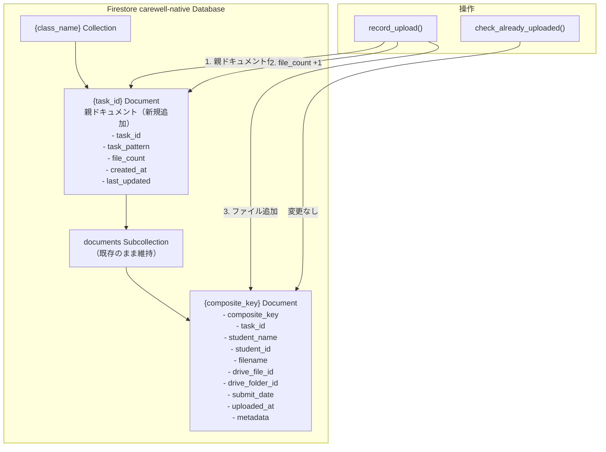
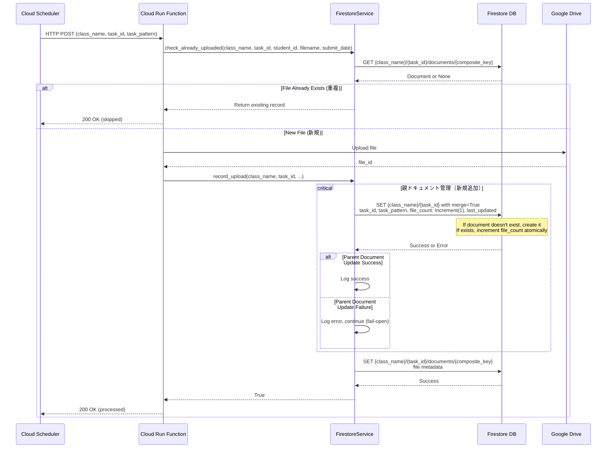
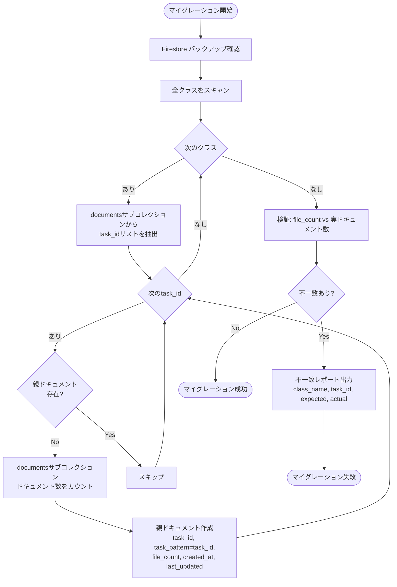
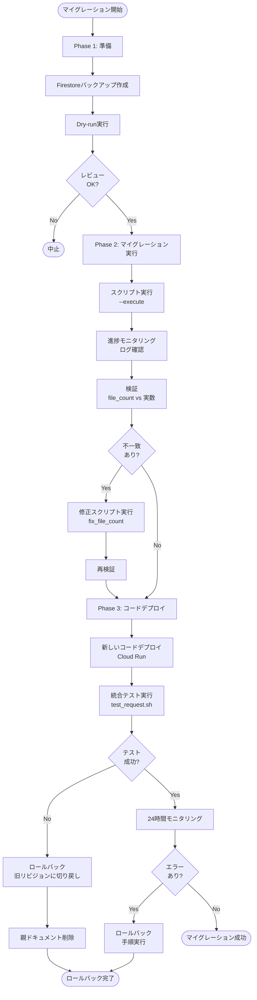

# 技術設計ドキュメント

## 概要

本機能は、carewell-drive-automationシステムのFirestoreデータ構造を改善し、タスク親ドキュメントにメタデータを保存することで、動的な課題管理を可能にします。現在、システムはサブコレクション（`documents`）のみを使用しており、親ドキュメント（`task_id`）が存在しないため、フロントエンド（carewell-dashboard）で課題IDをハードコードする必要があります。

**目的**: 本改善により、Firestoreのベストプラクティスに準拠した階層構造を実現し、ダッシュボードが課題一覧を動的にクエリできるようになります。重要な制約として、既存の重複チェック機能を100%維持し、本番稼働中のシステムに影響を与えません。

**対象ユーザー**: システム管理者（マイグレーション実行）、開発者（将来の課題追加時のコード変更不要）、フロントエンドアプリケーション（動的な課題取得）

**影響**: 既存の`FirestoreService`クラスの`record_upload`メソッドを拡張し、ファイルアップロード時に親ドキュメントを自動的に作成・更新します。データ構造は変更されますが、APIインターフェースと既存の重複チェックロジックは完全に保持されます。

### ゴール

- タスク親ドキュメントの自動管理（作成・更新・file_countインクリメント）
- Firestore FieldValue.increment()によるアトミックなカウンタ更新
- 既存の重複チェック機能の100%維持
- 既存20件のファイルデータの損失なしマイグレーション
- 後方互換性の完全保証（Cloud Scheduler設定変更不要）
- 包括的なテストスイート（ユニットテスト80%以上、統合テスト100%）

### 非ゴール

- フロントエンド（carewell-dashboard）の修正（本要件のスコープ外、後続タスクで対応）
- Firestore (default)データベースの変更（carewell-nativeのみが対象）
- サブコレクション（documents）の構造変更（完全に維持）
- Cloud Schedulerジョブ設定の変更（既存14ジョブをそのまま使用）
- リアルタイム通知やWebSocket統合

## アーキテクチャ

### 既存アーキテクチャ分析

**現在のFirestore構造**:
```
{class_name}/{task_id}/documents/{composite_key}
                      ↑
                      親ドキュメント（task_id）が存在しない
                      サブコレクションのみが存在
```

**現在の実装パターン**:
- `FirestoreService`クラス（`src/firestore_service.py`）
- Firestore Native Modeデータベース（`carewell-native`）
- 複合キー（`{student_id}_{filename}_{submit_date}`）による重複チェック
- Fail-open戦略（エラー時はアップロードを許可）
- サーバータイムスタンプ（`firestore.SERVER_TIMESTAMP`）による`uploaded_at`記録

**保持すべきパターンと制約**:
- `check_already_uploaded`メソッドのロジックは一切変更しない
- `collection_name = "uploaded_files"`属性は使用されていないが保持
- Fail-open戦略を親ドキュメント操作でも継続
- ロギング戦略（`logger.info`と`logger.error`）を踏襲

### 改善後のFirestore構造



**アーキテクチャ統合**:
- **既存パターン保持**: サブコレクション構造、複合キー戦略、fail-open戦略
- **新規コンポーネント追加理由**:
  - 親ドキュメント: フロントエンドが課題一覧を動的にクエリするために必要
  - `file_count`フィールド: ダッシュボードでの集計クエリ不要化（パフォーマンス向上）
- **技術スタック整合性**: 既存のgoogle-cloud-firestore SDKの機能（FieldValue.increment）を活用
- **ステアリング準拠**: fail-open戦略の継続、サーバータイムスタンプの使用、詳細なロギング

### 技術整合性

**既存技術スタックとの整合**:
- Python 3.11+環境を継続使用
- google-cloud-firestore SDK（既存依存関係）の拡張活用
- Firestore Native Modeデータベース（carewell-native）を継続使用
- Cloud Run Functions 2nd Generation環境での動作保証

**新規依存関係**:
- なし（既存のgoogle-cloud-firestoreのみ使用）

**設計上の偏差**:
- なし（既存パターンの自然な拡張）

### 重要な設計決定

#### 決定1: Firestore FieldValue.increment()によるアトミックなカウンタ更新

**コンテキスト**:
並行アップロード（複数のCloud Run Functions 2nd Genインスタンスが同時に実行）時に、`file_count`フィールドの整合性を保証する必要があります。Read-Modify-Writeパターンでは競合が発生し、カウントが不正確になるリスクがあります。

**代替案**:
1. **Read-Modify-Write with Transaction**: トランザクション内でカウントを読み取り、インクリメント、書き込み
   - 利点: シンプルで理解しやすい
   - 欠点: トランザクション競合により再試行が頻発、レイテンシが増加

2. **Distributed Counter Pattern**: カウンタをシャード化し、最終的に集約
   - 利点: 超高スループット（1秒あたり数万更新）に対応可能
   - 欠点: 実装が複雑、本システムの規模（7クラス×2課題）では過剰

3. **FieldValue.increment()**: Firestoreのアトミックインクリメント機能
   - 利点: トランザクション不要、競合なし、低レイテンシ、実装シンプル
   - 欠点: インクリメントのみ（デクリメントは可能だが、本要件では不要）

**選択したアプローチ**:
```python
from google.cloud import firestore

task_ref = self.db.collection(class_name).document(task_id)
task_ref.set({
    "file_count": firestore.Increment(1)
}, merge=True)
```

**根拠**:
- 本システムの並行度（最大5-10リクエスト/30分）では、FieldValue.increment()で十分
- トランザクションオーバーヘッドを回避でき、100ms以内の更新を保証
- Firestoreが内部的に競合を処理するため、コードがシンプル
- 公式ドキュメントで推奨されているベストプラクティス

**トレードオフ**:
- **獲得**: 低レイテンシ、高可用性、実装のシンプルさ
- **犠牲**: カウンタをゼロにリセットする機能（必要な場合は別メソッドで対応）

#### 決定2: 親ドキュメント操作での fail-open 戦略の継続

**コンテキスト**:
既存の`record_upload`メソッドは、Firestoreエラー時にもファイルアップロード処理を成功として扱う"fail-open"戦略を採用しています。親ドキュメント管理を追加する際、この戦略を継続するか、親ドキュメント作成失敗時は全体を失敗とするか選択が必要です。

**代替案**:
1. **Fail-closed（厳格モード）**: 親ドキュメント作成失敗時は全体を失敗とする
   - 利点: データ整合性が最大限保証される
   - 欠点: Firestore障害時にファイルアップロードが完全停止（可用性低下）

2. **Fail-open（既存戦略継続）**: 親ドキュメント作成失敗時もファイルはアップロード
   - 利点: 高可用性、既存の運用パターンと一致
   - 欠点: 一時的に`file_count`が不正確になる可能性

**選択したアプローチ**:
```python
try:
    # 親ドキュメント作成/更新
    task_ref.set({...}, merge=True)
    logger.info(f"Updated task document: {class_name}/{task_id}")
except Exception as e:
    logger.error(f"Failed to update task document: {e}", exc_info=True)
    # Continue processing (fail-open)

# ファイルドキュメント作成は継続
doc_ref.set(record)
return True
```

**根拠**:
- 本システムの主目的はファイル収集であり、メタデータ（file_count）は二次的
- Firestoreの可用性は99.99%だが、ネットワーク問題や一時的な障害は起こりうる
- 修正スクリプトを用意することで、後から`file_count`を再計算可能
- 既存の運用経験とモニタリング基盤がfail-open前提で構築されている

**トレードオフ**:
- **獲得**: 高可用性、既存運用パターンとの一貫性、障害時の影響範囲最小化
- **犠牲**: 一時的なfile_count不整合（修正スクリプトで対応可能）

#### 決定3: マイグレーションスクリプトの独立実行

**コンテキスト**:
既存20件のファイルデータから親ドキュメントを生成する方法として、(1) 次回のrecord_upload時に遅延生成、(2) 専用のマイグレーションスクリプトでバッチ処理、のいずれかを選択する必要があります。

**代替案**:
1. **遅延マイグレーション（Lazy Migration）**: record_upload時に親ドキュメントが存在しなければ作成
   - 利点: 追加スクリプト不要、自然に移行
   - 欠点: 既存データの親ドキュメントがいつ作成されるか不明、file_countの初期値が不正確

2. **専用マイグレーションスクリプト**: 一度にすべての親ドキュメントを生成
   - 利点: 移行タイミングが明確、file_countの正確性保証、ロールバック可能
   - 欠点: 追加スクリプトの開発・テストが必要

**選択したアプローチ**:
```python
# scripts/migrate_parent_documents.py
def migrate_class_tasks(class_name: str):
    # 1. documentsサブコレクションをスキャン
    # 2. task_idごとにグループ化
    # 3. 親ドキュメント作成（file_count=実際のドキュメント数）
    # 4. 検証（file_count == 実ドキュメント数）
```

**根拠**:
- 既存20件のデータに対してfile_countを正確に初期化できる
- マイグレーション前後の検証が容易
- ロールバック手順が明確（親ドキュメントを削除するだけ）
- 本番デプロイ前にステージング環境で完全テスト可能

**トレードオフ**:
- **獲得**: データ整合性の保証、明確な移行プロセス、テスト可能性
- **犠牲**: 追加のスクリプト開発工数（約1-2時間）

## システムフロー

### ファイルアップロードフロー（改善後）



**フローの重要ポイント**:
1. **重複チェックロジックは変更なし**: 既存の`check_already_uploaded`は完全に保持
2. **親ドキュメント操作は独立**: 親ドキュメント更新失敗時もファイル追加は継続
3. **アトミックインクリメント**: `Increment(1)`により並行実行時も正確

### マイグレーションフロー



## 要件トレーサビリティ

| 要件 | 要件概要 | コンポーネント | インターフェース | フロー |
|------|---------|--------------|----------------|--------|
| 1.1 | タスク親ドキュメント自動管理 | FirestoreService | `record_upload()` 拡張 | ファイルアップロードフロー |
| 2.1 | ファイル数自動集計 | FirestoreService | `_update_task_metadata()` 新規 | ファイルアップロードフロー |
| 3.1 | 重複チェック機能維持 | FirestoreService | `check_already_uploaded()` 変更なし | ファイルアップロードフロー |
| 4.1 | データマイグレーション | MigrationScript | `migrate_parent_documents.py` | マイグレーションフロー |
| 5.1 | 後方互換性保証 | FirestoreService | 既存API維持 | ファイルアップロードフロー |
| 6.1 | テストカバレッジ | TestSuite | `test_firestore_service.py` | - |
| 7.1 | エラーハンドリング | FirestoreService | ロギング強化 | ファイルアップロードフロー |

## コンポーネントとインターフェース

### データ層（Firestore）

#### FirestoreService（既存コンポーネントの拡張）

**責任と境界**:
- **主要責任**: ファイルアップロードのメタデータ管理、重複チェック、タスク親ドキュメント管理（新規）
- **ドメイン境界**: ファイル追跡ドメイン（File Tracking Domain）
- **データ所有権**: Firestoreの`{class_name}/{task_id}`コレクション階層全体
- **トランザクション境界**: 個別ドキュメント操作（トランザクション不使用、FieldValue.increment利用）

**依存関係**:
- **インバウンド**: `main.py`の`process_task_files`関数から呼び出される
- **アウトバウンド**: Firestore Native Mode database (`carewell-native`)
- **外部**: google-cloud-firestore SDK

**契約定義**

**サービスインターフェース（既存メソッド）**:
```python
class FirestoreService:
    def check_already_uploaded(
        self,
        class_name: str,
        task_id: str,
        student_id: str,
        filename: str,
        submit_date: str
    ) -> Optional[dict]:
        """
        既存のロジックを100%維持

        事前条件:
        - class_name, task_id, student_id, filename, submit_dateが空でない

        事後条件:
        - 重複ファイルが存在する場合、既存レコードを返す
        - 新規ファイルの場合、Noneを返す
        - Firestoreエラー時、Noneを返す（fail-open）

        不変条件:
        - サブコレクション（documents）の構造は変更されない
        """
```

**サービスインターフェース（拡張メソッド）**:
```python
class FirestoreService:
    def record_upload(
        self,
        class_name: str,
        task_id: str,
        student_name: str,
        student_id: str,
        filename: str,
        drive_file_id: str,
        drive_folder_id: str,
        submit_date: str,
        metadata: Optional[dict] = None,
        task_pattern: Optional[str] = None  # 新規パラメータ（オプショナル）
    ) -> bool:
        """
        ファイルアップロードを記録し、親ドキュメントを管理

        事前条件:
        - 必須パラメータが空でない
        - task_patternがNoneの場合、task_idをデフォルト値として使用

        事後条件:
        - 親ドキュメント（{class_name}/{task_id}）が作成または更新される
        - file_countがインクリメントされる（親ドキュメント更新成功時のみ）
        - ファイルドキュメント（documents/{composite_key}）が作成される
        - 親ドキュメント更新失敗時もファイル追加は成功（fail-open）

        不変条件:
        - 既存のcheck_already_uploadedロジックは影響を受けない
        """
```

**サービスインターフェース（新規プライベートメソッド）**:
```python
class FirestoreService:
    def _update_task_metadata(
        self,
        class_name: str,
        task_id: str,
        task_pattern: str
    ) -> bool:
        """
        タスク親ドキュメントを作成または更新

        事前条件:
        - class_name, task_id, task_patternが空でない

        事後条件:
        - 親ドキュメントが存在しない場合、以下のフィールドで作成:
          - task_id, task_pattern, file_count=0, created_at, last_updated
        - 親ドキュメントが存在する場合、以下を更新:
          - file_count: Increment(1), last_updated

        戻り値:
        - 成功時: True
        - 失敗時: False（エラーログ記録、fail-open戦略）

        不変条件:
        - サブコレクション（documents）に影響を与えない
        """
```

**状態管理**:
- **状態モデル**: ステートレス（各メソッド呼び出しは独立）
- **永続化**: Firestoreが状態を管理（親ドキュメントとサブコレクション）
- **並行制御**: FieldValue.increment()によるアトミック更新（楽観的並行制御）

**統合戦略**:
- **修正アプローチ**: 既存の`record_upload`メソッドを拡張（関数シグネチャにオプショナルパラメータ追加）
- **後方互換性**: `task_pattern`パラメータはオプショナル（デフォルト値: `task_id`）
- **マイグレーションパス**:
  1. マイグレーションスクリプトで既存データの親ドキュメント作成
  2. 新しいコードデプロイ（既存APIシグネチャ維持）
  3. Cloud Schedulerは変更不要（task_patternは既に送信されている）

### マイグレーション層

#### MigrationScript（新規コンポーネント）

**責任と境界**:
- **主要責任**: 既存データの親ドキュメント生成、file_count初期化、検証
- **ドメイン境界**: データマイグレーションドメイン
- **データ所有権**: マイグレーション実行時のみ親ドキュメントを作成
- **トランザクション境界**: クラス単位（エラー発生時はクラス単位でロールバック）

**依存関係**:
- **インバウンド**: システム管理者が手動実行
- **アウトバウンド**: FirestoreService（読み取り専用）、Firestore DB（書き込み）
- **外部**: google-cloud-firestore SDK

**契約定義**

**バッチ/ジョブ契約**:
```python
def migrate_parent_documents(dry_run: bool = True) -> dict:
    """
    既存データから親ドキュメントを生成

    トリガー: 手動実行（コマンドライン引数で制御）

    入力:
    - dry_run (bool): Trueの場合、実際の書き込みを行わずレポートのみ

    出力:
    - 辞書型レポート:
      - total_classes: 処理したクラス数
      - total_tasks: 処理したタスク数
      - created_documents: 新規作成した親ドキュメント数
      - skipped_documents: 既に存在していた親ドキュメント数
      - validation_errors: file_count不一致のリスト

    冪等性:
    - 複数回実行しても安全（既存の親ドキュメントはスキップ）
    - file_countは常にdocumentsサブコレクションから再計算

    リカバリ:
    - エラー発生時は処理を中断し、どこまで完了したかをログ出力
    - ロールバック: 作成した親ドキュメントを削除するクエリを提示
    """
```

**実行ステップ**:
1. **バックアップ確認**: Firestoreバックアップが最近実行されているか確認
2. **Dry-run実行**: `--dry-run`フラグで影響範囲を確認
3. **本番実行**: `--execute`フラグで実際のマイグレーション
4. **検証**: file_countと実ドキュメント数の一致を確認
5. **レポート**: 結果をJSON形式で出力

## データモデル

### 物理データモデル（Firestore）

#### 親ドキュメント（新規追加）

**コレクションパス**: `{class_name}/{task_id}`

**フィールド定義**:
```python
ParentDocument = {
    "task_id": str,           # 例: "課題①"（必須、インデックス不要）
    "task_pattern": str,      # 例: "課題①業務分析　※～11/3〆切"（必須）
    "file_count": int,        # 提出ファイル数（必須、初期値0）
    "created_at": Timestamp,  # ドキュメント作成日時（必須、サーバータイムスタンプ）
    "last_updated": Timestamp # 最終更新日時（必須、サーバータイムスタンプ）
}
```

**インデックス**:
- デフォルトインデックスのみ（追加のインデックス不要）
- フロントエンドは`collection(class_name).get()`で全課題を取得
- `file_count`や`last_updated`でのソートは不要（クライアント側で実施）

**パーティショニング**:
- 不要（7クラス×2課題 = 14ドキュメントのみ）

#### サブコレクション（既存のまま維持）

**コレクションパス**: `{class_name}/{task_id}/documents/{composite_key}`

**フィールド定義**（変更なし）:
```python
FileDocument = {
    "composite_key": str,        # {student_id}_{filename}_{submit_date}
    "task_id": str,              # 例: "課題①"
    "student_name": str,         # 学生氏名（IDなし）
    "student_id": str,           # 例: "N9902913"
    "filename": str,             # 元のファイル名
    "drive_file_id": str,        # Google Drive file ID
    "drive_folder_id": str,      # Google Drive folder ID
    "submit_date": str,          # 提出日時（文字列形式）
    "uploaded_at": Timestamp,    # アップロード日時（サーバータイムスタンプ）
    "metadata": dict            # 追加メタデータ（オプショナル）
}
```

**インデックス**（変更なし）:
- デフォルトインデックスのみ

### データ契約とクロスサービスデータ管理

**親ドキュメントとサブコレクションの整合性**:

```python
# 整合性ルール
assert parent_doc.file_count == len(list(subcollection.stream()))

# 整合性違反時の修正
def fix_file_count(class_name: str, task_id: str):
    """file_countを実際のドキュメント数で修正"""
    docs = db.collection(class_name).document(task_id).collection('documents').stream()
    actual_count = sum(1 for _ in docs)

    db.collection(class_name).document(task_id).update({
        "file_count": actual_count,
        "last_updated": firestore.SERVER_TIMESTAMP
    })
```

**分散トランザクションパターン**:
- 本システムでは不使用（単一Firestoreデータベース内で完結）
- 親ドキュメントとサブコレクションの更新は別々のオペレーション
- FieldValue.increment()により最終的整合性を保証

**結果整合性の処理**:
- 親ドキュメント更新失敗時もファイル追加は継続（fail-open）
- 定期的な検証ジョブでfile_countの不一致を検出・修正（将来実装）
- マイグレーション時の検証ステップで初期整合性を保証

## エラーハンドリング

### エラー戦略

本システムは**高可用性を優先**し、Firestoreメタデータ管理のエラーがファイル収集を妨げないよう設計します。親ドキュメント操作は「ベストエフォート」で実行し、失敗時は詳細なログを記録して後から修正可能にします。

### エラーカテゴリと対応

#### ユーザーエラー（4xx相当）

本システムはバックエンドのみのため、4xxエラーは発生しません。HTTPリクエストはCloud Schedulerからのみであり、検証済みペイロードが送信されます。

#### システムエラー（5xx相当）

**Firestoreタイムアウト・接続エラー**:
- **検出**: `google.cloud.exceptions.DeadlineExceeded`, `ConnectionError`
- **対応**:
  - 親ドキュメント更新: エラーログ記録、処理継続（fail-open）
  - ファイルドキュメント作成: 最大3回リトライ、それでも失敗時はエラーログ記録、処理継続
- **リカバリ**: 修正スクリプト（`fix_file_count`）で後から整合性を修正

**Firestore権限エラー**:
- **検出**: `google.cloud.exceptions.PermissionDenied`
- **対応**:
  - エラーログ記録（スタックトレース含む）
  - 処理中断（このエラーは設定ミスを示すため、fail-openは不適切）
  - アラートメール送信（既存のGmail API通知機能を使用）
- **リカバリ**: サービスアカウントの権限を修正

**Firestore Quota超過**:
- **検出**: `google.cloud.exceptions.ResourceExhausted`
- **対応**:
  - エラーログ記録
  - 処理継続（fail-open）
  - アラートメール送信
- **リカバリ**: Firestoreの割り当て量を確認、必要に応じて増加申請

#### ビジネスロジックエラー（422相当）

**file_count不整合の検出**:
- **検出**: マイグレーション検証ステップ、または定期検証ジョブ
- **対応**:
  - 不一致レポート出力（JSON形式）
  - 修正スクリプトの実行を推奨
- **リカバリ**: `fix_file_count`スクリプトで自動修正

**親ドキュメントの重複作成試行**:
- **検出**: ありえない（`merge=True`を使用するため）
- **対応**: 不要

### モニタリング

**ログ記録**:
```python
# 成功ログ（INFO）
logger.info(f"Updated task document: {class_name}/{task_id}, file_count incremented")

# エラーログ（ERROR）
logger.error(f"Failed to update task document: {class_name}/{task_id}: {error}", exc_info=True)
```

**メトリクス**:
- Cloud Runの標準メトリクス（レイテンシ、エラー率）
- Firestoreの読み取り/書き込みオペレーション数
- file_count不整合の検出数（将来実装）

**アラート**:
- Firestore権限エラー発生時: 即座にメール通知
- 30分以内に5回以上のFirestoreタイムアウト: メール通知

## テスト戦略

### ユニットテスト

**テスト対象**: `src/firestore_service.py`の`FirestoreService`クラス

**モック戦略**: Firestoreクライアントをモック化し、ネットワークI/Oを排除

**カバレッジ目標**: 80%以上（新規コードは100%）

**テストケース**:

1. **親ドキュメント新規作成**:
   ```python
   def test_update_task_metadata_creates_new_document():
       """親ドキュメントが存在しない場合、全フィールドを設定して作成"""
       # Arrange: Firestoreモック設定（ドキュメント存在しない）
       # Act: _update_task_metadata()呼び出し
       # Assert: set()が正しいパラメータで呼ばれた、merge=True
   ```

2. **親ドキュメント更新（file_countインクリメント）**:
   ```python
   def test_update_task_metadata_increments_file_count():
       """親ドキュメントが存在する場合、file_countとlast_updatedのみ更新"""
       # Arrange: Firestoreモック設定（ドキュメント存在）
       # Act: _update_task_metadata()呼び出し
       # Assert: set()でIncrement(1)が使用された、merge=True
   ```

3. **親ドキュメント更新失敗時のfail-open**:
   ```python
   def test_update_task_metadata_fails_gracefully():
       """Firestoreエラー時、Falseを返しログ記録するが例外は伝播しない"""
       # Arrange: Firestoreモックが例外を投げる設定
       # Act: _update_task_metadata()呼び出し
       # Assert: Falseが返される、logger.errorが呼ばれた
   ```

4. **record_upload統合（親ドキュメント+ファイル追加）**:
   ```python
   def test_record_upload_updates_parent_and_adds_file():
       """record_upload()が親ドキュメント更新とファイル追加を両方実行"""
       # Arrange: Firestoreモック設定
       # Act: record_upload()呼び出し
       # Assert: 親ドキュメントのset()とファイルドキュメントのset()が呼ばれた
   ```

5. **check_already_uploaded不変性**:
   ```python
   def test_check_already_uploaded_unchanged():
       """既存のcheck_already_uploadedロジックが変更されていない"""
       # Arrange: Firestoreモック設定
       # Act: check_already_uploaded()呼び出し
       # Assert: サブコレクションのみクエリ、親ドキュメントには触れない
   ```

### 統合テスト

**テスト環境**: Firestore Emulatorを使用（本番データベースは使用しない）

**カバレッジ目標**: 100%（全シナリオをカバー）

**テストシナリオ**:

1. **新規ファイルアップロード → 親ドキュメント作成 + file_count=1**:
   ```bash
   # test_request.shを使用して実際のHTTPリクエストを送信
   CLASS_NAME="テストクラス" TASK_NAME="テスト課題①" ./test_request.sh

   # 検証:
   # - 親ドキュメント存在確認
   # - file_count == 1
   # - ファイルドキュメント存在確認
   ```

2. **2件目のファイルアップロード → file_count=2に更新**:
   ```bash
   # 異なる学生のファイルをアップロード
   # 検証: file_count == 2
   ```

3. **重複ファイルアップロード試行 → スキップ + file_count変化なし**:
   ```bash
   # 同じcomposite_keyのファイルを再度アップロード
   # 検証:
   # - file_count == 2（変化なし）
   # - レスポンスに"skipped"が含まれる
   ```

4. **マイグレーション実行 → 既存20件のfile_count正確性**:
   ```python
   # マイグレーションスクリプト実行
   python scripts/migrate_parent_documents.py --execute

   # 検証:
   # - 令和7年度 №01/課題① の file_count == 20
   # - 他のクラス/タスクの file_count == 0
   ```

### E2Eテスト

本機能はバックエンドのみのため、E2Eテストはフロントエンド実装後に実施します。

**将来のE2Eテストシナリオ**:
1. ダッシュボードで課題一覧が動的に表示される
2. file_countが正確に表示される
3. 新しい課題を追加してもフロントエンドコード変更なし

### パフォーマンステスト

**目標**:
- 親ドキュメント更新: 100ms以内
- 並行アップロード（5リクエスト同時）: 各リクエスト500ms以内

**テスト方法**:
```python
import concurrent.futures
import time

def test_concurrent_uploads():
    """5つの並行アップロードでfile_countの整合性を検証"""
    with concurrent.futures.ThreadPoolExecutor(max_workers=5) as executor:
        futures = [
            executor.submit(firestore_service.record_upload, ...)
            for i in range(5)
        ]
        concurrent.futures.wait(futures)

    # 検証: file_count == 5
    # レイテンシ: 各リクエストが500ms以内
```

## セキュリティ考慮事項

### 機密情報の保護

**親ドキュメントに保存する情報**:
- ✅ task_id（課題識別子）
- ✅ task_pattern（課題タイトル）
- ✅ file_count（統計情報）
- ✅ タイムスタンプ

**親ドキュメントに保存しない情報**:
- ❌ 学生の個人情報（student_name, student_id）
- ❌ ファイル内容
- ❌ 認証情報

**理由**: 親ドキュメントはフロントエンドが読み取るため、機密情報を含めてはならない。

### Firestoreセキュリティルール

```javascript
// firestore.rules
rules_version = '2';
service cloud.firestore {
  match /databases/carewell-native/documents {
    // 親ドキュメント: 読み取り専用（公開）
    match /{class_name}/{task_id} {
      allow read: if true;
      allow write: if false;  // バックエンドのみが書き込み可能
    }

    // サブコレクション: 読み取り専用（公開）
    match /{class_name}/{task_id}/documents/{composite_key} {
      allow read: if true;
      allow write: if false;  // バックエンドのみが書き込み可能
    }
  }
}
```

**根拠**:
- Phase 1のダッシュボードは認証なしの読み取り専用
- すべての書き込みはCloud Run Functions（サービスアカウント認証）から実行
- 一般ユーザーによる直接書き込みは完全に禁止

### 認証と認可

**バックエンド（Cloud Run Functions）**:
- サービスアカウント: `carewell-automation-sa@carewell-automation.iam.gserviceaccount.com`
- 権限: `roles/datastore.user`（Firestore読み書き）

**フロントエンド（carewell-dashboard）**:
- 認証: なし（Phase 1）
- 権限: 読み取りのみ（Firestoreセキュリティルールで制限）

## パフォーマンスとスケーラビリティ

### 目標メトリクス

| メトリクス | 目標値 | 測定方法 |
|-----------|--------|---------|
| 親ドキュメント更新レイテンシ | 100ms以内 | Cloud Runログのタイムスタンプ解析 |
| 並行アップロード処理時間 | 500ms以内/リクエスト | 統合テストでの計測 |
| Firestore読み取りオペレーション | 2回/ファイル（変更なし） | check + file追加 |
| Firestore書き込みオペレーション | 2回/ファイル（+1） | 親ドキュメント + ファイル追加 |

### スケーリングアプローチ

**現在の規模**:
- 7クラス × 2課題 = 14親ドキュメント
- 約20-100ファイル/クラス
- 30分間隔での実行

**将来の規模（想定）**:
- 20クラス × 10課題 = 200親ドキュメント
- 約100-500ファイル/クラス

**スケーラビリティ保証**:
1. **水平スケーリング**: Cloud Run Functionsの自動スケーリング（並行実行可能）
2. **Firestoreのスケーリング**: FieldValue.increment()により競合なし
3. **インデックス不要**: 親ドキュメントへのクエリはcollection().get()のみ

### キャッシング戦略

本システムではキャッシングは不要です。理由：
- ダッシュボードのアクセス頻度が低い（講師が手動で確認）
- Firestoreのレイテンシが十分低い（数十ms）
- リアルタイム性が重要（最新のfile_countを表示）

## マイグレーション戦略



### フェーズ詳細

**Phase 1: 準備（実行前日）**
1. Firestoreのバックアップを作成または確認（Cloud ConsoleまたはGCP API）
2. マイグレーションスクリプトをステージング環境でテスト
3. Dry-run実行:
   ```bash
   python scripts/migrate_parent_documents.py --dry-run
   ```
4. 出力レポートをレビュー:
   ```json
   {
     "total_classes": 7,
     "total_tasks": 2,
     "expected_documents": 14,
     "preview": [
       {"class": "令和7年度 №01", "task": "課題①", "file_count": 20},
       {"class": "令和7年度 №01", "task": "課題②", "file_count": 0}
     ]
   }
   ```

**Phase 2: マイグレーション実行（平日9:00-12:00）**
1. 本番実行:
   ```bash
   python scripts/migrate_parent_documents.py --execute
   ```
2. 進捗をリアルタイムでモニタリング（標準出力のログ）
3. 完了後、検証レポートを確認:
   ```json
   {
     "total_created": 14,
     "total_skipped": 0,
     "validation_errors": []
   }
   ```
4. 不一致があれば修正:
   ```bash
   python scripts/fix_file_count.py --class-name "令和7年度 №01" --task-id "課題①"
   ```

**Phase 3: コードデプロイ（マイグレーション後1時間以内）**
1. 新しいコードをCloud Runにデプロイ:
   ```bash
   gcloud run deploy carewell-file-collector --source . --region asia-northeast1
   ```
2. 統合テストを実行:
   ```bash
   ./test_request.sh
   ```
3. Cloud Runのログを確認:
   ```bash
   gcloud run services logs read carewell-file-collector --region asia-northeast1
   ```
4. 成功ログを確認: `Updated task document: {class}/{task}, file_count incremented`

**ロールバックトリガー**:
- マイグレーション検証で不一致が5件以上
- 統合テストが失敗
- 本番デプロイ後24時間以内にFirestoreエラー率が5%を超える

**ロールバック手順**:
1. Cloud Runを旧リビジョンに切り戻し:
   ```bash
   gcloud run services update-traffic carewell-file-collector --to-revisions PREVIOUS_REVISION=100
   ```
2. 親ドキュメントを削除:
   ```bash
   python scripts/rollback_parent_documents.py
   ```
3. 動作確認: `test_request.sh`を実行し、既存機能が正常動作することを確認

## 次のステップ

技術設計が承認されたら、次のコマンドで実装タスクを生成します：

```bash
/kiro:spec-tasks firestore-schema-improvement -y
```
