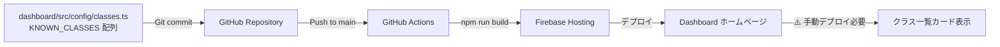

# Dashboard クラス表示機能 - 完全ガイド

**作成日**: 2025-11-18
**対象**: Carewell Dashboard のクラス表示機能
**目的**: 2つの異なるクラス表示機能の違いと更新方法を明確化

---

## 📋 目次

1. [概要](#概要)
2. [2つの異なるクラス表示機能](#2つの異なるクラス表示機能)
3. [データフロー](#データフロー)
4. [更新方法](#更新方法)
5. [FAQ](#faq)
6. [トラブルシューティング](#トラブルシューティング)

---

## 概要

Dashboard には**2つの異なるクラス表示機能**があります。それぞれ**データソースと更新方法が異なる**ため、混同しないよう注意が必要です。

| 機能 | データソース | 自動更新 | 更新方法 |
|------|------------|---------|---------|
| **A. ホームページのクラス一覧カード** | `KNOWN_CLASSES` 配列（ハードコード） | ❌ | コード編集 → デプロイ |
| **B. 学生詳細・グループページ** | Firestore `students.class_name` | ✅ | API実行のみ |

> 📌 本ドキュメントのコード例は当時の状態のスナップショット（一部クラスは省略）です。実際の現在値は `dashboard/src/config/classes.ts` を参照してください（2026-08-26時点で令和8年度・№01〜10の10クラス）。

---

## 2つの異なるクラス表示機能

### A. ホームページのクラス一覧カード（`/`）

**URL**: https://carewell-automation.web.app/

**表示内容**:
```
令和8年度 デジタル中核人材養成研修 №01 →
令和8年度 デジタル中核人材養成研修 №02 →
令和8年度 デジタル中核人材養成研修 №03 →
...
```

**データソース**:
- ファイル: `dashboard/src/config/classes.ts`
- 配列: `KNOWN_CLASSES`
- **ハードコード**されている

**コード例**:
```typescript
export const KNOWN_CLASSES = [
  '令和8年度 デジタル中核人材養成研修 №01',
  '令和8年度 デジタル中核人材養成研修 №02',
  '令和8年度 デジタル中核人材養成研修 №03',
  '令和8年度 デジタル中核人材養成研修 №04',
  '令和8年度 デジタル中核人材養成研修 №05',
  '令和8年度 デジタル中核人材養成研修 №08',
  '令和8年度 デジタル中核人材養成研修 №09',
];
```

**特徴**:
- ✅ **利点**: 高速表示（Firestore クエリ不要）
- ❌ **欠点**: 新クラス追加時にコード変更 → デプロイが必要
- ⚠️ **重要**: `/admin/sync-students-from-sheets` を実行しても**自動更新されない**

---

### B. 学生詳細・グループページのクラス表示

**URL 例**:
- 学生詳細: https://carewell-automation.web.app/students/N0102490
- グループ一覧: https://carewell-automation.web.app/class/令和8年度%20デジタル中核人材養成研修%20№05/groups

**表示内容**:
- 学生詳細ページ: 「クラス: No5」
- グループページ: URL パラメータからクラス名を取得 → 学生リストを表示

**データソース**:
- Firestore: `students/{student_id}.class_name`
- リアルタイムリスナー（`onSnapshot`）による自動更新

**特徴**:
- ✅ **利点**: `/admin/sync-students-from-sheets` 実行で即座に反映
- ✅ **利点**: Google Sheets が唯一の真実の情報源（Single Source of Truth）
- ❌ **欠点**: Firestore クエリが必要（わずかな読み取りコスト）

---

## データフロー

### フロー1: 学生データ同期（自動反映）✅

```mermaid
graph LR
    A[Google Sheets<br/>統合_受講者リスト<br/>K列: クラス] -->|POST /admin/sync-students-from-sheets| B[Backend API]
    B -->|SheetsService.get_student_data| C[A:K列読み取り]
    C -->|FirestoreService.create_student| D[Firestore<br/>students/{student_id}]
    D -->|class_name フィールド| E[Firestore に保存]
    E -->|リアルタイムリスナー<br/>onSnapshot| F[Dashboard]
    F --> G[学生詳細ページ]
    F --> H[グループページ]
    G -->|✅ 自動反映| I[クラス情報表示]
    H -->|✅ 自動反映| J[学生リスト表示]
```

**実行コマンド**:
```bash
TOKEN=$(gcloud auth print-identity-token)
curl -X POST \
  "https://carewell-file-collector-imczapxkba-an.a.run.app/admin/sync-students-from-sheets" \
  -H "Authorization: Bearer $TOKEN" \
  -H "Content-Type: application/json"
```

**所要時間**: 約30秒～1分

---

### フロー2: ホームページのクラス一覧カード（手動更新）⚠️



**実行手順**:
1. `dashboard/src/config/classes.ts` を編集
2. `git add` → `git commit` → `git push`
3. GitHub Actions で自動ビルド・デプロイ
4. Dashboard で確認（ハードリフレッシュ推奨）

**所要時間**: 約5～10分（GitHub Actions の実行時間）

---

## 更新方法

### シナリオ1: 新しいクラス（例: №10）を追加する

#### ステップ1: Google Sheets を更新

1. スプレッドシート `1AQ12-h3n_NmN2kWxi4Z_g354X0wmUyMKAPeAsXJwu_w` を開く
2. 「統合_受講者リスト」シートに移動
3. 新しい学生の K 列に `No10` を入力

#### ステップ2: Firestore に同期（学生詳細・グループページ用）

```bash
# 認証トークン取得
TOKEN=$(gcloud auth print-identity-token)

# API 実行
curl -X POST \
  "https://carewell-file-collector-imczapxkba-an.a.run.app/admin/sync-students-from-sheets" \
  -H "Authorization: Bearer $TOKEN" \
  -H "Content-Type: application/json"

# 成功レスポンス
# {
#   "status": "success",
#   "students_synced": 1156,
#   "students_created": 1,
#   "students_updated": 1155,
#   "errors": []
# }
```

**この時点で反映される場所**:
- ✅ 学生詳細ページ（例: https://carewell-automation.web.app/students/N9999999）
- ✅ グループページ（例: https://carewell-automation.web.app/class/...№10/groups）

**まだ反映されない場所**:
- ❌ ホームページのクラス一覧カード

---

#### ステップ3: Dashboard ホームページに追加（クラス一覧カード用）

**ファイル**: `dashboard/src/config/classes.ts`

**変更内容**:
```typescript
export const KNOWN_CLASSES = [
  '令和8年度 デジタル中核人材養成研修 №01',
  '令和8年度 デジタル中核人材養成研修 №02',
  '令和8年度 デジタル中核人材養成研修 №03',
  '令和8年度 デジタル中核人材養成研修 №04',
  '令和8年度 デジタル中核人材養成研修 №05',
  '令和8年度 デジタル中核人材養成研修 №08',
  '令和8年度 デジタル中核人材養成研修 №09',
  '令和8年度 デジタル中核人材養成研修 №10',  // ← 追加
];

export const CLASS_NAME_MAPPING: Record<string, string> = {
  '令和8年度 デジタル中核人材養成研修 №01': 'No1',
  '令和8年度 デジタル中核人材養成研修 №02': 'No2',
  '令和8年度 デジタル中核人材養成研修 №03': 'No3',
  '令和8年度 デジタル中核人材養成研修 №04': 'No4',
  '令和8年度 デジタル中核人材養成研修 №05': 'No5',
  '令和8年度 デジタル中核人材養成研修 №08': 'No8',
  '令和8年度 デジタル中核人材養成研修 №09': 'No9',
  '令和8年度 デジタル中核人材養成研修 №10': 'No10',  // ← 追加
};
```

**デプロイ**:
```bash
git add dashboard/src/config/classes.ts
git commit -m "feat: Add class №10 to dashboard class list"
git push origin main
```

**確認**:
- GitHub Actions: https://github.com/yasushi-honda/carewell-gcp-drive-automation/actions
- デプロイ完了後、Dashboard を開く: https://carewell-automation.web.app/
- ハードリフレッシュ（Cmd+Shift+R / Ctrl+Shift+R）

---

### シナリオ2: 既存学生のクラスを変更する

#### ステップ1: Google Sheets を更新

1. K 列の値を変更（例: `No5` → `No8`）

#### ステップ2: Firestore に同期

```bash
TOKEN=$(gcloud auth print-identity-token)
curl -X POST \
  "https://carewell-file-collector-imczapxkba-an.a.run.app/admin/sync-students-from-sheets" \
  -H "Authorization: Bearer $TOKEN" \
  -H "Content-Type: application/json"
```

**この操作で完了**:
- ✅ 学生詳細ページに即座に反映
- ✅ グループページに即座に反映
- ✅ ホームページのクラス一覧カードは影響なし（既存クラスなので変更不要）

---

## FAQ

### Q1: `/admin/sync-students-from-sheets` を実行したら、Dashboard のホームページに新しいクラスが表示されますか？

**A**: **いいえ、表示されません。**

- ✅ **学生詳細ページ**: 自動的に反映されます
- ✅ **グループページ**: 自動的に反映されます
- ❌ **ホームページのクラス一覧カード**: 手動でコード更新 → デプロイが必要です

**理由**:
Firebase Web SDK では Firestore の `listCollections()` が使用できないため、クラス名リストをフロントエンドでハードコード管理しています。

---

### Q2: 新しいクラス（例: №10）を Dashboard ホームページに追加するには？

**A**: 以下の手順が必要です：

1. `dashboard/src/config/classes.ts` の `KNOWN_CLASSES` と `CLASS_NAME_MAPPING` に追加
2. `git commit` → `git push`
3. GitHub Actions で自動デプロイ（約5～10分）
4. Dashboard で確認（ハードリフレッシュ推奨）

詳細は [更新方法 - シナリオ1](#シナリオ1-新しいクラス例-10-を追加する) を参照。

---

### Q3: `/admin/sync-students-from-sheets` は何度実行しても安全ですか？

**A**: **はい、安全です。**

- `merge=True` による差分更新（既存フィールドは保持）
- 冪等性があり、何度実行しても同じ結果
- 手動で追加したカスタムフィールドは削除されない

詳細は `docs/class-name-feature-implementation.md` を参照。

---

### Q4: Google Sheets から学生を削除したら、Firestore からも削除されますか？

**A**: **いいえ、削除されません。**

- Firestore のドキュメントはそのまま残ります
- `status` フィールドも `"active"` のまま

**削除したい場合**:
- 手動で Firestore Console から削除
- または `status` を `"inactive"` に変更

---

### Q5: 将来的に自動化できますか？

**A**: **はい、検討中です。**

**Phase 2 の改善案**:
1. **Cloud Scheduler による定期同期**:
   - 毎日深夜に `/admin/sync-students-from-sheets` を自動実行
   - 学生データを常に最新化

2. **Firestore `/metadata/classes` での動的管理**:
   - API 実行時にクラス名リストを Firestore に保存
   - Dashboard が Firestore から動的に取得
   - コード変更不要で新クラス追加可能

詳細は `docs/STUDENT_SYNC_AUTOMATION_PLAN.md` を参照（今後作成予定）。

---

## トラブルシューティング

### 問題1: Dashboard に新しいクラスが表示されない

**症状**:
- `/admin/sync-students-from-sheets` を実行した
- 学生詳細ページには表示される
- ホームページのクラス一覧カードには表示されない

**原因**:
- `KNOWN_CLASSES` 配列が更新されていない

**解決策**:
1. `dashboard/src/config/classes.ts` を編集
2. `KNOWN_CLASSES` と `CLASS_NAME_MAPPING` に新クラスを追加
3. Git commit → Push → GitHub Actions でデプロイ

---

### 問題2: API 実行後も学生詳細ページに反映されない

**症状**:
- `/admin/sync-students-from-sheets` を実行した
- 学生詳細ページのクラス情報が古いまま

**原因**:
1. API が失敗している
2. Google Sheets のデータが誤っている
3. ブラウザキャッシュが古い

**解決策**:

1. **API レスポンス確認**:
   ```bash
   curl -X POST "..." -H "..." | jq
   # "status": "success" を確認
   ```

2. **Cloud Run ログ確認**:
   ```bash
   gcloud logging read "resource.type=cloud_run_revision AND
     resource.labels.service_name=carewell-file-collector AND
     textPayload=~\"Created/updated student\"" --limit=10
   ```

3. **Firestore Console で確認**:
   - https://console.firebase.google.com/project/carewell-automation/firestore
   - `students/{student_id}` の `class_name` フィールドを確認

4. **ブラウザキャッシュクリア**:
   - ハードリフレッシュ（Cmd+Shift+R / Ctrl+Shift+R）
   - または DevTools → Application → Clear storage

---

### 問題3: GitHub Actions デプロイが失敗する

**症状**:
- `git push` 後、GitHub Actions が失敗

**確認事項**:
1. **Actions ログ確認**: https://github.com/yasushi-honda/carewell-gcp-drive-automation/actions
2. **文法エラー**: TypeScript エラーがないか確認
3. **Firebase 認証**: Secrets が正しく設定されているか

**解決策**:
- Actions ログのエラーメッセージを確認
- 必要に応じて `dashboard/` ディレクトリで `npm run build` をローカル実行（テスト目的）

---

## 参考資料

### 関連ドキュメント

- **プロジェクト概要**: `docs/QUICKSTART.md`
- **クラス名実装詳細**: `docs/class-name-feature-implementation.md`
- **Firestore スキーマ**: `docs/firestore-schema-improvement-implementation.md`
- **トラブルシューティング**: `docs/troubleshooting.md`

### 関連コード

**Backend**:
- `src/sheets_service.py` - Google Sheets 読み取り
- `src/firestore_service.py` - Firestore 保存
- `src/main.py` - `/admin/sync-students-from-sheets` エンドポイント

**Frontend**:
- `dashboard/src/config/classes.ts` - クラス名マスターリスト
- `dashboard/src/views/ClassListView.vue` - ホームページ
- `dashboard/src/views/StudentDetailView.vue` - 学生詳細ページ
- `dashboard/src/views/GroupListView.vue` - グループページ

### API エンドポイント

- **URL**: `https://carewell-file-collector-imczapxkba-an.a.run.app/admin/sync-students-from-sheets`
- **メソッド**: POST
- **認証**: Bearer トークン（`gcloud auth print-identity-token`）

---

## まとめ

Dashboard のクラス表示機能は**2つの異なる実装**があります：

| 機能 | データソース | 更新方法 | 自動反映 |
|------|------------|---------|---------|
| **ホームページのクラス一覧カード** | `KNOWN_CLASSES` ハードコード | コード編集 → デプロイ | ❌ |
| **学生詳細・グループページ** | Firestore `students.class_name` | API 実行のみ | ✅ |

**重要ポイント**:
- ✅ `/admin/sync-students-from-sheets` で学生データは自動反映
- ⚠️ ホームページのクラス一覧カードは手動更新が必要
- 🎯 Phase 2 で完全自動化を検討中

---

**ドキュメント作成日**: 2025-11-18
**最終更新日**: 2025-11-18
**作成者**: Claude Code AI Agent
