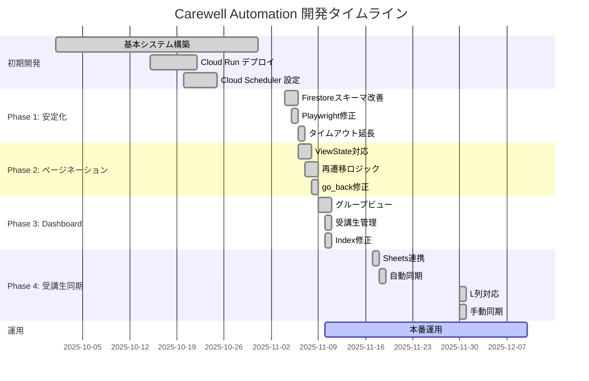
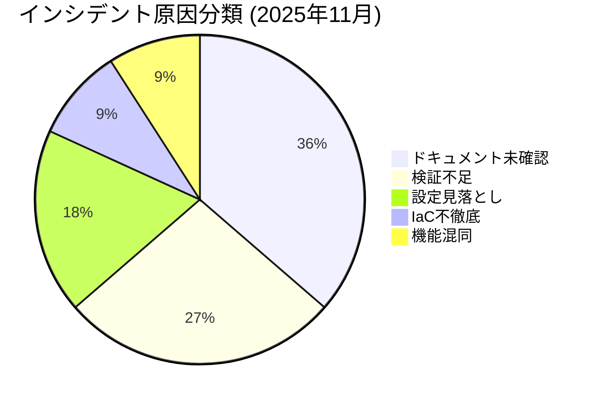

# プロジェクトタイムライン

**Carewell File Automation System 開発・運用履歴**

---

## 📊 全体タイムライン



---

## 📅 詳細履歴

### 2025年11月30日

#### 実装内容
- **L列「無効」チェックボックス対応**
  - Google Sheets の L列をステータスフィールドにマッピング
  - TRUE → `status: "inactive"`, FALSE/空 → `status: "active"`

- **Backfill 改善**
  - 全ファイルの非正規化データを常に更新（スキップ条件削除）
  - Cloud Scheduler リクエストボディに `{"backfill": true}` 追加

- **Dashboard 手動同期ボタン**
  - 管理者としてログイン（Firebase Authentication、Issue #12で `?admin=true` から移行）している場合のみ表示
  - スピナーアニメーション付きローディング
  - トースト通知による成功/失敗表示

#### コミット
```
991feec feat: Add L column (無効) checkbox support for student logical deletion
1761b53 feat: Enable automatic backfill of all files during student sync
2a0d67b feat(dashboard): Add manual sync button for admin mode
```

---

### 2025年11月18日

#### 実装内容
- **Cloud Scheduler 自動同期ジョブ**
  - `carewell-student-sync-daily` 作成
  - 毎日 JST 02:00 実行
  - OIDC 認証設定

#### 成果
- Google Sheets → Firestore の自動同期実現
- 運用負荷の大幅削減

---

### 2025年11月17日

#### 実装内容
- **Google Sheets 連携**
  - `sheets_service.py` 作成
  - A:K列の学生データ読み取り
  - `/admin/sync-students-from-sheets` エンドポイント追加

---

### 2025年11月10日

#### インシデント: Firestore Index Missing
- **原因**: 手動で作成したIndexがデプロイ時に削除された
- **影響**: 25分タイムアウト
- **解決**: `firestore.indexes.json` にIndex定義を追加

#### 実装内容
- **Dashboard 管理者機能**
  - ステータス切り替えボタン
  - 管理者モードのsessionStorage保持

#### 教訓
> 「手動インフラ変更は必ずコードに記録（IaC徹底）」

---

### 2025年11月9日

#### 実装内容
- **Dashboard Phase 2: グループビュー**
  - グループ一覧表示
  - グループ別受講生フィルタリング
  - 受講生テーブル拡張（通し番号、勤務先）

---

### 2025年11月8日

#### インシデント: Phase 1 go_back Skip Bug
- **原因**: `page.go_back()` タイムアウトで例外発生、再遷移ロジックに到達せず
- **影響**: Page 2+ の学生約50%が失敗
- **解決**: try-except で囲み、タイムアウトでも再遷移を実行

#### 教訓
> 「必須処理をスキップせず、タイムアウト短縮で最適化」

---

### 2025年11月7日

#### 実装内容
- **ページネーション再遷移ロジック**
  - Page 2+ で再遷移を実装
  - ViewState 問題の回避

---

### 2025年11月6日

#### インシデント: Cloud Run Timeout
- **原因**: Cloud Scheduler (15分) と Cloud Run (60分) のタイムアウト不整合
- **影響**: 200件処理が15分でタイムアウト
- **解決**: Scheduler を 25分 (1500秒) に延長

#### インシデント: Pagination URL Update Delay
- **原因**: ASP.NET の ViewState/EventValidation によるページ遷移問題
- **影響**: Page 2+ でページ遷移失敗
- **解決**: ページ番号の明示的な検証とリトライロジック

---

### 2025年11月5日

#### インシデント: Schema Migration & Playwright Fix
- **問題1**: Database名 `(default)` を使用 → `carewell-native` に修正
- **問題2**: iframe コンテキストエラー → フレーム更新処理を追加
- **問題3**: Playwright 無効なAPI使用 → auto-waiting を活用

#### 教訓
> 「コーディング前に必ずドキュメント/仕様を確認」

---

### 2025年11月4日

#### 実装内容
- **Firestore スキーマ改善**
  - 新パス: `submissions/{class}/tasks/{task}/files/`
  - 親ドキュメントに `file_count` 追加
  - Atomic increment によるカウント管理

---

## 📈 インシデント統計



### 原因別インシデント

| パターン | 件数 | インシデント例 |
|---------|------|--------------|
| ドキュメント未確認 | 4 | #1, #4, #10, #12 |
| 検証不足 | 3 | #9, #10, #11 |
| 設定見落とし | 2 | #7, #8 |
| IaC不徹底 | 1 | #13 |
| 機能混同 | 1 | #14 |

---

## 🎯 マイルストーン達成状況

### 完了済み ✅

| マイルストーン | 達成日 | 成果 |
|--------------|-------|------|
| 基本システム稼働 | 2025-10-25 | ファイル自動収集開始 |
| Firestore スキーマ確定 | 2025-11-04 | 正式パス構造採用 |
| ページネーション完全対応 | 2025-11-08 | 200件/2ページ 処理成功 |
| Dashboard Phase 2 | 2025-11-10 | グループビュー機能 |
| 受講生自動同期 | 2025-11-18 | 毎日自動更新 |
| 論理削除対応 | 2025-11-30 | L列チェックボックス連携 |

### 進行中 🔄

| マイルストーン | 予定 | 状況 |
|--------------|------|------|
| 本番安定運用 | 継続 | 毎日自動実行中 |

### 今後の予定 📋

| マイルストーン | 予定 | 内容 |
|--------------|------|------|
| Dashboard 認証 | Phase 2 | Firebase Authentication 統合 |
| 通知機能 | 検討中 | Slack/Email 連携 |

---

## 📊 システム稼働統計

### Cloud Scheduler 実行状況

| ジョブ種別 | 数 | 頻度 | 状態 |
|-----------|---|------|------|
| ファイル収集 | 14 | 毎時 :00, :30 | ✅ 稼働中 |
| 学生同期 | 1 | 毎日 02:00 | ✅ 稼働中 |

### 処理実績 (№01 課題①)

| 指標 | 値 |
|------|-----|
| 総レポート数 | 200件 |
| ページ数 | 2ページ |
| 処理時間 | 約19分 |
| 成功率 | 100% (修正後) |

---

## 🔗 関連ドキュメント

- [インデックス](index.md) - プロジェクトポータル
- [QUICKSTART.md](QUICKSTART.md) - クイックスタート
- [common-mistakes.md](common-mistakes.md) - 過去インシデント詳細
- [troubleshooting.md](troubleshooting.md) - トラブルシューティング

---

**最終更新**: 2025-11-30
**メンテナー**: Claude Code AI Agent
