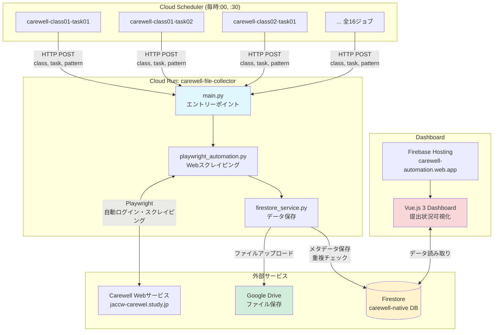
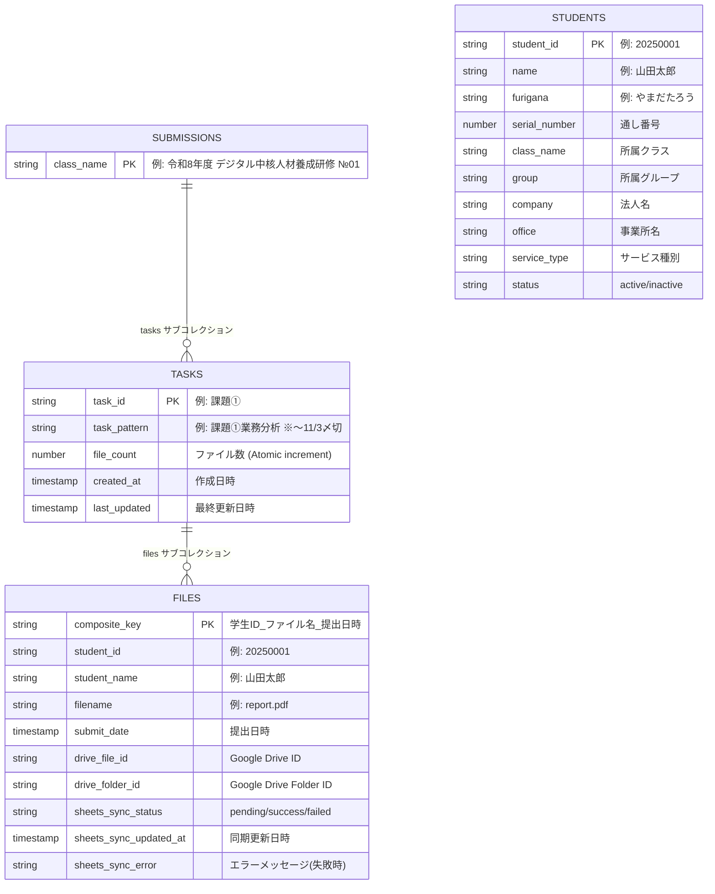

# 🚀 Carewell Automation - クイックスタート

**新しいAIエージェントへ：このファイルを最初に読んでください（所要時間: 5分）**

---

## 📋 目次

1. [システム概要（30秒）](#システム概要)
2. [システムアーキテクチャ（2分）](#システムアーキテクチャ)
3. [Firestore スキーマ（1分）](#firestore-スキーマ)
4. [必読ドキュメント（1分）](#必読ドキュメント)
5. [重要な設定値（30秒）](#重要な設定値)
6. [次のステップ](#次のステップ)

---

## システム概要

**Carewell File Automation System**

Carewell Webサービスから学生の提出ファイルを自動取得し、Google Driveに保存、Firestoreにメタデータを記録するシステム。講師向けDashboardで提出状況を可視化。

### 主要コンポーネント

- **Backend**: Cloud Run (Playwright + Python)
- **Storage**: Google Drive (ファイル) + Firestore (メタデータ)
- **Frontend**: Firebase Hosting (Vue.js 3 Dashboard)
- **Scheduler**: Cloud Scheduler (毎時:00と:30に自動実行)

### 基本スペック

- **クラス数**: 令和7年度は8クラス (№01, 02, 03, 04, 05, 08, 09, 10)。令和8年度は10クラス (№06・07追加) を計画中、詳細は`docs/SERVICE_SHUTDOWN_AND_RESUME.md`参照
- **課題数**: 各クラス2課題 (課題①, 課題②)
- **実行頻度**: 毎時:00と:30 (30分間隔)
- **対象URL**: https://jaccw-carewel.study.jp/

### Dashboard Phase 2機能（2025-11-10追加）

**グループビュー・受講生管理強化**:
- グループ一覧表示: 課題ごとのグループ統計（受講生数）
- グループ別受講生一覧: 特定グループの受講生をフィルタ表示
- 受講生テーブル拡張: 通し番号、勤務先カラム、ソート機能
- UI用語統一: 全UI表示を「学生」→「受講生」に統一

**新規ユーザーフロー**:
```
クラス一覧 → 課題一覧 → [👥 受講生一覧] → グループ一覧 → グループ別受講生一覧
```

### Sheets同期信頼性向上（2025-01-28追加）

**Google Sheets 書き込みリトライ機能**:

- **リトライロジック**: 指数バックオフ (1秒, 2秒, 4秒) で最大3回リトライ
- **同期ステータス追跡**: Firestoreドキュメントに `sheets_sync_status` フィールド追加
  - `pending`: 初期状態
  - `success`: Sheets書き込み成功
  - `failed`: 全リトライ失敗
- **整合性チェックスクリプト**: `scripts/check_all_spreadsheets_consistency.py`

**データフロー**:
```
ファイル取得 → Firestore保存 (sheets_sync_status: pending)
    ↓
Sheets書き込み試行 (最大3回リトライ)
    ↓
成功 → sheets_sync_status: success
失敗 → sheets_sync_status: failed + エラーメッセージ保存
```

### 受講生同期機能（2025-11-30追加）

**Google Sheets ↔ Firestore 自動同期**:

- **自動同期**: 毎日 JST 02:00 に `carewell-student-sync-daily` ジョブが実行
- **手動同期**: Dashboard 管理者モード (`?admin=true`) で「データ同期」ボタン
- **論理削除**: Google Sheets L列「無効」チェックボックス → `status: "inactive"`
- **Backfill**: 受講生データ変更時、全ファイルの非正規化データも自動更新

**データフロー**:
```
Google Sheets (統合_受講者リスト)
    ↓ 毎日 JST 02:00 / 手動同期
Firestore students/ コレクション
    ↓ Backfill
Firestore files/ 内の非正規化データ
```

詳細: [docs/STUDENT_SYNC_FEATURE_HANDOVER.md](STUDENT_SYNC_FEATURE_HANDOVER.md)

---

## システムアーキテクチャ

### 全体構成図



### 処理フロー（1実行あたり）

1. **Cloud Scheduler** が HTTP POST でトリガー
2. **Cloud Run** がCarewell Webにログイン
3. **Playwright** で提出リストページをスクレイピング
4. **Firestore** で重複チェック (composite_key)
5. 新規ファイルのみダウンロード → **Google Drive** 保存
6. **Firestore** にメタデータ保存 (親ドキュメントの `file_count` をIncrement)
7. **Dashboard** がFirestoreから読み取り表示

---

## Firestore スキーマ

### データ構造（ER図）



**Phase 2追加**: `students` コレクションを使用したグループビュー機能

### パス構造

**✅ 正しいスキーマ** (公式仕様):
```
submissions/{class_name}/tasks/{task_id}/files/{composite_key}
```

**❌ 旧スキーマ** (使用禁止):
```
{class_name}/{task_id}/documents/{composite_key}
```

### 重要な親ドキュメント

パス: `submissions/{class_name}/tasks/{task_id}`

**必須フィールド**:
- `task_id`: 課題ID (例: "課題①")
- `task_pattern`: 課題表示名 (例: "課題①業務分析　※～11/3〆切")
- `file_count`: ファイル数 (Atomic increment使用)
- `created_at`: 作成日時
- `last_updated`: 最終更新日時

---

## 必読ドキュメント

### 🚨 最優先（絶対に読む）

1. **CLAUDE.md Lines 11-42**: CRITICAL セクション
   - インシデント対応の必須手順
   - 「ドキュメント確認ファースト」の原則

2. **CLAUDE.md Lines 224-308**: Common Mistakes
   - 過去の5つの重大インシデント
   - 具体的なコード例と教訓

3. **このファイル**: 重要な設定値（次セクション）

### 📚 次に読むべきドキュメント

4. **docs/architecture-overview.md**: 詳細アーキテクチャ
5. **docs/troubleshooting.md**: トラブルシューティング
6. **.serena/memories/incident_response_lessons.md**: 教訓とチェックリスト

### 📖 設計仕様（必要時）

7. **.kiro/steering/firestore-critical-config.md**: Firestore公式仕様
8. **.kiro/steering/dashboard-workflow.md**: Dashboard開発ルール
9. **.kiro/specs/**: 各機能の詳細設計

---

## 重要な設定値

### 🔴 絶対に変更禁止

#### Firestore Database
```
carewell-native  # NEVER use (default)
```

**理由**: プロジェクト設計の根幹。全環境で統一必須。

#### Collection Path
```
submissions/{class_name}/tasks/{task_id}/files/{composite_key}
```

**理由**: Backend と Dashboard が同じパスを使用。変更すると整合性が崩れる。

#### 必須パラメータ（record_upload()）

```python
# MUST pass all parameters
record_upload(
    class_name="令和8年度...",
    task_id="課題①",
    task_pattern="課題①業務分析 ※～11/3〆切",  # ⚠️ よく忘れられる
    student_name="...",
    student_id="...",
    filename="...",
    drive_file_id="...",
    drive_folder_id="...",
    submit_date="..."
)
```

**よくある間違い**: `task_pattern` を渡し忘れ → `task_id` がデフォルト値になる

### 🟡 重要な設定（変更時は要注意）

#### Cloud Scheduler Deadline
```
25分 (1500秒)
```

**背景**: 以前は15分でタイムアウト頻発。Phase 1-6で段階的に改善し25分に延長。

#### Playwright Timeout
```
60秒 (テーブル描画待機)
```

**背景**: Phase 5で30秒→60秒に延長してタイムアウト率改善。

---

## 次のステップ

### ✅ クイックスタート完了後

1. **詳細理解**: `docs/architecture-overview.md` を読む
2. **トラブル対応準備**: `docs/troubleshooting.md` を読む
3. **過去インシデント学習**: `docs/incident-2025-11-05-schema-migration-and-playwright-fix.md`

### 🛠️ 実際の作業開始前

**必須チェックリスト**:
- [ ] CLAUDE.md CRITICAL セクション確認
- [ ] CLAUDE.md Common Mistakes 確認
- [ ] Memory files 確認 (incident_response_lessons)
- [ ] 設計ドキュメント（Steering Document）確認
- [ ] 過去の類似インシデント検索

**忘れるな**: 「ちゃんとドキュメントをみてから行動してください」

---

## 重要なコマンド

### Cloud Run ログ確認（最優先）
```bash
gcloud logging read "resource.type=cloud_run_revision AND
  resource.labels.service_name=carewell-file-collector" \
  --limit 50 --format json
```

### Cloud Scheduler 状態確認
```bash
gcloud scheduler jobs describe JOB_NAME \
  --location=asia-northeast1 \
  --format="value(state,lastAttemptTime,status.code)"
```

### Dashboard 確認
```
https://carewell-automation.web.app/
```

---

## 🆘 問題発生時

**最初にやること**:
1. ❌ **すぐにコード修正しない**
2. ✅ **CLAUDE.md を読む**
3. ✅ **過去の類似事例を検索**
4. ✅ **現状を記録（スナップショット）**
5. ✅ **段階的に対応**

詳細: `docs/troubleshooting.md`

---

## 📞 サポート

- **設計仕様**: `.kiro/steering/` ディレクトリ
- **過去インシデント**: `docs/incident-*.md`
- **教訓**: `.serena/memories/incident_response_lessons.md`
- **コマンド集**: `.serena/memories/suggested_commands.md`

---

**最終更新**: 2025/01/28
**バージョン**: 1.2
**メンテナー**: Claude Code
