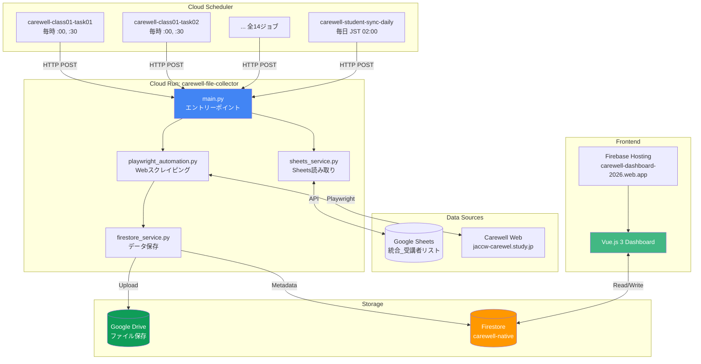
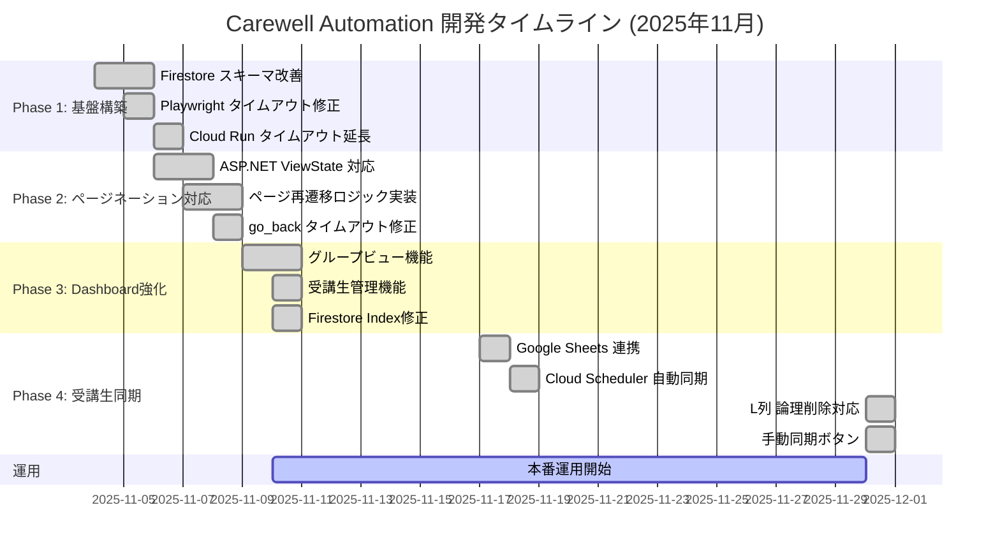
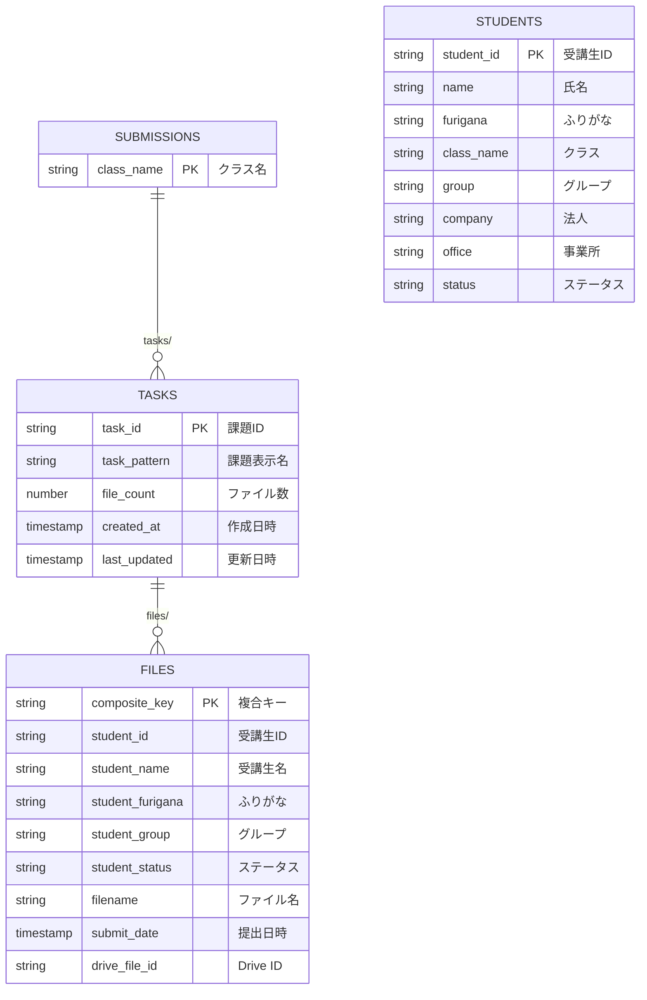

# Carewell Automation Project

**プロジェクト全体の実績・経緯・システム構成をまとめたポータルページ**

---

## 📋 プロジェクト概要

### システム名
**Carewell File Automation System**

### 目的
Carewell Webサービスから学生の提出ファイルを自動取得し、Google Driveに保存、Firestoreにメタデータを記録。講師向けDashboardで提出状況を可視化。

### 主要URL
| サービス | URL |
|---------|-----|
| **Dashboard**（令和8年度） | https://carewell-dashboard-2026.web.app/ |
| **Dashboard (管理者)** | https://carewell-dashboard-2026.web.app/?admin=true |
| **Dashboard（令和7年度・凍結アーカイブ）** | https://carewell-automation.web.app/（今後デプロイしない） |
| **GitHub** | https://github.com/yasushi-honda/carewell-gcp-drive-automation |
| **Cloud Run** | carewell-file-collector (asia-northeast1) |

---

## 📊 システム構成図



---

## 📅 プロジェクトタイムライン

### 2025年11月 主要マイルストーン



### 開発履歴サマリー

| 日付 | マイルストーン | 主な成果 |
|------|--------------|---------|
| **2025-11-04** | Firestore スキーマ改善 | `submissions/{class}/tasks/{task}/files/` 構造採用 |
| **2025-11-05** | Playwright 修正 | iframe コンテキスト問題解決、タイムアウト改善 |
| **2025-11-06** | Cloud Run 最適化 | タイムアウト 15分→25分、ページネーション対応開始 |
| **2025-11-07** | ページ再遷移 | ASP.NET ViewState 対応、Page 2+ 処理成功 |
| **2025-11-08** | go_back 修正 | try-except でタイムアウト耐性強化 |
| **2025-11-09** | Dashboard Phase 2 | グループビュー、受講生管理機能追加 |
| **2025-11-10** | Index 修正 | Firestore Index IaC 徹底、25分タイムアウト解消 |
| **2025-11-17** | 受講生同期 | Google Sheets → Firestore 自動同期 |
| **2025-11-18** | 自動化完成 | Cloud Scheduler による毎日自動同期 |
| **2025-11-30** | L列対応 | 論理削除機能、手動同期ボタン追加 |

---

## 📁 ドキュメント一覧

### クイックスタート
- [QUICKSTART.md](QUICKSTART.md) - 新規AIエージェント向け5分ガイド
- [QUICKSTART_FOR_NEW_AI.md](QUICKSTART_FOR_NEW_AI.md) - AI向け詳細オンボーディング

### 機能引き継ぎ
- [STUDENT_SYNC_FEATURE_HANDOVER.md](STUDENT_SYNC_FEATURE_HANDOVER.md) - 受講生同期機能（図表付き）
- [STUDENT_SYNC_AUTOMATION_HANDOVER.md](STUDENT_SYNC_AUTOMATION_HANDOVER.md) - 自動同期設定ガイド
- [DASHBOARD_CLASS_DISPLAY.md](DASHBOARD_CLASS_DISPLAY.md) - Dashboard クラス表示機能

### トラブルシューティング
- [troubleshooting.md](troubleshooting.md) - 問題解決フローチャート
- [common-mistakes.md](common-mistakes.md) - 過去13の重大インシデント記録
- [EMERGENCY_RESPONSE.md](EMERGENCY_RESPONSE.md) - 緊急対応ガイド

### 設計・アーキテクチャ
- [architecture-overview.md](architecture-overview.md) - システム詳細アーキテクチャ
- [design.md](design.md) - 設計方針

### インシデント記録
- [incident-2025-11-05-schema-migration-and-playwright-fix.md](incident-2025-11-05-schema-migration-and-playwright-fix.md)
- [incident-2025-11-06-cloud-run-timeout.md](incident-2025-11-06-cloud-run-timeout.md)
- [incident-2025-11-06-pagination-url-update-delay.md](incident-2025-11-06-pagination-url-update-delay.md)
- [incident-2025-11-08-phase1-go-back-skip-bug.md](incident-2025-11-08-phase1-go-back-skip-bug.md)
- [incident-2025-11-10-firestore-index-missing.md](incident-2025-11-10-firestore-index-missing.md)

---

## 🗂️ Firestore スキーマ



### コレクションパス

```
submissions/
  └── {class_name}/
      └── tasks/
          └── {task_id}/              ← 親ドキュメント (file_count等)
              └── files/
                  └── {composite_key}  ← ファイルメタデータ

students/
  └── {student_id}/                    ← 受講生マスター
```

---

## ⚙️ Cloud Scheduler ジョブ一覧

### ファイル収集ジョブ (令和7年度時点16ジョブ、令和8年度は10クラス計画で20ジョブへ拡大予定。2026-04-03以降は全ジョブPAUSED、詳細は`docs/SERVICE_SHUTDOWN_AND_RESUME.md`)

| ジョブ名 | スケジュール | 対象 |
|---------|-------------|------|
| carewell-class01-task01 | 毎時 :00, :30 | №01 課題① |
| carewell-class01-task02 | 毎時 :00, :30 | №01 課題② |
| carewell-class02-task01 | 毎時 :00, :30 | №02 課題① |
| carewell-class02-task02 | 毎時 :00, :30 | №02 課題② |
| ... | ... | ... |

### 学生同期ジョブ

| ジョブ名 | スケジュール | 機能 |
|---------|-------------|------|
| carewell-student-sync-daily | 毎日 JST 02:00 | Google Sheets → Firestore 同期 + Backfill |

---

## 📈 システム規模

### データ規模 (2025-11-07時点)

| クラス | 課題 | レポート数 | ページ数 | 処理時間 |
|-------|------|-----------|---------|---------|
| №01 | 課題① | 200件 | 2ページ | 約19分 |
| その他 | 各課題 | 100-200件 | 1-2ページ | 10-20分 |

### クラス構成

- **クラス数**: 令和7年度は8クラス (№01, 02, 03, 04, 05, 08, 09, 10)。令和8年度は10クラス (№06・07追加) を計画中
- **課題数**: 各クラス2課題 (課題①, 課題②)
- **受講生総数**: 1,923名

---

## 🔧 技術スタック

### Backend
- **言語**: Python 3.11
- **Webスクレイピング**: Playwright 1.40.0
- **コンテナ**: Docker (python:3.11-bookworm)
- **実行環境**: Cloud Run (2nd Gen)

### Frontend
- **フレームワーク**: Vue.js 3 + TypeScript
- **UIフレームワーク**: Tailwind CSS
- **ホスティング**: Firebase Hosting

### Infrastructure
- **データベース**: Firestore (carewell-native)
- **ファイルストレージ**: Google Drive
- **スケジューラ**: Cloud Scheduler
- **CI/CD**: GitHub Actions + Workload Identity Federation
- **シークレット管理**: Secret Manager

---

## 📞 連絡先・サポート

### ドキュメント参照先
- **設計仕様**: `.kiro/steering/` ディレクトリ
- **過去インシデント**: `docs/incident-*.md`
- **教訓**: `.serena/memories/`

### 重要な確認コマンド

```bash
# Cloud Run ログ確認
gcloud logging read "resource.type=cloud_run_revision AND
  resource.labels.service_name=carewell-file-collector" --limit 50

# Cloud Scheduler 状態確認
gcloud scheduler jobs list --location=asia-northeast1

# 手動同期実行
curl -X POST "https://carewell-file-collector-imczapxkba-an.a.run.app/admin/sync-students-from-sheets" \
  -H "Authorization: Bearer $(gcloud auth print-identity-token)" \
  -H "Content-Type: application/json" \
  -d '{"backfill": true}'
```

---

**最終更新**: 2025-11-30
**メンテナー**: Claude Code AI Agent
