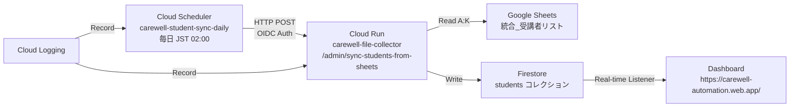

# Student Sync Automation 引き継ぎドキュメント

**実装完了日**: 2025-11-18
**実装者**: Claude Code AI Agent
**ステータス**: ✅ 本番運用中

---

## 📋 概要

Google Sheets の学生データを毎日自動的に Firestore に同期する Cloud Scheduler Job を実装しました。

### 同期の仕組み

1. **Phase 1: 学生マスター同期** - Google Sheets → `students/` コレクション
2. **Phase 2: ファイル Backfill** - `students/` → `files/` 内の非正規化データ更新

これにより、**学生マスターの変更（氏名、グループ、ステータス等）が過去・現在・未来の全ファイルに反映**されます。

### 自動化の効果

| 項目 | 従来（手動） | 現在（自動） |
|------|------------|------------|
| **同期頻度** | 不定期（手動実行） | 毎日 JST 02:00 |
| **運用負荷** | 高（手動実行必要） | 低（自動実行） |
| **データ鮮度** | 低（同期忘れあり） | 高（毎日自動更新） |
| **監視** | 手動確認 | Cloud Logging 自動記録 |

---

## 🎯 実装内容

### Cloud Scheduler Job

**Job 名**: `carewell-student-sync-daily`

**スケジュール**: `0 17 * * *` （UTC 17:00 = JST 02:00）

**実行頻度**: 毎日

**エンドポイント**: `POST https://carewell-file-collector-imczapxkba-an.a.run.app/admin/sync-students-from-sheets`

**リクエストボディ**: `{"backfill": true}`

**認証**: OIDC (`carewell-automation-sa@carewell-automation.iam.gserviceaccount.com`)

**タイムアウト**: 180秒（3分）

**リトライ設定**:
- 最大リトライ回数: 3回
- 最小バックオフ: 10秒
- 最大バックオフ: 300秒

---

## ✅ 検証結果

### API 動作確認（2025-11-18 12:03 実施）

| 検証項目 | 結果 | 詳細 |
|---------|------|------|
| API 実行成功 | ✅ PASS | HTTP 200, status: success |
| 冪等性 | ✅ PASS | 2回目実行で students_created: 0 |
| データ保護 | ✅ PASS | merge=True による差分更新 |
| 実行時間 | ✅ PASS | 約50秒（タイムアウト180秒以内） |

詳細: [docs/STUDENT_SYNC_VERIFICATION_2025_11_18.md](STUDENT_SYNC_VERIFICATION_2025_11_18.md)

---

### Cloud Scheduler テスト実行（2025-11-18 12:19 実施）

✅ **成功**

**ログ確認**:
```
2025-11-18 12:19:28 - main - INFO - Request: POST /admin/sync-students-from-sheets
```

**結果**: Cloud Scheduler から Cloud Run への実行が正常に完了

---

## 🔧 設定詳細

### Service Account 権限

**Service Account**: `carewell-automation-sa@carewell-automation.iam.gserviceaccount.com`

**付与された権限**:
1. **Cloud Run Invoker** (`roles/run.invoker`)
   - 対象: `carewell-file-collector` Cloud Run サービス
   - 目的: Cloud Scheduler から API を呼び出す

2. **Service Account User** (`roles/iam.serviceAccountUser`)
   - 対象: `system@jaccw.or.jp`
   - 目的: Cloud Scheduler Job 作成時に Service Account を使用する

**設定コマンド**:
```bash
# Cloud Run Invoker 権限
gcloud run services add-iam-policy-binding carewell-file-collector \
  --region=asia-northeast1 \
  --member="serviceAccount:carewell-automation-sa@carewell-automation.iam.gserviceaccount.com" \
  --role="roles/run.invoker"

# Service Account User 権限
gcloud iam service-accounts add-iam-policy-binding \
  carewell-automation-sa@carewell-automation.iam.gserviceaccount.com \
  --member="user:system@jaccw.or.jp" \
  --role="roles/iam.serviceAccountUser"
```

---

### Cloud Scheduler Job 設定

**作成コマンド**:
```bash
gcloud scheduler jobs create http carewell-student-sync-daily \
  --location=asia-northeast1 \
  --schedule="0 17 * * *" \
  --time-zone="UTC" \
  --uri="https://carewell-file-collector-imczapxkba-an.a.run.app/admin/sync-students-from-sheets" \
  --http-method=POST \
  --oidc-service-account-email="carewell-automation-sa@carewell-automation.iam.gserviceaccount.com" \
  --headers="Content-Type=application/json" \
  --attempt-deadline=180s \
  --max-retry-attempts=3 \
  --min-backoff=10s \
  --max-backoff=300s \
  --max-doublings=5
```

**確認コマンド**:
```bash
gcloud scheduler jobs describe carewell-student-sync-daily --location=asia-northeast1
```

---

## 📊 監視方法

### 日次監視（推奨）

**Cloud Scheduler ログ確認**:
```bash
gcloud logging read "resource.type=cloud_scheduler_job AND
  resource.labels.job_id=carewell-student-sync-daily" \
  --limit=10 \
  --freshness=1d
```

**確認項目**:
- ✅ Job 実行時刻が JST 02:00 頃であること
- ✅ HTTP Status Code が 200 であること
- ✅ エラーがないこと

---

**Cloud Run ログ確認**:
```bash
gcloud logging read "resource.type=cloud_run_revision AND
  resource.labels.service_name=carewell-file-collector AND
  textPayload=~\"sync-students-from-sheets\"" \
  --limit=20 \
  --freshness=1d
```

**確認項目**:
- ✅ `status: "success"` が記録されていること
- ✅ `students_synced` の数が妥当であること（約1,400件）
- ✅ `errors: []` （エラーが0件）であること

---

### 週次監視（推奨）

**Dashboard 確認**:
1. https://carewell-automation.web.app/ を開く
2. 学生一覧ページで学生数を確認
3. 学生詳細ページでクラス情報を確認

**Firestore Console 確認**:
1. https://console.firebase.google.com/project/carewell-automation/firestore を開く
2. `students` コレクションのドキュメント数を確認
3. 任意のドキュメントの `last_updated` フィールドが最新であることを確認

---

## 🔴 トラブルシューティング

### 問題1: Cloud Scheduler Job が失敗する

**症状**:
- Cloud Logging に `Job execution failed` が記録される

**確認手順**:

1. **Cloud Scheduler ログ確認**:
   ```bash
   gcloud logging read "resource.type=cloud_scheduler_job AND
     resource.labels.job_id=carewell-student-sync-daily AND
     severity>=ERROR" --limit=10
   ```

2. **Cloud Run ログ確認**:
   ```bash
   gcloud logging read "resource.type=cloud_run_revision AND
     resource.labels.service_name=carewell-file-collector AND
     severity>=ERROR" --limit=20
   ```

3. **手動実行で確認**:
   ```bash
   TOKEN=$(gcloud auth print-identity-token)
   curl -X POST \
     "https://carewell-file-collector-imczapxkba-an.a.run.app/admin/sync-students-from-sheets" \
     -H "Authorization: Bearer $TOKEN" \
     -H "Content-Type: application/json"
   ```

**考えられる原因**:
- Google Sheets の読み取りエラー
- Firestore への書き込みエラー
- タイムアウト（180秒超過）
- Service Account の権限不足

---

### 問題2: 学生データが反映されない

**症状**:
- Job は成功するが、Dashboard に新しいデータが表示されない

**確認手順**:

1. **Google Sheets 確認**:
   - スプレッドシート `1AQ12-h3n_NmN2kWxi4Z_g354X0wmUyMKAPeAsXJwu_w` を開く
   - 「統合_受講者リスト」シートにデータが存在するか確認

2. **Firestore 確認**:
   - Firestore Console で `students` コレクションを確認
   - `last_updated` フィールドが最新のタイムスタンプか確認

3. **Dashboard リフレッシュ**:
   - ハードリフレッシュ（Cmd+Shift+R / Ctrl+Shift+R）

---

### 問題3: Cloud Scheduler Job を一時停止したい

**一時停止**:
```bash
gcloud scheduler jobs pause carewell-student-sync-daily --location=asia-northeast1
```

**再開**:
```bash
gcloud scheduler jobs resume carewell-student-sync-daily --location=asia-northeast1
```

**削除**（注意: 完全に削除されます）:
```bash
gcloud scheduler jobs delete carewell-student-sync-daily --location=asia-northeast1
```

---

## 🛠️ 運用ガイド

### 新しいクラスを追加する場合

**手順**:

1. **Google Sheets を更新**:
   - スプレッドシート `1AQ12-h3n_NmN2kWxi4Z_g354X0wmUyMKAPeAsXJwu_w` を開く
   - 「統合_受講者リスト」シートの K 列に新しいクラス名を入力（例: `No10`）

2. **自動同期を待つ** (次回の JST 02:00)
   - または手動実行:
     ```bash
     TOKEN=$(gcloud auth print-identity-token)
     curl -X POST \
       "https://carewell-file-collector-imczapxkba-an.a.run.app/admin/sync-students-from-sheets" \
       -H "Authorization: Bearer $TOKEN" \
       -H "Content-Type: application/json"
     ```

3. **Dashboard ホームページを更新**（クラス一覧カードに表示する場合）:
   - `dashboard/src/config/classes.ts` を編集
   - `KNOWN_CLASSES` 配列に新しいクラスを追加
   - `CLASS_NAME_MAPPING` にもマッピングを追加
   - Git commit → Push → GitHub Actions で自動デプロイ

詳細: [docs/DASHBOARD_CLASS_DISPLAY.md](DASHBOARD_CLASS_DISPLAY.md)

---

### 受講生を無効化する場合（論理削除）

**手順**:

1. **Google Sheets を更新**:
   - スプレッドシート `1AQ12-h3n_NmN2kWxi4Z_g354X0wmUyMKAPeAsXJwu_w` を開く
   - 「統合_受講者リスト」シートの L 列「無効」のチェックボックスにチェックを入れる

2. **自動同期を待つ** (次回の JST 02:00)
   - または手動実行で即座に反映

3. **結果**:
   - Firestore `students/{student_id}` の `status` フィールドが `"inactive"` に更新される
   - Dashboard では引き続き表示される（フィルタリングは別途実装が必要）

**注意事項**:

- L列がチェックされている = `status: "inactive"`
- L列がチェックされていない（または空） = `status: "active"`
- レコードを削除してもFirestoreからは削除されない（論理削除のみ対応）

---

### 誤ったデータを同期してしまった場合

**ロールバック手順**:

1. **Google Sheets を修正**:
   - 誤ったデータを正しいデータに修正

2. **手動で即座に再同期**:
   ```bash
   TOKEN=$(gcloud auth print-identity-token)
   curl -X POST \
     "https://carewell-file-collector-imczapxkba-an.a.run.app/admin/sync-students-from-sheets" \
     -H "Authorization: Bearer $TOKEN" \
     -H "Content-Type: application/json"
   ```

3. **Dashboard で確認**:
   - 正しいデータが反映されていることを確認

**安全性の保証**:
- `merge=True` により、既存フィールドは保持される
- 手動で追加したカスタムフィールドは削除されない

---

## 📚 関連ドキュメント

### 実装関連

- **検証記録**: `docs/STUDENT_SYNC_VERIFICATION_2025_11_18.md`
- **自動化計画**: `docs/STUDENT_SYNC_AUTOMATION_PLAN.md`
- **Dashboard クラス表示**: `docs/DASHBOARD_CLASS_DISPLAY.md`
- **クラス名実装**: `docs/class-name-feature-implementation.md`

### API 関連

- **エンドポイント**: `POST /admin/sync-students-from-sheets`
- **実装ファイル**: `src/main.py` (Line 470-520)
- **Firestore Service**: `src/firestore_service.py` (Line 456-494)
- **Sheets Service**: `src/sheets_service.py` (Line 238-340)

---

## 🎓 教訓

### 実装時の学び

1. **Service Account の確認**:
   - Cloud Scheduler のデフォルト Service Account が自動作成されない場合がある
   - 既存の Service Account (`carewell-automation-sa`) を使用することで解決

2. **権限付与の順序**:
   - Service Account → Cloud Run Invoker 権限
   - User → Service Account User 権限
   - この順序で権限を付与する必要がある

3. **テスト実行の重要性**:
   - `gcloud scheduler jobs run` で手動トリガーしてテスト
   - Cloud Logging で実行結果を確認

---

## 📊 システム構成図



---

## ✅ まとめ

### 実装完了事項

✅ **Cloud Scheduler Job 作成**:
- Job 名: `carewell-student-sync-daily`
- スケジュール: 毎日 JST 02:00
- 認証: OIDC (carewell-automation-sa)
- タイムアウト: 180秒
- リトライ: 最大3回

✅ **検証完了**:
- API 動作確認: ✅
- 冪等性確認: ✅
- データ保護確認: ✅
- 実行時間確認: ✅（50秒 < 180秒）

✅ **テスト実行成功**:
- 手動トリガーで正常実行を確認
- Cloud Logging で実行ログを確認

---

### 運用開始

**ステータス**: ✅ **本番運用中**

**次回実行**: 2025-11-18 17:00 UTC（2025-11-19 02:00 JST）

**監視方法**:
- 日次: Cloud Logging で実行ログを確認
- 週次: Dashboard と Firestore Console で データを確認

---

**実装完了日**: 2025-11-18
**実装者**: Claude Code AI Agent
**レビュー**: 推奨
