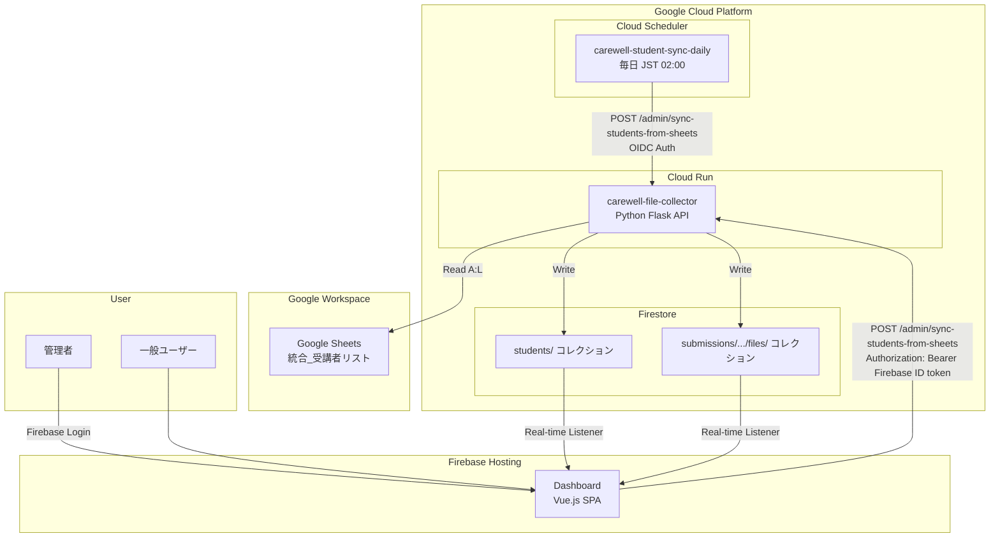
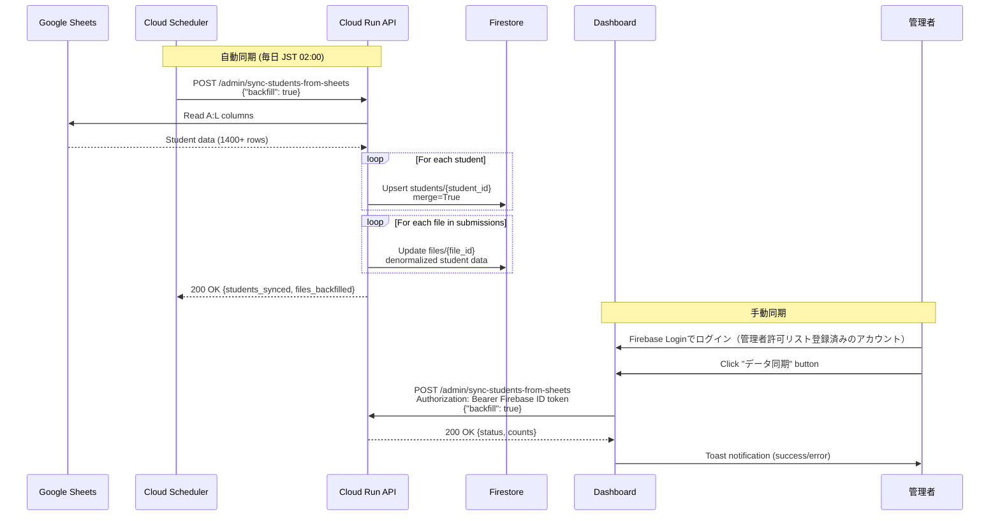
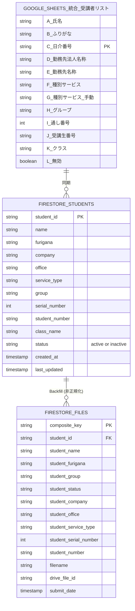
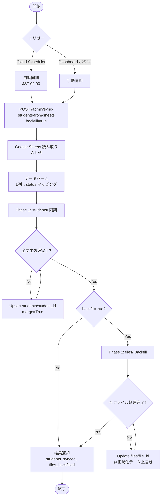
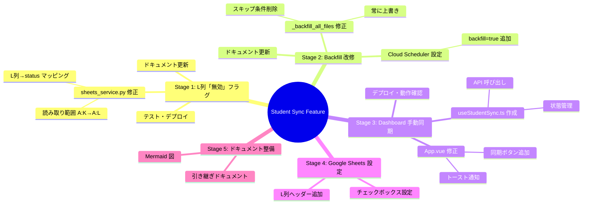
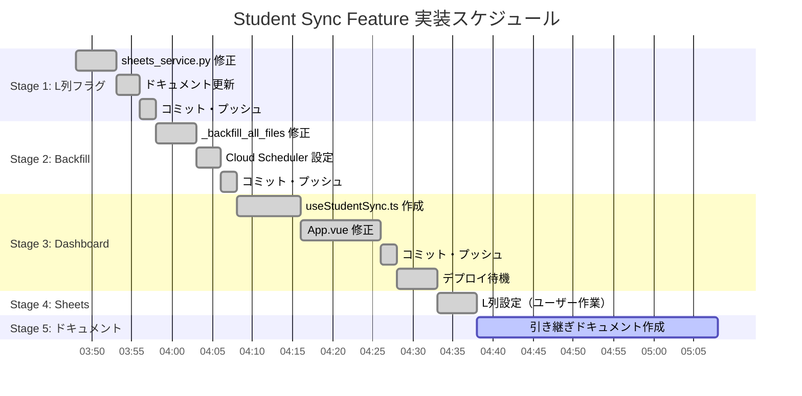

# Student Sync Feature 完全引き継ぎドキュメント

**作成日**: 2025-11-30
**作成者**: Claude Code AI Agent
**対象**: 新規AIエージェント・開発者向け

---

## 目次

1. [機能概要](#機能概要)
2. [システム構成図](#システム構成図)
3. [データフロー図](#データフロー図)
4. [ER図（データ設計）](#er図データ設計)
5. [実装詳細](#実装詳細)
6. [Cloud Scheduler 設定](#cloud-scheduler-設定)
7. [Dashboard 手動同期機能](#dashboard-手動同期機能)
8. [Google Sheets 設定](#google-sheets-設定)
9. [処理フロー図](#処理フロー図)
10. [WBS（作業分解図）](#wbs作業分解図)
11. [ガントチャート](#ガントチャート)
12. [トラブルシューティング](#トラブルシューティング)
13. [改修・拡張ガイド](#改修拡張ガイド)

---

## 機能概要

### 目的

Google Sheets の学生マスターデータを Firestore に同期し、全ての提出ファイルに最新の学生情報を反映する。

### 主要機能

| 機能 | 説明 |
|------|------|
| **学生マスター同期** | Google Sheets → Firestore `students/` コレクション |
| **ファイル Backfill** | `students/` → `files/` 内の非正規化データ更新 |
| **論理削除** | L列「無効」チェックボックスで `status: "inactive"` に設定 |
| **手動同期** | Dashboard 管理者モードから即座に同期実行 |
| **自動同期** | Cloud Scheduler で毎日 JST 02:00 に自動実行 |

### 影響範囲

```
Google Sheets (統合_受講者リスト)
    ↓ 同期
Firestore students/ コレクション
    ↓ Backfill
Firestore files/ コレクション (全クラス・全課題)
    ↓ リアルタイム反映
Dashboard (https://carewell-automation.web.app/)
```

---

## システム構成図



---

## データフロー図



---

## ER図（データ設計）



### フィールドマッピング

| Google Sheets 列 | Firestore students/ フィールド | 備考 |
|-----------------|------------------------------|------|
| A: 氏名 | `name` | |
| B: ふりがな | `furigana` | |
| C: 日介番号 | `student_id` (ドキュメントID) | Primary Key |
| D: 勤務先法人名称 | `company` | |
| E: 勤務先名称 | `office` | |
| F: 種別サービス | `service_type` | G列が空の場合に使用 |
| G: 種別サービス（手動） | `service_type` | 優先使用 |
| H: グループ | `group` | デフォルト: "未分類" |
| I: 通し番号 | `serial_number` | int型 |
| J: 受講生番号 | `student_number` | |
| K: クラス | `class_name` | |
| L: 無効 | `status` | TRUE→"inactive", FALSE/空→"active" |

---

## 実装詳細

### ファイル構成

```
src/
├── main.py                    # API エンドポイント定義
│   ├── sync_students_from_sheets()  # Line 443-504
│   ├── _sync_students()             # Line 506-603
│   └── _backfill_all_files()        # Line 605-725
├── sheets_service.py          # Google Sheets 読み取り
│   └── get_student_data()           # Line 234-342
└── firestore_service.py       # Firestore 書き込み
    ├── create_student()             # Line 456-494
    └── get_all_students()           # Line 496-520

dashboard/src/
├── App.vue                    # 同期ボタン・トースト通知
└── composables/
    └── useStudentSync.ts      # API 呼び出し composable
```

### 主要コード解説

#### 1. L列「無効」フラグの処理 (`sheets_service.py`)

```python
# Line 299-302
# Check L列「無効」flag (checkbox returns "TRUE" or "FALSE" as string)
is_inactive = (
    row[11].strip().upper() == "TRUE" if row[11] else False
)

# Line 310
"status": "inactive" if is_inactive else "active",  # L列に基づく
```

#### 2. Backfill 処理 (`main.py`)

```python
# Line 679-691 - 常に上書き（スキップ条件なし）
update_data = {
    "student_furigana": student.get("furigana", ""),
    "student_group": student.get("group", "未分類"),
    "student_status": student.get("status", "active"),
    "student_company": student.get("company", ""),
    "student_office": student.get("office", ""),
    "student_service_type": student.get("service_type", ""),
    "student_serial_number": student.get("serial_number", 0),
    "student_number": student.get("student_number", ""),
}
file_doc.reference.update(update_data)
```

#### 3. Dashboard 同期ボタン (`App.vue`)

```vue
<button
  v-if="isAdmin"
  @click="handleSync"
  :disabled="syncing"
>
  <!-- スピナー or 同期アイコン -->
  {{ syncing ? '同期中...' : 'データ同期' }}
</button>
```

---

## Cloud Scheduler 設定

### Job 詳細

| 項目 | 値 |
|------|-----|
| **Job 名** | `carewell-student-sync-daily` |
| **スケジュール** | `0 17 * * *` (UTC) = JST 02:00 |
| **リージョン** | `asia-northeast1` |
| **HTTP メソッド** | `POST` |
| **URL** | `https://carewell-file-collector-imczapxkba-an.a.run.app/admin/sync-students-from-sheets` |
| **リクエストボディ** | `{"backfill": true}` |
| **認証** | OIDC Token |
| **サービスアカウント** | `carewell-automation-sa@carewell-automation.iam.gserviceaccount.com` |
| **タイムアウト** | 180秒 |
| **リトライ** | 最大3回、バックオフ 10-300秒 |

### 確認コマンド

```bash
# Job 設定確認
gcloud scheduler jobs describe carewell-student-sync-daily --location=asia-northeast1

# 手動実行
gcloud scheduler jobs run carewell-student-sync-daily --location=asia-northeast1

# 一時停止
gcloud scheduler jobs pause carewell-student-sync-daily --location=asia-northeast1

# 再開
gcloud scheduler jobs resume carewell-student-sync-daily --location=asia-northeast1
```

---

## Dashboard 手動同期機能

### アクセス方法

```
https://carewell-dashboard-2026.web.app/
```

右上の「ログイン」ボタンから、`admins` コレクションに登録済みの Google アカウントでログインする（Issue #12、詳細は [docs/admin-authentication.md](admin-authentication.md) 参照）。

### 機能詳細

| 項目 | 説明 |
|------|------|
| **表示条件** | Firebase Authentication でログイン済み、かつ管理者許可リスト（`admins` コレクション）に登録済み |
| **ボタン位置** | ヘッダー右上（ナビゲーションの左） |
| **ボタン色** | 緑色 (`bg-green-600`) |
| **処理中表示** | スピナーアニメーション + 「同期中...」テキスト |
| **完了通知** | トースト通知（右上、5秒後自動消去） |

### API 呼び出し

```typescript
// dashboard/src/composables/useStudentSync.ts
const SYNC_API_URL =
  'https://carewell-file-collector-imczapxkba-an.a.run.app/admin/sync-students-from-sheets';

const response = await fetch(SYNC_API_URL, {
  method: 'POST',
  headers: { 'Content-Type': 'application/json' },
  body: JSON.stringify({ backfill: true }),
});
```

### 注意事項

- Cloud Run サービスは **public** に設定されている（認証不要）
- Dashboard からの呼び出しは管理者モードでのみ可能（UI 制限）
- 同期処理には 30秒〜2分程度かかる

---

## Google Sheets 設定

### スプレッドシート情報

| 項目 | 値 |
|------|-----|
| **スプレッドシートID** | `1AQ12-h3n_NmN2kWxi4Z_g354X0wmUyMKAPeAsXJwu_w` |
| **シート名** | `統合_受講者リスト` |
| **読み取り範囲** | `A:L` |
| **データ開始行** | 2行目（1行目はヘッダー） |

### L列「無効」チェックボックス設定

1. L1 セルに `無効` と入力（ヘッダー）
2. L2:L2000 を選択
3. データ → データの入力規則 → チェックボックス
4. 保存

### 動作

| L列の状態 | Firestore `status` |
|----------|-------------------|
| ✓ (TRUE) | `"inactive"` |
| 空 / チェックなし (FALSE) | `"active"` |

---

## 処理フロー図



---

## WBS（作業分解図）



---

## ガントチャート



---

## トラブルシューティング

### 問題1: 同期ボタンが表示されない

**原因**: 管理者としてログインしていない、または管理者許可リストに未登録

**解決**:
1. 管理者として許可された Google アカウントでログインしているか確認
2. `admins` コレクションにそのメールアドレスが登録されているか確認（`python scripts/seed_admins.py --list`）
3. ブラウザの DevTools Console/Network で 401/403 エラーが出ていないか確認

### 問題2: 同期エラー「Failed to fetch」

**原因**: Cloud Run サービスがダウンまたはネットワークエラー

**解決**:
```bash
# Cloud Run サービス状態確認
gcloud run services describe carewell-file-collector --region=asia-northeast1

# ログ確認
gcloud logging read "resource.type=cloud_run_revision AND
  resource.labels.service_name=carewell-file-collector" --limit=20
```

### 問題3: L列のチェックが反映されない

**原因**:
- Google Sheets の L列が正しく設定されていない
- 同期が実行されていない

**解決**:
1. Google Sheets で L列のデータ検証がチェックボックスになっているか確認
2. Dashboard から手動同期を実行
3. Firestore Console で `students/{student_id}` の `status` フィールドを確認

### 問題4: Backfill が遅い

**原因**: ファイル数が多い（数千件）

**対応**:
- Cloud Scheduler のタイムアウトを延長（現在180秒）
- 必要に応じてバッチ処理に改修

---

## 改修・拡張ガイド

### 新しいフィールドを追加する場合

1. **Google Sheets** に列を追加
2. **sheets_service.py** の `get_student_data()` を修正
   - 読み取り範囲を拡張
   - `student_data` dict にフィールド追加
3. **firestore_service.py** の `create_student()` を修正（必要に応じて）
4. **main.py** の `_backfill_all_files()` を修正
   - `update_data` dict にフィールド追加

### 同期頻度を変更する場合

```bash
# 例: 6時間ごとに変更
gcloud scheduler jobs update http carewell-student-sync-daily \
  --location=asia-northeast1 \
  --schedule="0 */6 * * *"
```

### Dashboard にフィルタリング機能を追加する場合

1. `useStudents.ts` で `status` フィールドによるフィルタリングを実装
2. UI にトグルスイッチを追加（「無効な受講生を表示」）

### 物理削除を実装する場合

**注意**: 現在は論理削除のみ。物理削除は慎重に検討が必要。

1. **Google Sheets** から削除されたレコードを検出するロジックを追加
2. **Firestore** から対応するドキュメントを削除
3. **関連する `files/` ドキュメント**の処理を検討

---

## 関連ドキュメント

- [STUDENT_SYNC_AUTOMATION_HANDOVER.md](STUDENT_SYNC_AUTOMATION_HANDOVER.md) - 運用ガイド
- [DASHBOARD_CLASS_DISPLAY.md](DASHBOARD_CLASS_DISPLAY.md) - Dashboard クラス表示
- [QUICKSTART.md](QUICKSTART.md) - システム概要

---

## 変更履歴

| 日付 | 変更内容 | 担当 |
|------|---------|------|
| 2025-11-18 | 初期実装（Cloud Scheduler 自動同期） | Claude Code |
| 2025-11-30 | L列「無効」フラグ対応 | Claude Code |
| 2025-11-30 | Backfill 常時実行対応 | Claude Code |
| 2025-11-30 | Dashboard 手動同期ボタン追加 | Claude Code |
| 2025-11-30 | 本ドキュメント作成 | Claude Code |

---

**作成完了日**: 2025-11-30
**レビュー**: 推奨
