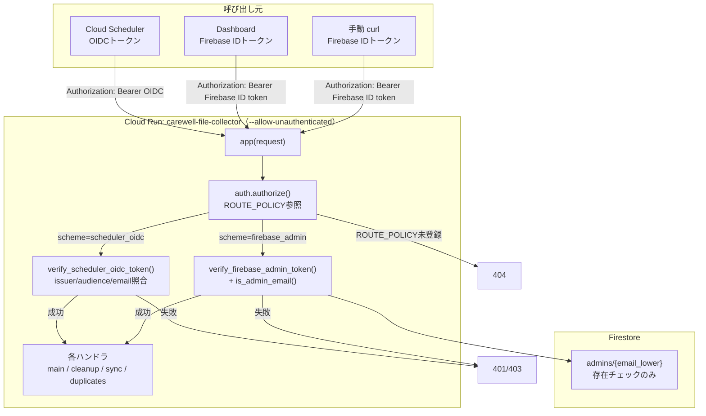

# 管理者認証アーキテクチャ（Issue #12）

## 背景

以前は Cloud Run (`carewell-file-collector`) の管理エンドポイント（`/cleanup`, `/admin/sync-students-from-sheets`, `/admin/duplicate-students`）と Firestore `students` コレクションの書き込みが無認証で誰でも実行できた。README には「認証トークン必須」と記載されていたが実態と乖離しており、PR #11 のセカンドオピニオンレビューで発見され Issue #12（P1）として起票された。本ドキュメントは、その修正として実装した認証アーキテクチャをまとめる。

閲覧系（Dashboard の提出状況表示・ファイル一覧、`students`/`submissions` の read）は認証で塞いでいない。ファイル本体のアクセス管理は Google Drive 側の責務とする decision-maker の運用方針に合わせ、**書き込み・削除操作のみを保護対象**にしている。

## なぜ Cloud Run から `--allow-unauthenticated` を外さないか

Firebase Authentication が発行する ID トークンは、Cloud Run の IAM（Google アカウントベースの認証）では検証できない。`--allow-unauthenticated` を外すと Dashboard（ブラウザ）からのリクエストが一切通らなくなり、同期ボタン・重複学生一覧が機能停止する。

代わりに、`src/main.py` の `app(request)` という単一のディスパッチ点に**アプリケーション層の認証ゲート**（`src/auth.py`）を置き、リクエストごとに検証する。

## アーキテクチャ図



## エンドポイント別の認証要求

| パス | メソッド | 呼び出し元 | 要求する認証 |
|---|---|---|---|
| `/` | POST | Cloud Scheduler（ファイル収集ジョブ、現在全PAUSED） | Google OIDC（Scheduler用サービスアカウント限定） |
| `/admin/sync-students-from-sheets` | POST | Cloud Scheduler（`student-sync-daily`）または Dashboard | OIDC **または** Firebase ID トークン＋管理者許可 |
| `/admin/duplicate-students` | GET | Dashboard | Firebase ID トークン＋管理者許可 |
| `/cleanup` | POST | 手動運用（curl） | Firebase ID トークン＋管理者許可 |
| `/health` | GET | 監視 | 不要 |
| `OPTIONS *` | - | CORS preflight | 不要（応答のみ） |

`ROUTE_POLICY`（`src/auth.py`）に登録されていないパスは自動的に 404（default-deny）。

## 管理者許可リストの管理（Firestore `admins` コレクション）

管理者かどうかは Firestore の `admins/{email.lower()}` ドキュメントの**存在チェックのみ**で判定する（値の中身は見ない）。真実の源は Firestore の1箇所のみで、バックエンド（`is_admin_email()`）・Firestore ルール（`isAdmin()`）・フロントエンド（`useAuth().checkAdmin()`）が同じロジックを参照する。

権限剥奪の即時性（`admins` から削除すれば次リクエストで即403）を優先し、Cloud Run 環境変数やコード内定数は使わない（本リポジトリは public のため、実メールアドレスを git 履歴や CI 設定に残さないため）。

### `scripts/seed_admins.py` の使い方

**実メールアドレスは本ドキュメント・リポジトリのどこにもハードコードしない。** 実行時に `--email` または `--file` で指定する。デフォルトは dry-run。

```bash
# 一覧確認
python scripts/seed_admins.py --list

# 追加（dry-run、実際には書き込まない）
python scripts/seed_admins.py --add --email admin@example.com

# 追加（本実行）
DRY_RUN=false python scripts/seed_admins.py --add --email admin@example.com

# 複数まとめて追加（scripts/admins.local.json、gitignore対象）
DRY_RUN=false python scripts/seed_admins.py --add --file scripts/admins.local.json

# 削除（確認プロンプトあり）
DRY_RUN=false python scripts/seed_admins.py --remove --email admin@example.com
```

`FirestoreService` を再利用しており、`carewell-native` データベースへ明示的に書き込む（`(default)` DB に投入すると全管理者が拒否される既知の罠を回避）。

## `/cleanup` を手動実行する場合のトークン取得手順

`/cleanup` は Dashboard の UI からは呼ばれず、運用上は curl での手動実行を想定している。Firebase ID トークンの取得は以下の手順で行う（有効期限は約1時間）:

1. 管理者アカウントで Dashboard (`https://carewell-dashboard-2026.web.app/`) にログイン
2. ブラウザの DevTools Console を開き、以下を実行してトークンを取得

   ```js
   await firebase.auth().currentUser.getIdToken()
   ```

   （Dashboard がグローバル `firebase` を露出していない場合は、`useAuth` 経由の一時的なデバッグヘルパーを使うか、`getAuth().currentUser.getIdToken()` を直接呼ぶ）

3. 取得したトークンで curl 実行

   ```bash
   curl -X POST \
     -H "Authorization: Bearer <取得したIDトークン>" \
     https://carewell-file-collector-imczapxkba-an.a.run.app/cleanup
   ```

## Firestore セキュリティルールとの関係

`dashboard/firestore.rules` の `isAdmin()` 関数は上記と同じ `admins/{email.lower()}` の存在チェックを行う。`students` の `update`（`status`/`last_updated` フィールドのみ）は管理者ログイン必須、`create`/`delete` は誰にも許可しない。`admins` コレクション自体への書き込みは Admin SDK 経由（`seed_admins.py`）のみで、クライアントからの `write` は常に拒否する。ルールのテストは `tests/rules/`（`npm install && npm run test:rules`）で実行できる。

## decision-maker が行う作業（コード変更では自動化できない部分）

1. **Firebase Authentication 有効化**: Firebase Console で Google Sign-In プロバイダを有効化（サポートメール設定が必要なため Console 操作必須）
2. **認可済みドメイン追加**: Firebase Console > Authentication > Settings > Authorized domains に `carewell-dashboard-2026.web.app` を追加
3. **管理者メールアドレスの投入**: 自分＋運営メンバーの Google アカウントメールを確定後、`scripts/seed_admins.py --add` で投入

## ルート直下の `firebase.json` について（スコープ外）

リポジトリルート直下の `firebase.json` は `firestore.rules` を参照しておらず（`database` キーもない）、本 Issue のスコープでは触っていない。実際にデプロイに使われているのは `dashboard/firebase.json` である。
