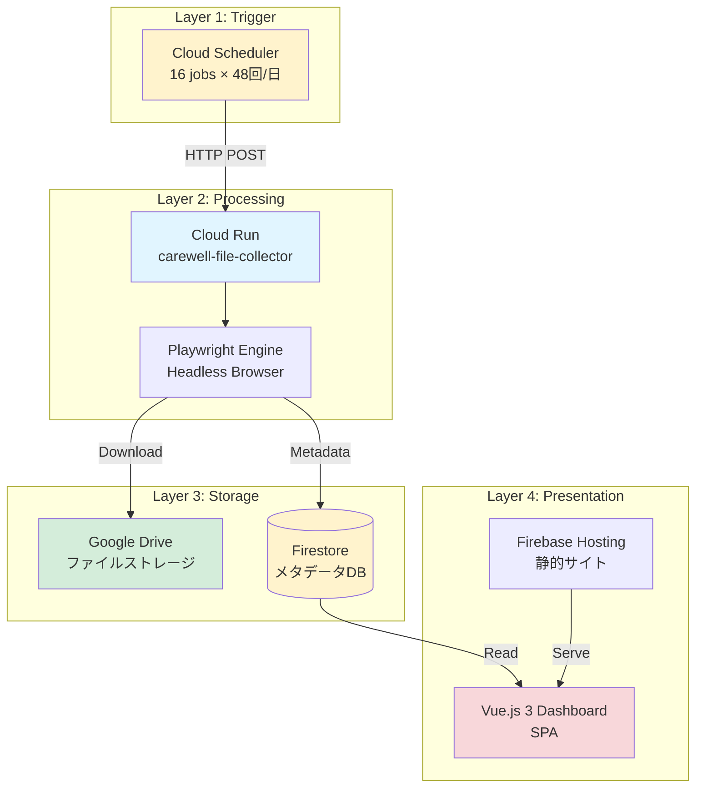
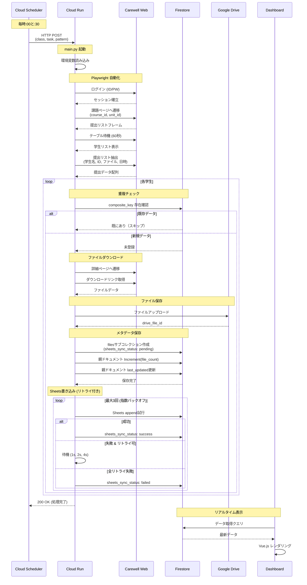
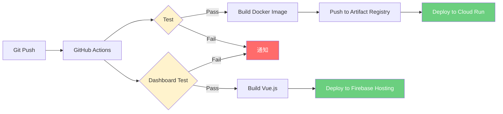

# 🏗️ Carewell Automation - アーキテクチャ概要

**詳細なシステムアーキテクチャと技術仕様**

---

## 📋 目次

1. [システム全体像](#システム全体像)
2. [コンポーネント詳細](#コンポーネント詳細)
3. [データフロー](#データフロー)
4. [技術スタック](#技術スタック)
5. [デプロイメント](#デプロイメント)
6. [セキュリティ](#セキュリティ)

---

## システム全体像

### レイヤー構成



### 実行フロー

**毎時:00と:30に自動実行** (令和7年度時点で合計 16ジョブ × 48回/日 = 768回/日。令和8年度は10クラス計画で20ジョブへ拡大予定、詳細は`docs/SERVICE_SHUTDOWN_AND_RESUME.md`参照。2026-04-03以降は全ジョブPAUSED）

1. Cloud Scheduler が HTTP POST
2. Cloud Run が起動（コンテナ）
3. Playwright で Carewell Web スクレイピング
4. Firestore で重複チェック
5. 新規ファイルのみ Google Drive 保存
6. Firestore メタデータ更新
7. Dashboard がリアルタイム表示

---

## コンポーネント詳細

### 1. Cloud Scheduler (Trigger)

**役割**: 定期実行のトリガー

**設定**:
- **ジョブ数**: 令和7年度は16個（8クラス × 2課題 = 16ジョブ、№01, 02, 03, 04, 05, 08, 09, 10）。令和8年度は10クラス（№06・07追加）× 2課題 = 20ジョブを計画中（未作成、詳細は`docs/SERVICE_SHUTDOWN_AND_RESUME.md`参照）
- **スケジュール**:
  - 課題①: `0,30 * * * *` (毎時:00と:30)
  - 課題②: `5,35 * * * *` (毎時:05と:35)
- **Deadline**: 25分 (1500秒)
- **Retry**: 3回

**リクエストペイロード**:
```json
{
  "class_name": "令和8年度 デジタル中核人材養成研修 №01",
  "task_id": "課題①",
  "task_pattern": "課題①業務分析　※～11/3〆切"
}
```

### 2. Cloud Run (Processing)

**役割**: ファイル取得とデータ保存の実行環境

**スペック**:
- **リージョン**: asia-northeast1 (東京)
- **CPU**: 1vCPU
- **メモリ**: 1GB
- **最大インスタンス数**: 10
- **タイムアウト**: 25分
- **コンテナイメージ**: Artifact Registry

**主要ファイル**:
- `src/main.py`: エントリーポイント (Flask)
- `src/playwright_automation.py`: スクレイピングエンジン
- `src/firestore_service.py`: Firestore操作
- `src/drive_service.py`: Google Drive操作
- `src/spreadsheet_service.py`: スプレッドシート操作
- `src/sheets_retry.py`: Sheets書き込みリトライ（指数バックオフ）

**環境変数**:
- `GOOGLE_CLOUD_PROJECT`: carewell-automation
- `FIRESTORE_DATABASE`: carewell-native
- `DRIVE_FOLDER_ID`: (各クラスごと)
- `SPREADSHEET_ID`: (各クラスごと)

### 3. Firestore (Database)

**役割**: ファイルメタデータの永続化と重複チェック

**データベース**:
- **名前**: `carewell-native` (Firestore Native Mode)
- **リージョン**: asia-northeast1
- **アクセス**: Backend (読み書き) + Dashboard (読み取り専用)

**パフォーマンス最適化**:
- **Composite Key インデックス**: 重複チェック高速化
- **Atomic Increment**: `file_count` の並行更新対応
- **親ドキュメントキャッシュ**: サブコレクションスキャン削減

### 4. Google Drive (File Storage)

**役割**: 提出ファイルの永続保存

**構造**:
```
Carewell Automation Root/
├── 令和8年度 デジタル中核人材養成研修 №01/
│   ├── 課題①/
│   │   ├── 20250001_山田太郎_report.pdf
│   │   └── 20250002_佐藤花子_report.pdf
│   └── 課題②/
├── 令和8年度 デジタル中核人材養成研修 №02/
...
```

**アクセス権限**:
- Backend: 書き込み権限
- 講師: 読み取り権限（共有設定）

### 5. Firebase Hosting (Frontend)

**役割**: Dashboard の配信

**設定**:
- **URL**: https://carewell-automation.web.app/
- **デプロイ**: GitHub Actions (自動)
- **リージョン**: グローバル (CDN)

**フレームワーク**:
- Vue.js 3 (Composition API)
- TypeScript
- Vite (ビルドツール)

**主要ファイル**:
- `dashboard/src/composables/useFirestore.ts`: Firestore接続
- `dashboard/src/composables/useTaskList.ts`: 課題一覧
- `dashboard/src/composables/useFileList.ts`: ファイル一覧

---

## データフロー

### シーケンス図（1実行の詳細）



### データ変換フロー

```
Carewell Web (HTML)
    ↓ Playwright スクレイピング
学生リスト (Python dict)
    ↓ 重複チェック (Firestore)
新規ファイルリスト (filtered)
    ↓ ダウンロード
ファイルバイナリ (bytes)
    ↓ Google Drive API
drive_file_id (string)
    ↓ Firestore API
メタデータドキュメント (JSON)
    ↓ Dashboard クエリ
Vue.js コンポーネント (UI)
```

---

## 技術スタック

### Backend

| 技術 | バージョン | 用途 |
|------|-----------|------|
| Python | 3.11 | メイン言語 |
| Playwright | 1.40+ | Webスクレイピング |
| Flask | 3.0+ | HTTPサーバー |
| google-cloud-firestore | 2.14+ | Firestore SDK |
| google-cloud-storage | 2.14+ | Drive SDK |
| pytest | 7.4+ | テスト |

### Frontend

| 技術 | バージョン | 用途 |
|------|-----------|------|
| Vue.js | 3.4+ | UIフレームワーク |
| TypeScript | 5.3+ | 型安全性 |
| Vite | 5.0+ | ビルドツール |
| Firebase SDK | 10.7+ | Firestore接続 |

### Infrastructure

| サービス | 用途 | リージョン |
|---------|------|-----------|
| Cloud Run | コンテナ実行 | asia-northeast1 |
| Cloud Scheduler | 定期実行 | asia-northeast1 |
| Firestore | メタデータDB | asia-northeast1 |
| Google Drive | ファイル保存 | グローバル |
| Firebase Hosting | 静的サイト | グローバル (CDN) |
| Artifact Registry | コンテナイメージ | asia-northeast1 |
| Cloud Build | CI/CD | asia-northeast1 |

---

## デプロイメント

### CI/CD パイプライン



### デプロイフロー

**Backend**:
1. GitHub Actions トリガー (push to main)
2. Unit Tests 実行
3. Integration Tests 実行 (Firestore Emulator)
4. Docker Image ビルド
5. Artifact Registry へプッシュ
6. Cloud Run へデプロイ

**Dashboard**:
1. GitHub Actions トリガー (push to main)
2. TypeScript コンパイル
3. Vite ビルド
4. Firebase Hosting へデプロイ

**所要時間**: 約4-5分

---

## セキュリティ

### 認証・認可

**Backend**:
- Cloud Run: IAM認証 (内部トラフィックのみ)
- Firestore: サービスアカウント (書き込み権限)
- Google Drive: サービスアカウント (書き込み権限)

**Dashboard**:
- Firebase Hosting: 公開 (将来的に認証追加予定)
- Firestore: Security Rules (読み取り専用)
  ```javascript
  allow read: if request.auth != null;  // 将来実装
  ```

### シークレット管理

- **Cloud Scheduler**: HTTP ヘッダーで認証トークン
- **環境変数**: Cloud Run 環境変数（機密情報なし）
- **サービスアカウント**: IAM ロール最小権限の原則

### ネットワーク

- **Cloud Run**: 内部トラフィックのみ許可
- **Firestore**: VPC Service Controls (将来実装予定)
- **Dashboard**: HTTPS のみ (Firebase Hosting 強制)

---

## パフォーマンス

### スケーラビリティ

- **Cloud Run**: 最大10インスタンス (同時実行)
- **Firestore**: 自動スケーリング (無制限)
- **Firebase Hosting**: CDN (グローバル配信)

### 最適化施策

1. **Firestore 親ドキュメント**: サブコレクションスキャン削減
2. **Atomic Increment**: 並行更新の競合回避
3. **Composite Key インデックス**: 重複チェック高速化
4. **Playwright Auto-waiting**: 不要な待機削除
5. **Sheets リトライ**: 指数バックオフによる一時エラー耐性

### 監視

- **Cloud Logging**: 全ログ集約
- **Cloud Monitoring**: メトリクス監視（将来実装予定）
- **Error Reporting**: エラー通知（将来実装予定）

---

## 制約と前提

### 技術的制約

1. **Cloud Run タイムアウト**: 最大25分
   - 対策: Scheduler Deadline を25分に設定

2. **Playwright 安定性**: JavaScript実行待機が必要
   - 対策: 60秒のテーブル待機時間

3. **Firestore クエリ制限**: サブコレクションは親から取得不可
   - 対策: 親ドキュメントにメタデータ保存

### ビジネス前提

1. **Carewell Web 仕様**: URLパターン、HTML構造が変更されないこと
2. **実行頻度**: 30分間隔で十分（リアルタイム性不要）
3. **データ保持**: 削除機能なし（蓄積のみ）

---

## 関連ドキュメント

- **QUICKSTART.md**: 5分でわかる概要
- **troubleshooting.md**: トラブルシューティング
- **CLAUDE.md**: 開発ルールとインシデント事例
- **.kiro/steering/**: 設計仕様
- **docs/incident-*.md**: 過去のインシデント記録

---

**最終更新**: 2025/01/28
**バージョン**: 1.1
**メンテナー**: Claude Code
