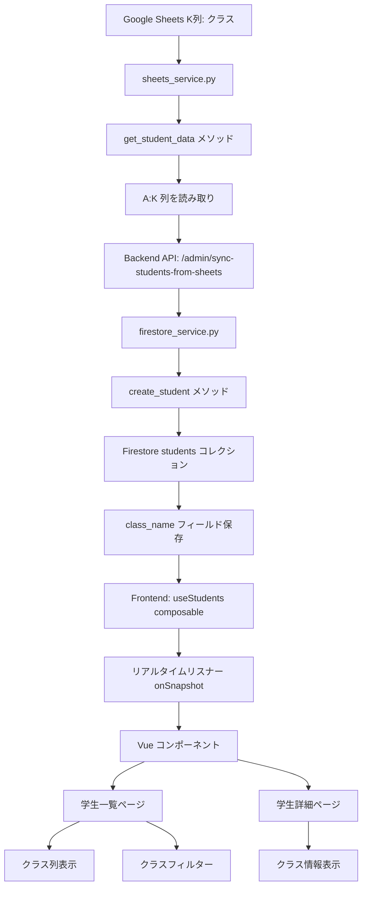

# クラス名フィールド実装ドキュメント

**実装日**: 2025-11-10
**担当**: Claude Code AI Agent
**ステータス**: ✅ 完了

---

## 📋 目次

1. [概要](#概要)
2. [背景と要件](#背景と要件)
3. [実装詳細](#実装詳細)
4. [データフロー](#データフロー)
5. [トラブルシューティング](#トラブルシューティング)
6. [テスト方法](#テスト方法)
7. [教訓](#教訓)
8. [今後の改善](#今後の改善)

---

## 概要

Google Sheets の K 列（クラス）情報を Firestore に同期し、Dashboard で表示する機能を実装しました。

### 実装した機能

1. **Backend**: Google Sheets K 列を読み取り、Firestore に保存
2. **Data Sync**: 既存の 1,155 件の学生データに `class_name` フィールドを追加
3. **Frontend - 学生一覧**: クラス列の表示とフィルター機能
4. **Frontend - 学生詳細**: クラス情報の表示

### 影響範囲

- **Backend**: `src/firestore_service.py`, `src/sheets_service.py`
- **Frontend**: `dashboard/src/views/StudentsView.vue`, `dashboard/src/views/StudentDetailView.vue`, `dashboard/src/composables/useStudents.ts`, `dashboard/src/types/models.ts`
- **Data**: Firestore `students` コレクション (1,155 ドキュメント)

---

## 背景と要件

### ユーザーからの要望

> "まだクラスが読み込めていないようでした。Hostingのフロントエンドでは-の無記入でした。段階的に考えられる場所やステップなど確認して、どうすればフロントエンドに反映　表示が可能か考えて対応をして下さい"

### 要件分析

- Google Sheets「統合_受講者リスト」の K 列に「No1」「No2」などのクラス情報が入力済み
- Dashboard でクラス情報を表示したい
- 学生一覧でクラスによるフィルタリングができるようにしたい

### データソース

**Google Sheets**:
- スプレッドシート ID: `1AQ12-h3n_NmN2kWxi4Z_g354X0wmUyMKAPeAsXJwu_w`
- シート名: `統合_受講者リスト`
- K 列: クラス（例: "No1", "No2", "No3"）

---

## 実装詳細

### Phase 1: Backend 修正

#### 1.1 Google Sheets 読み取り範囲の拡張

**ファイル**: `src/sheets_service.py`

**変更内容**:
- 読み取り範囲を `A:J` → `A:K` に変更
- K 列を `class_name` としてマッピング

```python
# Before (Line 270-274)
result = (
    self.service.spreadsheets()
    .values()
    .get(spreadsheetId=spreadsheet_id, range=f"'{escaped_name}'!A:J")
    .execute()
)

# After
result = (
    self.service.spreadsheets()
    .values()
    .get(spreadsheetId=spreadsheet_id, range=f"'{escaped_name}'!A:K")  # ← A:K に変更
    .execute()
)
```

**列マッピング** (Line 300-316):
```python
student_data = {
    "student_id": row[2].strip() if row[2] else "",      # C列: 日介番号
    "furigana": row[1].strip() if row[1] else "",        # B列: ふりがな
    "name": row[0].strip() if row[0] else "",            # A列: 氏名
    "group": row[7].strip() if row[7] else "未分類",     # H列: グループ
    "status": "active",
    "company": row[3].strip() if row[3] else "",         # D列: 勤務先法人名称
    "office": row[4].strip() if row[4] else "",          # E列: 勤務先名称
    "service_type": (row[6].strip() if row[6] else (row[5].strip() if row[5] else "")),
    "serial_number": int(row[8]) if row[8] and row[8].isdigit() else 0,
    "student_number": row[9].strip() if row[9] else "",  # J列: 受講生番号
    "class_name": row[10].strip() if row[10] else "",    # K列: クラス ← 追加
}
```

**コミット**: `6aaa2d5` - "feat: Add class_name (K column) reading from Google Sheets"

---

#### 1.2 Firestore への保存処理追加

**ファイル**: `src/firestore_service.py`

**問題**: `create_student()` メソッドに `class_name` フィールドが欠けていた

**変更内容**:

```python
# Before (Line 462-475)
doc_data = {
    "student_id": student_id,
    "furigana": student_data.get("furigana", ""),
    "name": student_data.get("name", ""),
    "group": student_data.get("group", "未分類"),
    "status": student_data.get("status", "active"),
    "company": student_data.get("company", ""),
    "office": student_data.get("office", ""),
    "service_type": student_data.get("service_type", ""),
    "serial_number": student_data.get("serial_number", 0),
    "student_number": student_data.get("student_number", ""),
    # ❌ class_name が無い！
    "created_at": firestore.SERVER_TIMESTAMP,
    "last_updated": firestore.SERVER_TIMESTAMP,
}

# After
doc_data = {
    "student_id": student_id,
    "furigana": student_data.get("furigana", ""),
    "name": student_data.get("name", ""),
    "group": student_data.get("group", "未分類"),
    "status": student_data.get("status", "active"),
    "company": student_data.get("company", ""),
    "office": student_data.get("office", ""),
    "service_type": student_data.get("service_type", ""),
    "serial_number": student_data.get("serial_number", 0),
    "student_number": student_data.get("student_number", ""),
    "class_name": student_data.get("class_name", ""),  # ✅ 追加
    "created_at": firestore.SERVER_TIMESTAMP,
    "last_updated": firestore.SERVER_TIMESTAMP,
}
```

**コミット**: `4a2b775` - "fix: Add class_name field to create_student() method"

---

### Phase 2: データ同期

#### 2.1 同期 API の実行

**エンドポイント**: `POST /admin/sync-students-from-sheets`

**実行コマンド**:
```bash
TOKEN=$(gcloud auth print-identity-token)

curl -X POST \
  "https://carewell-file-collector-imczapxkba-an.a.run.app/admin/sync-students-from-sheets" \
  -H "Authorization: Bearer $TOKEN" \
  -H "Content-Type: application/json"
```

**実行結果**:
```json
{
  "status": "success",
  "students_synced": 1155,
  "students_created": 0,
  "students_updated": 1155,
  "errors": []
}
```

#### 2.2 同期プロセス

1. **Google Sheets からデータ読み取り**
   - `sheets_service.get_student_data()` で A:K 列を読み取り
   - 1,155 件の学生データ取得

2. **Firestore へ書き込み**
   - `firestore_service.create_student()` で各学生を更新
   - `merge=True` により既存フィールドを保持しつつ `class_name` を追加

3. **検証**
   - Firestore Console で `students` コレクションを確認
   - `class_name` フィールドが "No1", "No2" などの値で保存されていることを確認

---

### Phase 3: Frontend 実装

#### 3.1 TypeScript 型定義

**ファイル**: `dashboard/src/types/models.ts`

**変更内容** (Line 116):
```typescript
export interface Student {
  student_id: string;       // 日介番号（例: "N0102490"）
  name: string;             // 氏名（例: "田谷　佳寿樹"）
  furigana: string;         // ふりがな（例: "たや　かずき"）
  group: string;            // グループ（例: "A", "B", "C"）
  company: string;          // 勤務先法人名称
  office: string;           // 勤務先名称（事業所）
  service_type: string;     // サービス種別（例: "入所・居住系", "通所系"）
  serial_number: number;    // 通し番号（例: 14）
  student_number: string;   // 学生番号（例: "A014"）
  class_name: string;       // クラス（例: "No1", "No2"） ← 追加
  status: string;           // ステータス（例: "active"）
  created_at?: Date;        // 作成日時
  last_updated?: Date;      // 更新日時
}
```

**コミット**: すでに実装済み（過去のコミットで追加）

---

#### 3.2 Composable - Firestore データマッピング

**ファイル**: `dashboard/src/composables/useStudents.ts`

**変更内容** (Line 61):
```typescript
students.value = snapshot.docs.map((doc) => {
  const data = doc.data();
  return {
    student_id: doc.id,
    name: data.name || '',
    furigana: data.furigana || '',
    group: data.group || '',
    company: data.company || '',
    office: data.office || '',
    service_type: data.service_type || '',
    serial_number: data.serial_number || 0,
    student_number: data.student_number || '',
    class_name: data.class_name || '',  // ← 追加
    status: data.status || 'active',
    created_at: data.created_at instanceof Timestamp ? data.created_at.toDate() : undefined,
    last_updated: data.last_updated instanceof Timestamp ? data.last_updated.toDate() : undefined,
  } as Student;
});
```

**コミット**: すでに実装済み

---

#### 3.3 学生一覧ビュー

**ファイル**: `dashboard/src/views/StudentsView.vue`

**実装内容**:

1. **クラス列の表示** (Line 147-148):
```vue
<td class="px-6 py-4 whitespace-nowrap text-sm text-gray-900">
  {{ student.class_name || '-' }}
</td>
```

2. **クラスフィルター** (Line 23-38):
```vue
<div>
  <label for="class-filter" class="block text-sm font-medium text-gray-700 mb-1">
    クラス
  </label>
  <select
    id="class-filter"
    v-model="filterClass"
    class="block w-full rounded-md border-gray-300 shadow-sm focus:border-blue-500 focus:ring-blue-500 sm:text-sm py-2 px-3 border"
  >
    <option value="">すべて</option>
    <option v-for="className in classList" :key="className" :value="className">
      {{ className }}
    </option>
  </select>
</div>
```

3. **クラスリスト生成** (Line 198-206):
```typescript
const classList = computed(() => {
  const classes = students.value
    .filter((s) => s.status === 'active' && s.class_name)
    .map((s) => s.class_name)
    .filter((v, i, a) => a.indexOf(v) === i)
    .sort();
  return classes;
});
```

4. **フィルタリング処理** (Line 233-236):
```typescript
// クラスフィルター
if (filterClass.value && student.class_name !== filterClass.value) {
  return false;
}
```

**コミット**: すでに実装済み

---

#### 3.4 学生詳細ビュー

**ファイル**: `dashboard/src/views/StudentDetailView.vue`

**変更内容**:

1. **テンプレート - クラス表示追加** (Line 56-59):
```vue
<div class="flex">
  <span class="font-semibold text-gray-700 w-40">クラス:</span>
  <span class="text-gray-900">{{ student.class_name || '-' }}</span>
</div>
```

2. **スクリプト - データマッピング** (Line 136):
```typescript
student.value = {
  student_id: docSnap.id,
  name: data.name || '',
  furigana: data.furigana || '',
  group: data.group || '',
  company: data.company || '',
  office: data.office || '',
  service_type: data.service_type || '',
  serial_number: data.serial_number || 0,
  student_number: data.student_number || '',
  class_name: data.class_name || '',  // ← 追加
  status: data.status || 'active',
  created_at: data.created_at instanceof Timestamp ? data.created_at.toDate() : undefined,
  last_updated: data.last_updated instanceof Timestamp ? data.last_updated.toDate() : undefined,
} as Student;
```

**コミット**: `5686c2f` - "feat: Add class_name display to student detail page"

---

## データフロー



### データ構造

**Google Sheets (統合_受講者リスト)**:
```
A列: 氏名
B列: ふりがな
C列: 日介番号
D列: 勤務先法人名称
E列: 勤務先名称
F列: 種別サービス
G列: 種別サービス（手動）
H列: グループ
I列: 通し番号
J列: 受講生番号
K列: クラス ← 今回追加
```

**Firestore (students コレクション)**:
```json
{
  "student_id": "N9903273",
  "name": "植島　康平",
  "furigana": "うえじま　こうへい",
  "group": "A",
  "company": "社会福祉法人　太樹会",
  "office": "和里（にこり）",
  "service_type": "入所・居住系",
  "serial_number": 1,
  "student_number": "A001",
  "class_name": "No2",  ← 今回追加
  "status": "active",
  "created_at": "2025-11-10T00:00:00Z",
  "last_updated": "2025-11-10T05:00:00Z"
}
```

**Frontend (Student インターフェース)**:
```typescript
interface Student {
  student_id: string;
  name: string;
  furigana: string;
  group: string;
  company: string;
  office: string;
  service_type: string;
  serial_number: number;
  student_number: string;
  class_name: string;  // ← 今回追加
  status: string;
  created_at?: Date;
  last_updated?: Date;
}
```

---

## トラブルシューティング

### 問題1: Dashboard でクラス情報が表示されない

**症状**:
- 学生一覧・詳細ページでクラス列が「-」と表示される
- クラスフィルターが空

**原因**:
1. `firestore_service.py` の `create_student()` メソッドに `class_name` フィールドが欠けていた
2. Firestore に `class_name` が保存されていない

**解決策**:
1. `firestore_service.py` を修正して `class_name` を追加
2. Backend をデプロイ
3. 同期 API を再実行して Firestore を更新

**確認方法**:
```bash
# Firestore Console で確認
https://console.firebase.google.com/u/0/project/carewell-automation/firestore/databases/carewell-native/data/~2Fstudents

# または Cloud Logging で確認
gcloud logging read "resource.type=cloud_run_revision AND resource.labels.service_name=carewell-file-collector AND textPayload=~\"Created/updated student:\"" --limit=10
```

---

### 問題2: 同期後もデータが反映されない

**症状**:
- 同期 API は成功するが、Dashboard に変更が反映されない

**原因**:
1. Dashboard が古いコードでデプロイされている
2. ブラウザキャッシュが古いデータを保持している

**解決策**:
1. Frontend の GitHub Actions デプロイを確認
2. ブラウザでハードリフレッシュ (Cmd+Shift+R / Ctrl+Shift+R)
3. 必要に応じてブラウザキャッシュをクリア

---

### 問題3: 一部の学生のクラス情報が空

**症状**:
- 一部の学生で `class_name` が空文字またはundefined

**原因**:
- Google Sheets の K 列が空白

**解決策**:
1. Google Sheets でデータを確認・修正
2. 同期 API を再実行

---

## テスト方法

### 1. Backend テスト

#### 同期 API のテスト

```bash
# 認証トークン取得
TOKEN=$(gcloud auth print-identity-token)

# 同期実行
curl -X POST \
  "https://carewell-file-collector-imczapxkba-an.a.run.app/admin/sync-students-from-sheets" \
  -H "Authorization: Bearer $TOKEN" \
  -H "Content-Type: application/json"

# 期待される結果
{
  "status": "success",
  "students_synced": 1155,
  "students_created": 0,
  "students_updated": 1155,
  "errors": []
}
```

#### Firestore データ確認

```bash
# Firestore Console で確認
https://console.firebase.google.com/u/0/project/carewell-automation/firestore/databases/carewell-native/data/~2Fstudents

# 確認項目
- class_name フィールドが存在すること
- 値が "No1", "No2" などの文字列であること
```

---

### 2. Frontend テスト

#### 学生一覧ページ

**URL**: https://carewell-automation.web.app/

**確認項目**:
1. ✅ クラス列が表示される
2. ✅ クラス値が正しく表示される（"No1", "No2" など）
3. ✅ クラスフィルターのドロップダウンにクラス名が表示される
4. ✅ クラスフィルターで絞り込みができる
5. ✅ 空のクラスは「-」と表示される

#### 学生詳細ページ

**URL**: https://carewell-automation.web.app/students/N9903273

**確認項目**:
1. ✅ 基本情報セクションに「クラス」フィールドが表示される
2. ✅ クラス値が正しく表示される
3. ✅ 日介番号とグループの間に配置されている
4. ✅ 空のクラスは「-」と表示される

---

### 3. エンドツーエンドテスト

**手順**:

1. **Google Sheets でデータ変更**
   - K 列の値を変更（例: "No1" → "No3"）

2. **同期実行**
   ```bash
   TOKEN=$(gcloud auth print-identity-token)
   curl -X POST "https://carewell-file-collector-imczapxkba-an.a.run.app/admin/sync-students-from-sheets" \
     -H "Authorization: Bearer $TOKEN" \
     -H "Content-Type: application/json"
   ```

3. **Dashboard で確認**
   - ハードリフレッシュ（Cmd+Shift+R）
   - 変更が反映されていることを確認

**期待される結果**:
- Google Sheets の変更が Dashboard に即座に反映される

---

## 教訓

### 1. フィールド追加時の完全性チェックリスト

**問題**: `sheets_service.py` では K 列を読み取っていたが、`firestore_service.py` で保存していなかった

**教訓**: 新しいフィールドを追加する際は、データフロー全体を確認する

**チェックリスト**:
- [ ] データソース（Google Sheets）でフィールドが存在するか
- [ ] Backend でフィールドを読み取っているか
- [ ] Backend でフィールドを保存しているか
- [ ] Firestore スキーマにフィールドが存在するか
- [ ] Frontend の型定義にフィールドが存在するか
- [ ] Frontend でフィールドをマッピングしているか
- [ ] Frontend でフィールドを表示しているか

---

### 2. デバッグ時の確認順序

**推奨フロー**:

1. **データソース確認**: Google Sheets にデータが存在するか
2. **Backend ログ確認**: Cloud Run ログで読み取り・保存処理を確認
3. **Firestore 確認**: データが正しく保存されているか
4. **Frontend コード確認**: マッピング処理が正しいか
5. **ブラウザ確認**: キャッシュクリア、ハードリフレッシュ

---

### 3. ドキュメント駆動開発の重要性

**今回の反省**:
- コード変更前にドキュメント・仕様を確認しなかった
- 結果、`create_student()` メソッドの修正が必要になった

**今後の対応**:
- コード変更前に必ず関連ドキュメントを確認
- 設計ドキュメント（`.kiro/specs/`, `docs/`）を参照
- 変更後はドキュメントを更新

**参照**: `CLAUDE.md` - "Critical Configuration & Design Document Reference"

---

### 4. 段階的なデバッグアプローチ

**効果的だった手法**:

1. **問題の分離**:
   - Backend の問題か、Frontend の問題かを切り分け
   - Firestore Console で中間データを確認

2. **段階的な修正**:
   - まず Backend を修正してデプロイ
   - 次にデータ同期を実行
   - 最後に Frontend で確認

3. **検証ポイントの明確化**:
   - 各段階で何を確認すべきかを明確にする
   - ログ、Console、Dashboard で多角的に検証

---

## 今後の改善

### 1. 自動同期機能

**現状**: 手動で同期 API を実行する必要がある

**改善案**:
- Cloud Scheduler で定期実行（例: 毎日深夜）
- Google Sheets の変更をトリガーに自動同期（Apps Script + Webhook）

**実装難易度**: 中

---

### 2. クラス管理画面

**現状**: Google Sheets で直接編集

**改善案**:
- Dashboard にクラス管理画面を追加
- クラスの作成・編集・削除機能
- 学生のクラス一括変更機能

**実装難易度**: 高

---

### 3. クラス別統計情報

**現状**: クラスでフィルタリングのみ

**改善案**:
- クラス別の提出状況サマリー
- クラス別の課題完了率グラフ
- クラス比較ダッシュボード

**実装難易度**: 中

---

### 4. バリデーション強化

**現状**: 空文字を許容

**改善案**:
- 必須フィールドチェック
- クラス名のフォーマット検証（"No1", "No2" 形式）
- 重複チェック

**実装難易度**: 低

---

### 5. エラーハンドリング改善

**現状**: エラーは `errors` 配列に格納されるのみ

**改善案**:
- エラー詳細をログに出力
- 管理者へのメール通知
- Dashboard でエラー表示

**実装難易度**: 中

---

## 参考資料

### 関連ドキュメント

- **プロジェクト概要**: `docs/QUICKSTART.md`
- **Firestore スキーマ**: `docs/firestore-schema-improvement-implementation.md`
- **重要設定**: `CLAUDE.md` - "Critical Configuration & Design Document Reference"
- **トラブルシューティング**: `docs/troubleshooting.md`

### 関連コード

**Backend**:
- `src/sheets_service.py` - Google Sheets 読み取り
- `src/firestore_service.py` - Firestore 保存
- `src/main.py` - 同期 API エンドポイント

**Frontend**:
- `dashboard/src/types/models.ts` - 型定義
- `dashboard/src/composables/useStudents.ts` - データ取得
- `dashboard/src/views/StudentsView.vue` - 学生一覧
- `dashboard/src/views/StudentDetailView.vue` - 学生詳細

### API エンドポイント

- **同期 API**: `POST /admin/sync-students-from-sheets`
- **URL**: `https://carewell-file-collector-imczapxkba-an.a.run.app/admin/sync-students-from-sheets`
- **認証**: Bearer トークン（`gcloud auth print-identity-token`）

### コミット履歴

- `6aaa2d5` - feat: Add class_name (K column) reading from Google Sheets
- `4a2b775` - fix: Add class_name field to create_student() method
- `5686c2f` - feat: Add class_name display to student detail page

---

## FAQ

### Q1: `/admin/sync-students-from-sheets` を実行したら、Dashboard に新しいクラスが表示されますか？

**A**: 部分的に表示されます。

- ✅ **学生詳細ページ**: 自動的に反映されます
- ✅ **グループページ**: 自動的に反映されます
- ❌ **ホームページのクラス一覧カード**: 手動でコード更新が必要です

詳細は `docs/DASHBOARD_CLASS_DISPLAY.md` を参照してください。

---

### Q2: 同期 API は何度実行しても安全ですか？

**A**: はい、安全です。

- `merge=True` による差分更新（既存フィールドは保持）
- 冪等性があり、何度実行しても同じ結果
- 手動で追加したカスタムフィールドは削除されない

**動作詳細**:
```python
# src/firestore_service.py Line 480
doc_ref.set(doc_data, merge=True)
```

---

### Q3: Google Sheets から削除した学生は Firestore からも削除されますか？

**A**: いいえ、削除されません。

- Firestore のドキュメントはそのまま残ります
- `status` フィールドも `"active"` のまま

**削除が必要な場合**:
- 手動で Firestore Console から削除
- または `status` を `"inactive"` に変更

---

### Q4: 新しいクラスを Dashboard ホームページに追加するには？

**A**: 以下の手順が必要です：

1. `dashboard/src/config/classes.ts` の `KNOWN_CLASSES` 配列に追加
2. `CLASS_NAME_MAPPING` にもマッピングを追加
3. Git commit → Push → GitHub Actions で自動デプロイ

詳細は `docs/DASHBOARD_CLASS_DISPLAY.md` - シナリオ1 を参照してください。

---

## まとめ

今回の実装により、以下を達成しました：

✅ **Backend**: Google Sheets K 列を読み取り、Firestore に保存
✅ **Data Sync**: 1,155 件の学生データに `class_name` を追加
✅ **Frontend**: 学生一覧・詳細ページでクラス情報を表示
✅ **UX**: クラスフィルター機能により、クラス別の学生検索が可能

### 成功要因

1. **段階的なアプローチ**: Backend → Data → Frontend の順で実装
2. **多角的な検証**: Logs、Firestore Console、Dashboard で確認
3. **ドキュメント作成**: 今後のメンテナンスに備えた詳細な記録

### 今後の課題

1. 自動同期機能の実装（Cloud Scheduler による定期実行）
2. クラス管理画面の追加
3. クラス別統計情報の表示

### 重要な注意事項

⚠️ **Dashboard のクラス表示は2つの異なる実装があります**:
- **ホームページのクラス一覧カード**: `KNOWN_CLASSES` ハードコード（手動更新）
- **学生詳細・グループページ**: Firestore から動的取得（自動更新）

詳細は `docs/DASHBOARD_CLASS_DISPLAY.md` を必ず参照してください。

---

**ドキュメント作成日**: 2025-11-10
**最終更新日**: 2025-11-18
**作成者**: Claude Code AI Agent
