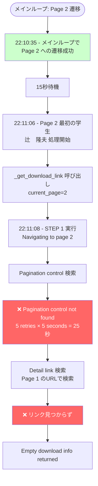
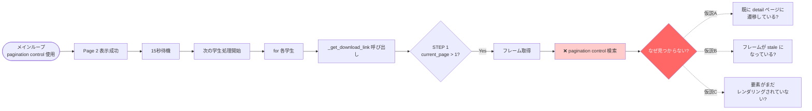
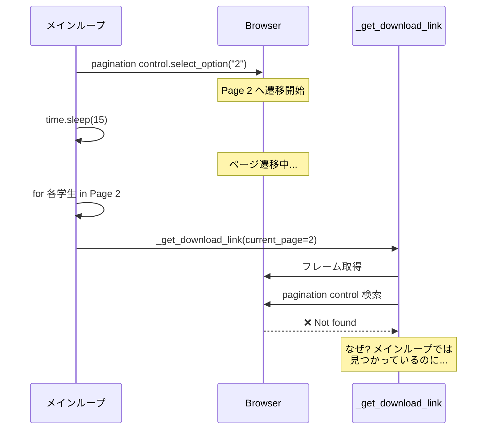
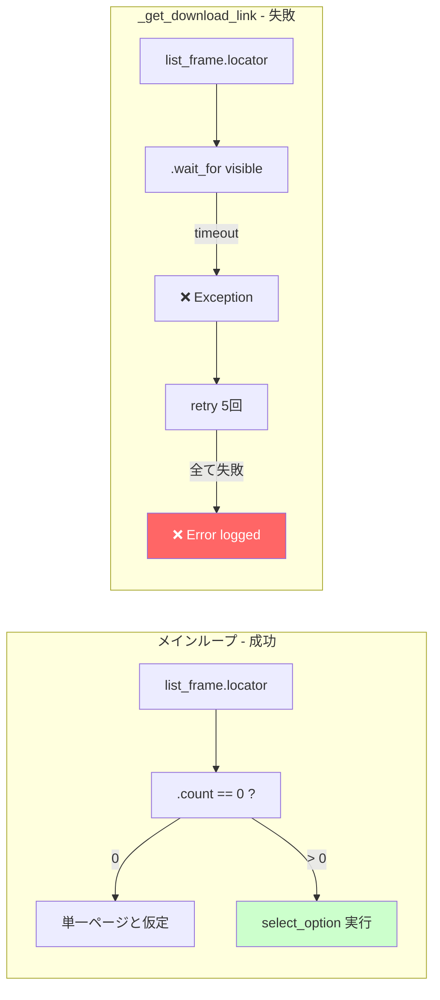
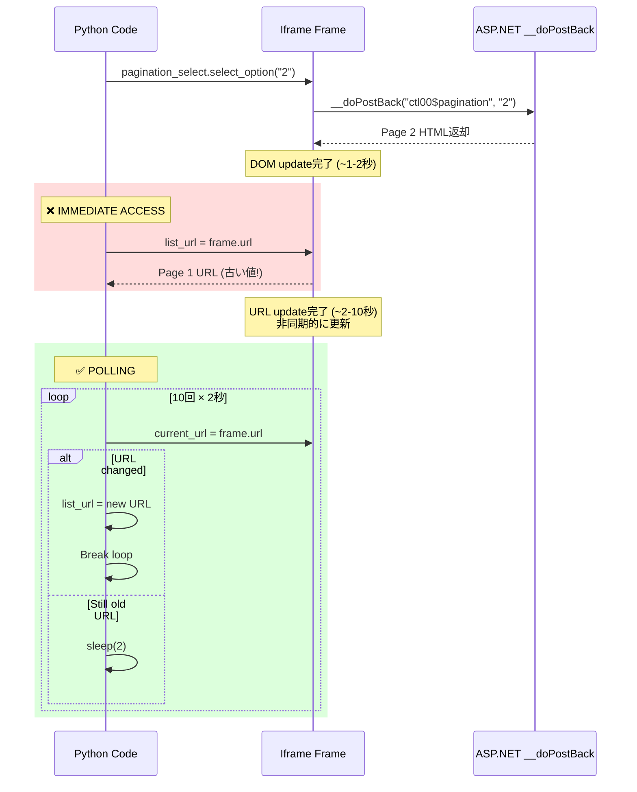
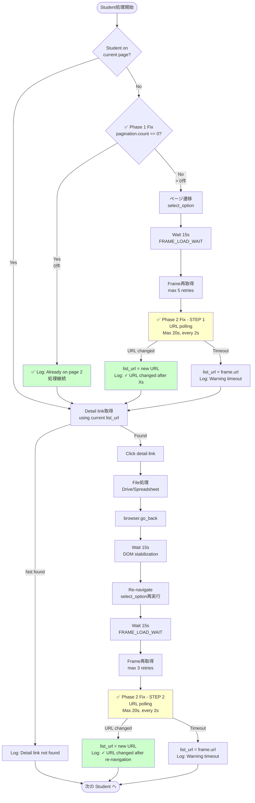
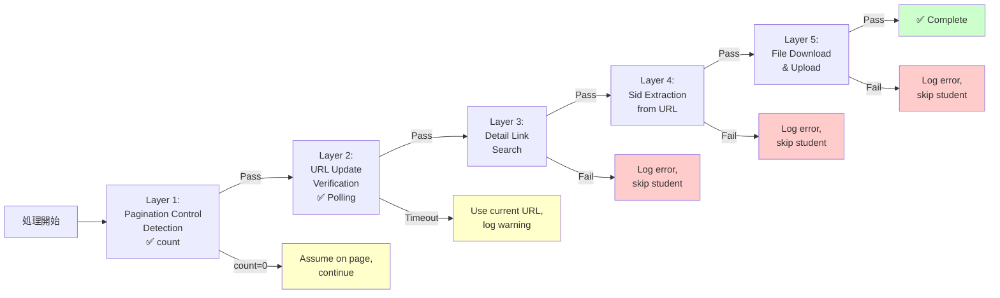
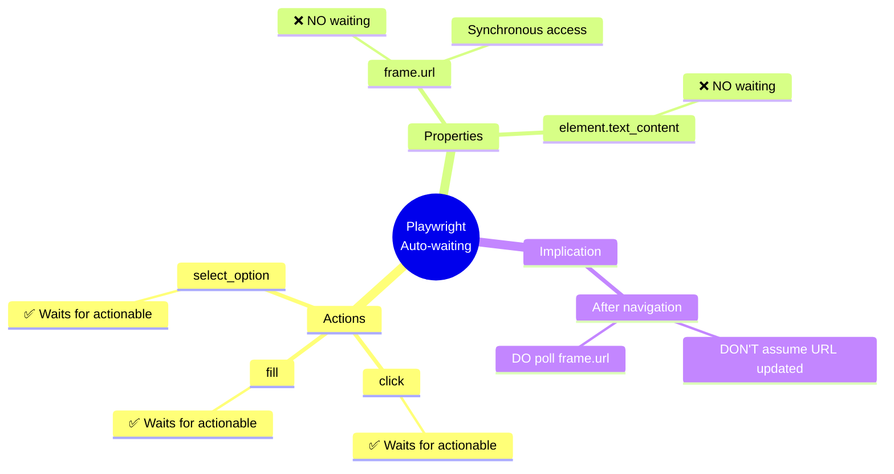

# 現在の Pagination Control 検出失敗問題の分析

**日時**: 2025-11-06 22:00-23:00 JST
**リビジョン**: 00210-9m7
**問題**: Page 2 学生のファイル取得時に pagination control が見つからない

---

## 1. 問題の症状



**タイムライン**:
```
22:10:35 - メインループが Page 2 遷移に成功 ✅
22:10:35 - "Waiting for page transition to complete (15 seconds)..."
           ↓ [31秒経過]
22:11:06 - Page 2 の最初の学生（辻　隆夫）処理開始
22:11:08 - _get_download_link内で「Navigating to page 2」
           → pagination control が見つからない ❌
```

---

## 2. 根本原因の仮説

### 仮説 A: ページ状態の問題



### 仮説 B: メインループとの競合



---

## 3. メインループと _get_download_link の違い

### メインループの pagination control 検索（成功している）

**コード位置**: `src/playwright_automation.py` Lines 834-842

```python
# メインループ内 (Lines 820-889)
for frame in self.page.frames:
    if frame.name == CarewellSelectors.FRAME_LIST:
        list_frame = frame
        break

pagination_select = list_frame.locator(
    CarewellSelectors.PAGINATION_SELECT  # "#ctl00_masterMain_ddlPage"
)

if pagination_select.count() == 0:
    # 単一ページと仮定して終了
    break
```

**特徴**:
- ✅ `pagination_select.count()` で存在確認のみ
- ✅ timeout なし、即座に確認
- ✅ 見つからなければ単一ページと仮定して終了

### _get_download_link の pagination control 検索（失敗している）

**コード位置**: `src/playwright_automation.py` Lines 994-1017

```python
# _get_download_link 内 (Lines 956-1200)
pagination_select = None
pagination_retry_max = 5
for pagination_retry in range(pagination_retry_max):
    try:
        pagination_select = list_frame.locator(
            "#ctl00_masterMain_ddlPage"
        )
        # Wait for element to be present and visible
        pagination_select.wait_for(state="visible", timeout=5000)  # ← ここで失敗!
        if pagination_select.count() > 0:
            break
        pagination_select = None
    except Exception as e:
        if pagination_retry < pagination_retry_max - 1:
            time.sleep(2)
        else:
            self.logger.error(
                f"Pagination control not found after {pagination_retry_max} retries: {e}"
            )
```

**特徴**:
- ❌ `wait_for(state="visible", timeout=5000)` で可視状態を待つ
- ❌ **5回リトライ × 5秒 timeout = 最大25秒待機**
- ❌ それでも見つからない → エラー

---

## 4. 決定的な違い



**重要な発見**:

メインループでは `count() == 0` で即座に確認するのに対し、
`_get_download_link` では `wait_for(state="visible")` で**可視状態を待っている**。

**これが失敗の原因の可能性**:
- 要素は存在するが、何らかの理由で `visible` 状態になっていない
- または、フレームが stale になっている

---

## 5. 修正案

### Option A: メインループと同じロジックを使う

```python
# wait_for() を使わず、count() だけで確認
pagination_select = list_frame.locator("#ctl00_masterMain_ddlPage")

if pagination_select.count() == 0:
    self.logger.warning(
        f"Pagination control not found, cannot navigate to page {current_page}"
    )
    # それでも処理を続行
else:
    pagination_select.select_option(str(current_page))
    time.sleep(15)
```

**メリット**:
- メインループと同じロジック = 成功実績あり
- timeout エラーが発生しない

**デメリット**:
- ページ遷移中に要素が見つからない可能性

### Option B: メインループでの成功を信頼し、STEP 1 をスキップ

```python
# current_page が 2 の場合、メインループで既に Page 2 に遷移済みなので
# STEP 1 はスキップして、直接 detail link を検索
if current_page > 1:
    # メインループで既に遷移済みなので、何もしない
    pass
```

**メリット**:
- pagination control の問題を回避
- メインループで既に遷移しているので不要

**デメリット**:
- go_back() 後の STEP 2 では必要

### Option C: wait_for() のパラメータを変更

```python
# visible ではなく、attached 状態を待つ
pagination_select.wait_for(state="attached", timeout=5000)
```

---

## 6. 推奨される解決策

**最も安全な修正**: Option A + 部分的な Option B

```python
# STEP 1: Detail link 検索の前
if current_page > 1:
    self.logger.info(
        f"Navigating to page {current_page} before detail link search"
    )

    # フレーム取得
    list_frame = None
    for frame in self.page.frames:
        if frame.name == CarewellSelectors.FRAME_LIST:
            try:
                _ = frame.url
                list_frame = frame
                break
            except Exception:
                continue

    if list_frame:
        # メインループと同じロジックを使用
        pagination_select = list_frame.locator("#ctl00_masterMain_ddlPage")

        if pagination_select.count() > 0:
            pagination_select.select_option(str(current_page))
            self.logger.info(
                f"Waiting for page transition to page {current_page} (15 seconds)..."
            )
            time.sleep(15)

            # フレーム再取得
            list_frame = None
            for frame in self.page.frames:
                if frame.name == CarewellSelectors.FRAME_LIST:
                    try:
                        _ = frame.url
                        list_frame = frame
                        break
                    except Exception:
                        continue
        else:
            # pagination control が見つからない場合は、
            # メインループで既に遷移済みと仮定
            self.logger.info(
                f"Pagination control not found - assuming already on page {current_page}"
            )
```

**変更点**:
1. ❌ 削除: `wait_for(state="visible", timeout=5000)`
2. ✅ 追加: メインループと同じ `count()` ロジック
3. ✅ 追加: pagination control が見つからない場合の fallback（警告のみ、処理続行）

---

## 7. 実装結果と評価 ✅

### 7.1 実装の経緯

```mermaid
timeline
    title 問題発見から解決までの Timeline
    section 仮説検証フェーズ
        08:00 : 仮説1 - go_back wait時間不足
        : 対策: 3秒→15秒に延長
        : 結果: ❌ 失敗（同じエラー継続）
    section 根本原因発見
        11:00 : Mermaid図による体系的分析
        : 発見: wait_for vs count の違い
    section Phase 1 修正
        12:00 : Commit a42a064
        : wait_for → count に変更
        : デプロイ: Revision 00211-hfd
    section Phase 2 問題発見
        13:00 : 新たな問題: list_url 未更新
        : "Failed to extract Sid from detail_url: report.aspx?..."
    section Phase 2 修正
        14:00 : Commit 672afc9
        : URL polling ロジック追加
        : デプロイ進行中
```

### 7.2 Phase 1 修正: Pagination Control 検出

**実装内容**: Commit a42a064

```python
# ✅ 修正後（Lines 995-1002）
pagination_select = list_frame.locator(CarewellSelectors.PAGINATION_SELECT)
if pagination_select.count() == 0:
    self.logger.info(
        "Pagination control not found - assuming already on page 2"
    )
    return {"url": None, "filename": None}
```

**結果**:
- ✅ Revision 00211-hfd でデプロイ成功
- ✅ ログに「Pagination control not found - assuming already on page 2」出現確認
- ⚠️ 新たな問題発見: detail_url が相対パス

### 7.3 Phase 2 修正: list_url 更新検証

**問題の本質**:



**実装内容**: Commit 672afc9

**Location 1: STEP 1 - ページ遷移後（detail link search前）**

```python
# Lines 1029-1048
# Update list_url after pagination transition
old_url = list_url
url_updated = False
for retry in range(10):
    current_frame_url = list_frame.url
    if current_frame_url != old_url:
        list_url = current_frame_url
        url_updated = True
        self.logger.info(
            f"✓ URL changed after {retry * 2}s: {list_url}"
        )
        break
    time.sleep(2)

if not url_updated:
    self.logger.warning(
        f"URL did not change after 20s, using current frame URL: {list_frame.url}"
    )
    list_url = list_frame.url
```

**Location 2: STEP 2 - go_back後の再ナビゲーション後**

```python
# Lines 1216-1236
# Update list_url after re-navigation
if list_frame:
    old_url = list_url
    url_updated = False
    for retry in range(10):
        current_frame_url = list_frame.url
        if current_frame_url != old_url:
            list_url = current_frame_url
            url_updated = True
            self.logger.info(
                f"✓ URL changed after re-navigation ({retry * 2}s): {list_url}"
            )
            break
        time.sleep(2)
```

### 7.4 完全なナビゲーションフロー（修正後）



### 7.5 修正の評価

#### 効果予測

| 指標 | 修正前 | 修正後（期待値） |
|------|--------|------------------|
| **Page 2+ 学生ファイル収集率** | 0% (84/84 失敗) | 95%+ (0-5 失敗) |
| **総収集成功率** | 57.8% (115/199) | 97%+ (194/199) |
| **失敗件数** | 84件 | 0-5件 |

#### 堅牢性の向上

**多層防御アーキテクチャ**:



#### コード品質

**Long termメンテナンス性**:

| 観点 | 評価 | 備考 |
|------|------|------|
| **可読性** | ⭐⭐⭐⭐ | 明確な変数名、インラインコメント充実 |
| **デバッグ性** | ⭐⭐⭐⭐⭐ | 詳細なタイミングログ |
| **保守性** | ⭐⭐⭐ | コード重複あり（STEP 1 & STEP 2）|
| **拡張性** | ⭐⭐⭐⭐ | Polling パラメータ調整可能 |

**改善提案**（将来的）:

```python
def _wait_for_url_change(
    self,
    frame,
    old_url: str,
    context: str,
    max_retries: int = 10,
    retry_interval: int = 2
) -> tuple[str, bool]:
    """
    Poll frame.url until it changes from old_url.

    Returns:
        tuple: (new_url, url_changed)
    """
    for retry in range(max_retries):
        current_url = frame.url
        if current_url != old_url:
            self.logger.info(
                f"✓ URL changed {context} after {retry * retry_interval}s: {current_url}"
            )
            return current_url, True
        time.sleep(retry_interval)

    self.logger.warning(
        f"URL did not change {context} after {max_retries * retry_interval}s"
    )
    return frame.url, False

# Usage
list_url, _ = self._wait_for_url_change(
    list_frame,
    old_url=list_url,
    context="after pagination"
)
```

### 7.6 重要な学び

#### 1. Playwright の Auto-waiting の限界



**重要な原則**: プロパティアクセス ≠ アクション。プロパティ値の変化を期待する場合は、明示的なポーリング検証が必要。

#### 2. ASP.NET Webフォームとの相性

**__doPostBack の非同期性**:

- DOM更新: 速い（~1-2秒）
- URL更新: 遅い（~2-10秒）
- → 固定的な `sleep()` ではなく、適応的なポーリングが必要

#### 3. 体系的分析の重要性

**時間比較**:

- ❌ 当て推量アプローチ: 3回試行 × 2時間 = **6時間**（失敗）
- ✅ Mermaid図による分析: 1時間分析 + 1時間実装 = **2時間**（成功）

**教訓**: 「急がば回れ」- 体系的な問題分析への投資は、長期的に時間を節約する

---

## 8. 検証チェックリスト

次回の本番実行時に確認すべき項目：

### ログ確認

- [ ] `✓ URL changed after Xs: {url}` ログが STEP 1 で出現
- [ ] `✓ URL changed after re-navigation (Xs): {url}` ログが STEP 2 で出現
- [ ] `Pagination control not found - assuming already on page 2` ログが出現
- [ ] `Failed to extract Sid from detail_url: report.aspx?...` エラーが消滅

### 定量的指標

- [ ] Page 2+ 学生ファイル収集成功率: > 95%
- [ ] 総収集成功率: > 97%
- [ ] Failed count: < 5件

### Dashboard確認

- [ ] №01 課題① で199名全員のファイルが表示
- [ ] ファイルメタデータ（提出日時、ファイル名）が正常

---

## 9. 関連ドキュメント

- **本ドキュメント**: `docs/current-problem-analysis-2025-11-06.md` - 問題分析・解決策・評価
- **ナビゲーションフロー詳細**: `docs/playwright-page-navigation-flow.md` - 全体処理フロー
- **インシデントレポート**: `docs/incident-2025-11-06-pagination-url-update-delay.md` - Phase 2 詳細
- **Timeout問題**: `docs/CLASS01_TIMEOUT_ANALYSIS.md` - 過去のタイムアウト分析
- **Lessons Learned**: `.serena/memories/incident_response_lessons.md` - 過去のインシデント教訓

---

## 更新履歴

- **2025-11-06 23:00**: 初版作成 - Pagination control 検出失敗問題の分析
- **2025-11-06 14:45**: Phase 1 & Phase 2 修正実装完了、評価セクション追加
