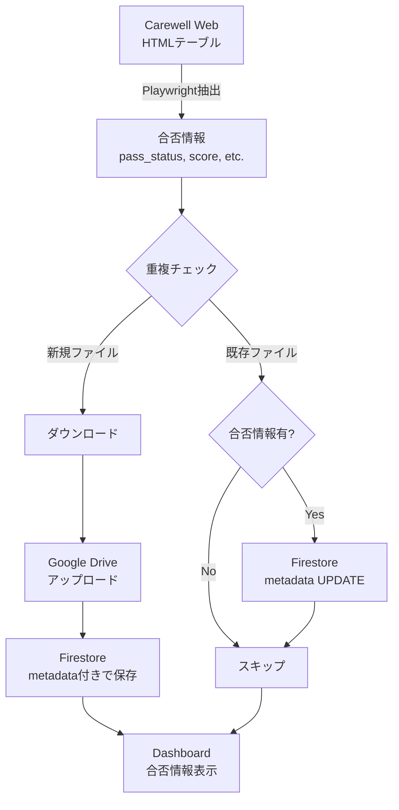

# 合否情報抽出・バックフィル機能 実装記録

**実装日**: 2025-11-09
**コミット**: `a175783` - "feat: Add grading information extraction and backfill"
**デプロイ**: Cloud Run revision `00239-jmv`, Firebase Hosting
**実装者**: Claude Code

---

## 📋 目次

1. [概要](#概要)
2. [背景と要求事項](#背景と要求事項)
3. [技術設計](#技術設計)
4. [実装詳細](#実装詳細)
5. [デプロイと検証](#デプロイと検証)
6. [今後の参考事項](#今後の参考事項)
7. [トラブルシューティング](#トラブルシューティング)
8. [チェックリスト](#チェックリスト)

---

## 概要

### 機能説明

Carewell Webサービスから取得した学生の提出ファイル情報に**合否（合格/不合格）、スコア、採点状況**などのメタデータを追加し、Firestoreに保存・Dashboard で表示する機能。

さらに、既存データ（過去にアップロードされたファイル）も重複チェック時に**自動的にバックフィル（後方充填）**する。

### ビジネス価値

- **講師の作業効率向上**: 提出状況と採点結果を同じ画面で確認可能
- **最新情報の自動反映**: 採点情報が後から変更された場合も自動的に更新
- **データの一元管理**: Google Drive、Firestore、Dashboard で一貫した情報を提供

### 影響範囲

| コンポーネント | 変更内容 | 影響度 |
|-------------|---------|-------|
| `src/main.py` | metadata構造最適化、バックフィル処理追加 | 🟡 中 |
| `src/firestore_service.py` | `update_file_metadata()` メソッド追加 | 🟢 小 |
| `src/playwright_automation.py` | `existing_composite_key` 保存追加 | 🟢 小 |
| `dashboard/src/types/models.ts` | 型定義拡張 | 🟢 小 |
| `dashboard/src/composables/useFileList.ts` | マッピング修正 | 🟢 小 |
| `dashboard/src/components/FileTable.vue` | UI表示拡張 | 🟡 中 |

**リスク評価**: 🟢 低リスク（既存フィールド変更なし、後方互換性100%）

---

## 背景と要求事項

### 課題

1. **メタデータ不足**: Carewell Webサービスから取得した情報に合否・スコアが含まれていない
2. **講師の不便**: DashboardとCarewell Webを行き来して採点結果を確認する必要
3. **既存データ**: 過去にアップロードされたファイルには合否情報がない

### 要求事項

#### 機能要件

- [x] HTMLテーブルから合否情報を抽出（pass_status, score, grading_status, log_no）
- [x] 新規ファイルアップロード時にmetadataとして保存
- [x] 既存ファイル検出時、HTMLに合否情報があれば自動的にmetadataを更新（バックフィル）
- [x] Dashboard で合否情報を表示（デスクトップ版・モバイル版）
- [x] 合格=緑、不合格=赤のカラーコーディング

#### 非機能要件

- [x] **後方互換性**: 既存データ（metadata未設定）でもエラーにならない
- [x] **fail-open戦略**: 合否情報抽出失敗時もファイルアップロードは継続
- [x] **スキーマ変更禁止**: `metadata` フィールドは既存（新規フィールド追加不可）
- [x] **重複チェックロジック不変**: `check_already_uploaded()` は変更しない
- [x] **上書き更新**: 既存metadataを常に最新情報で上書き（講師の採点変更に対応）

### 設計仕様参照

実装前に以下のドキュメントを確認済み：

- ✅ `.kiro/specs/firestore-schema-improvement/design.md` - metadataフィールド設計
- ✅ `.kiro/specs/firestore-schema-improvement/requirements.md` - 既存フィールド変更禁止
- ✅ `src/firestore_service.py` - `record_upload()` シグネチャ確認
- ✅ `src/playwright_automation.py` - 既存抽出ロジック確認
- ✅ `CLAUDE.md` - Critical Configuration セクション
- ✅ `.serena/memories/incident_response_lessons.md` - 過去の教訓

---

## 技術設計

### データフロー



### Firestoreスキーマ

#### ファイルドキュメント構造（変更なし）

```
submissions/{class_name}/tasks/{task_id}/files/{composite_key}
{
  "composite_key": "N9902913_report.pdf_2025-10-02_09-50-45",
  "task_id": "課題①",
  "student_name": "山田太郎",
  "student_id": "N9902913",
  "filename": "report.pdf",
  "drive_file_id": "1a2b3c...",
  "drive_folder_id": "5e6f7g...",
  "submit_date": "2025/10/02 09:50:45",
  "uploaded_at": Timestamp,
  "metadata": {  // ← 既存フィールド（今回拡張）
    "pass_status": "不合格",      // 新規追加
    "score": "0点 / 1点",          // 新規追加
    "grading_status": "採点済み",  // 新規追加
    "log_no": "1"                  // 新規追加
  }
}
```

#### metadata構造の最適化

**変更前（問題あり）**:
```python
metadata = {
    "student_id": ...,    # ❌ 親フィールドに重複
    "log_no": ...,
    "score": ...,
    "pass_status": ...,
    "status": ...,        # ❌ "grading_status"の方が明確
    "submit_date": ...,   # ❌ 親フィールドに重複
}
```

**変更後（最適化）**:
```python
metadata = {
    "pass_status": submission.get("pass_status"),
    "score": submission.get("score"),
    "grading_status": submission.get("status"),  # ✅ 明確な命名
    "log_no": submission.get("log_no"),
}
# None値をフィルタリング
metadata = {k: v for k, v in metadata.items() if v is not None}
```

### HTMLソース構造

```html
<tr class="standard_grid_item">
    <td><a>川久保　晃 &lt;N9903754&gt;</a></td>
    <td><span id="ctl00_masterMain_gvwMain_ctl02_lblLogNo">1</span></td>
    <td>0点 / 1点</td>  <!-- スコア（3列目） -->
    <td><span id="ctl00_masterMain_gvwMain_ctl02_lblIspassed"><font color="red">不合格</font></span></td>
    <td><span id="ctl00_masterMain_gvwMain_ctl02_lblStatus">採点済み</span></td>
    <td><span id="ctl00_masterMain_gvwMain_ctl02_lblStudyDate">2025/10/02 09:50:45</span></td>
</tr>
```

### 抽出ロジック（既存実装を活用）

`playwright_automation.py:632-647` で既に実装済み：

```python
log_no = cells[1].text_content().strip()        # ログ番号
score = cells[2].text_content().strip()         # スコア
pass_status = cells[3].text_content().strip()   # 合否
status = cells[4].text_content().strip()        # 採点状況
```

→ **今回の実装**: 抽出済みデータをFirestoreに保存する処理を追加

---

## 実装詳細

### Backend実装

#### 1. metadata構造の最適化 (`src/main.py:183-191`)

**変更理由**:
- 重複フィールド削除（`student_id`, `submit_date` は親フィールドに存在）
- 命名の明確化（`status` → `grading_status`）
- None値のフィルタリング（クリーンなデータ）

```python
# Record upload in Firestore
# Build metadata with grading information (excluding fields already in parent doc)
metadata = {
    "pass_status": submission.get("pass_status"),
    "score": submission.get("score"),
    "grading_status": submission.get("status"),  # Renamed from "status" for clarity
    "log_no": submission.get("log_no"),
}
# Remove None values to keep metadata clean
metadata = {k: v for k, v in metadata.items() if v is not None}

firestore_service.record_upload(
    class_name,
    task_id,
    submission["student_name"],
    submission.get("student_id", ""),
    submission["filename"],
    drive_file_id,
    drive_folder_id,
    submission.get("submit_date", ""),
    metadata=metadata,  # ← 新規ファイルにmetadataを含める
    task_pattern=task_pattern,
)
```

#### 2. `update_file_metadata()` メソッド追加 (`src/firestore_service.py:209-256`)

**設計判断**:
- **Atomic操作**: `doc_ref.update()` でmetadataフィールドのみ更新
- **fail-open戦略**: 更新失敗時も `False` を返して処理継続（例外を伝播しない）
- **上書き更新**: 既存metadataを完全に置き換え（講師の採点変更に対応）

```python
def update_file_metadata(
    self,
    class_name: str,
    task_id: str,
    composite_key: str,
    metadata: dict,
) -> bool:
    """
    Update metadata field of an existing file document (for backfilling grading info).

    Args:
        class_name: Class name
        task_id: Task ID (e.g., "課題①")
        composite_key: Existing document's composite key
        metadata: Updated metadata dict (grading information)

    Returns:
        True if successful, False if error occurred (fail-open strategy)

    Note:
        Only updates the metadata field. All other fields remain unchanged.
        Existing metadata is overwritten with new values (latest grading info).
    """
    try:
        # Collection path: submissions/{class_name}/tasks/{task_id}/files/{composite_key}
        doc_ref = (
            self.db.collection("submissions")
            .document(class_name)
            .collection("tasks")
            .document(task_id)
            .collection("files")
            .document(composite_key)
        )

        # Update metadata field only (overwrites existing metadata)
        doc_ref.update({"metadata": metadata})

        logger.info(
            f"Backfilled metadata for existing file: {composite_key}, metadata: {metadata}"
        )
        return True

    except Exception as e:
        logger.error(
            f"Failed to update metadata for {composite_key}: {e}", exc_info=True
        )
        # fail-open: continue processing even if metadata update fails
        return False
```

#### 3. バックフィル処理の実装 (`src/main.py:130-175`)

**重要な技術的課題と解決策**:

**課題**: 早期重複チェックの時点では `filename` が取得されていない（download linkをクリックする前）。しかし、`composite_key` を生成するには `filename` が必要。

**解決策**:
1. `playwright_automation.py` で早期重複チェック時に `existing_composite_key` を保存
2. `main.py` でそれを使用してバックフィル

**playwright_automation.py:692-701** (修正箇所):
```python
if existing_upload:
    # Mark as duplicate and save composite_key for backfill
    basic["is_duplicate"] = True
    basic["skip_reason"] = "already_uploaded"
    basic["existing_composite_key"] = existing_upload.get("composite_key")  # ← 追加
    self.logger.info(
        f"Duplicate detected (early check): {basic['student_name']} "
        f"(student_id={basic.get('student_id')}, submit_date={basic.get('submit_date')}, "
        f"composite_key={basic['existing_composite_key']})"
    )
else:
    basic["is_duplicate"] = False
```

**main.py:130-175** (バックフィル処理):
```python
# Check early duplicate flag first (set during get_submission_list)
if submission.get("is_duplicate", False):
    # Backfill grading info if available
    grading_metadata = {
        "pass_status": submission.get("pass_status"),
        "score": submission.get("score"),
        "grading_status": submission.get("status"),
        "log_no": submission.get("log_no"),
    }
    # Remove None values
    grading_metadata = {
        k: v for k, v in grading_metadata.items() if v is not None
    }

    # Only update if we have grading info to backfill
    if grading_metadata:
        # Get composite_key from early duplicate check result
        composite_key = submission.get("existing_composite_key")

        if composite_key:
            logger.info(
                f"Backfilling grading info for existing file: student_id={submission.get('student_id')}, "
                f"submit_date={submission.get('submit_date')}, composite_key={composite_key}"
            )

            success = firestore_service.update_file_metadata(
                class_name, task_id, composite_key, grading_metadata
            )

            if success:
                logger.info(
                    f"Successfully backfilled grading info: {composite_key}"
                )
            else:
                logger.warning(
                    f"Failed to backfill grading info: {composite_key}"
                )
        else:
            logger.warning(
                "Cannot backfill: existing_composite_key not available"
            )

    logger.info(
        f"Skipping already uploaded file (early check): student_id={submission.get('student_id')}, "
        f"submit_date={submission.get('submit_date')}"
    )
    skipped_count += 1
    continue
```

**バックフィル判定ロジック**:
- **条件1**: HTMLに合否情報がある（`grading_metadata` が空でない）
- **条件2**: `existing_composite_key` が取得できている
- **両方を満たす場合のみ**: Firestore UPDATE を実行

**上書き更新の理由**:
- 講師が後から採点結果を変更する可能性がある
- 最新のHTML情報を常に反映させる必要がある
- 既存metadataの有無に関わらず、新しいmetadataで完全に置き換える

### Frontend実装

#### 1. 型定義拡張 (`dashboard/src/types/models.ts:35-44`)

```typescript
/**
 * ファイル提出情報（UI表示用）
 */
export interface FileData {
  composite_key: string;
  student_id: string;
  student_name: string;
  filename: string;
  submit_date: string;
  drive_file_id: string;

  /**
   * 合否情報（オプショナル）
   * 既存データでは undefined の可能性がある
   */
  metadata?: {
    pass_status?: string;      // "合格" | "不合格"
    score?: string;            // "0点 / 1点" 形式
    grading_status?: string;   // "採点済み" | "未採点"
    log_no?: string;           // ログ番号（文字列）
  };
}
```

**型安全性のポイント**:
- `metadata` 自体が optional (`?:`)
- 各フィールドも optional (`?:`)
- Optional chaining (`?.`) でnull安全

#### 2. データ取得処理修正 (`dashboard/src/composables/useFileList.ts:84-93`)

```typescript
files.value = documents.map((doc) => ({
  composite_key: doc.composite_key,
  student_id: doc.student_id,
  student_name: doc.student_name,
  filename: doc.filename,
  submit_date: doc.submit_date,
  drive_file_id: doc.drive_file_id,
  // Include metadata (grading information) if available
  metadata: doc.metadata || undefined,
}));
```

#### 3. FileTable.vue拡張

##### デスクトップ版（テーブル）

**ヘッダー追加** (`FileTable.vue:72-92`):
```html
<!-- 合否情報カラム（新規追加） -->
<th scope="col" class="px-6 py-3 text-left text-xs font-medium text-gray-500 uppercase tracking-wider">
  スコア
</th>

<th scope="col" class="px-6 py-3 text-left text-xs font-medium text-gray-500 uppercase tracking-wider">
  合否
</th>

<th scope="col" class="px-6 py-3 text-left text-xs font-medium text-gray-500 uppercase tracking-wider">
  採点状況
</th>
```

**セル追加** (`FileTable.vue:127-146`):
```html
<!-- 合否情報セル（新規追加） -->
<td class="px-6 py-4 whitespace-nowrap text-sm text-gray-700">
  {{ file.metadata?.score || '-' }}
</td>

<td class="px-6 py-4 whitespace-nowrap text-sm">
  <span
    v-if="file.metadata?.pass_status"
    :class="{
      'text-green-600 font-semibold': file.metadata.pass_status.includes('合格'),
      'text-red-600 font-semibold': file.metadata.pass_status.includes('不合格')
    }"
  >
    {{ file.metadata.pass_status }}
  </span>
  <span v-else class="text-gray-400">-</span>
</td>

<td class="px-6 py-4 whitespace-nowrap text-sm text-gray-700">
  {{ file.metadata?.grading_status || '-' }}
</td>
```

##### モバイル版（カード）

**カード要素追加** (`FileTable.vue:295-352`):
```html
<!-- 合否情報（新規追加） -->
<div v-if="file.metadata?.score" class="flex items-center text-sm text-gray-700">
  <svg class="h-4 w-4 text-gray-400 mr-2" fill="none" stroke="currentColor" viewBox="0 0 24 24">
    <path stroke-linecap="round" stroke-linejoin="round" stroke-width="2"
          d="M9 12h6m-6 4h6m2 5H7a2 2 0 01-2-2V5a2 2 0 012-2h5.586a1 1 0 01.707.293l5.414 5.414a1 1 0 01.293.707V19a2 2 0 01-2 2z"/>
  </svg>
  <span>スコア: {{ file.metadata.score }}</span>
</div>

<div v-if="file.metadata?.pass_status" class="flex items-center text-sm">
  <svg class="h-4 w-4 text-gray-400 mr-2" fill="none" stroke="currentColor" viewBox="0 0 24 24">
    <path stroke-linecap="round" stroke-linejoin="round" stroke-width="2"
          d="M9 12l2 2 4-4m6 2a9 9 0 11-18 0 9 9 0 0118 0z"/>
  </svg>
  <span
    :class="{
      'text-green-600 font-bold': file.metadata.pass_status.includes('合格'),
      'text-red-600 font-bold': file.metadata.pass_status.includes('不合格')
    }"
  >
    {{ file.metadata.pass_status }}
  </span>
</div>

<div v-if="file.metadata?.grading_status" class="flex items-center text-sm text-gray-600">
  <svg class="h-4 w-4 text-gray-400 mr-2" fill="none" stroke="currentColor" viewBox="0 0 24 24">
    <path stroke-linecap="round" stroke-linejoin="round" stroke-width="2" d="M5 13l4 4L19 7"/>
  </svg>
  <span>{{ file.metadata.grading_status }}</span>
</div>
```

**UXのポイント**:
- `v-if` で存在確認してから表示（既存データ対応）
- Optional chaining（`?.`）でnull安全
- フォールバック値：`|| '-'` で未設定時は "-" 表示
- カラーコーディング：合格=緑、不合格=赤
- アイコン使用（視認性向上）

---

## デプロイと検証

### デプロイ手順

1. **Git commit & push** (2025-11-09 09:39 JST)
```bash
git add src/firestore_service.py src/main.py src/playwright_automation.py \
        dashboard/src/types/models.ts dashboard/src/composables/useFileList.ts \
        dashboard/src/components/FileTable.vue

git commit -m "feat: Add grading information extraction and backfill"
git push origin main
```

2. **GitHub Actions自動デプロイ**
   - **Cloud Run**: Workflow "Deploy to Cloud Run Functions" (4分19秒)
   - **Firebase Hosting**: Workflow "Deploy Carewell Dashboard to Firebase Hosting" (2分48秒)

### デプロイ検証（CLAUDE.md準拠）

#### ✅ Step 1: リビジョン作成確認

```bash
gcloud run revisions list --service=carewell-file-collector \
  --region=asia-northeast1 --limit=3 \
  --format="table(metadata.name,status.conditions[0].status,metadata.creationTimestamp)" \
  --sort-by="~metadata.creationTimestamp"
```

**結果**:
```
NAME                               STATUS  CREATION_TIMESTAMP
carewell-file-collector-00239-jmv  True    2025-11-09T09:42:52.184027Z  ← 新リビジョン
carewell-file-collector-00238-mfc  True    2025-11-09T00:29:41.644149Z
carewell-file-collector-00237-kd5  True    2025-11-09T00:12:25.594015Z
```

✅ **新リビジョン `00239-jmv` 作成成功**

#### ✅ Step 2: トラフィック配分確認

```bash
gcloud run services describe carewell-file-collector \
  --region=asia-northeast1 \
  --format="table(status.traffic[0].revisionName,status.traffic[0].percent)"
```

**結果**:
```
REVISION_NAME                      PERCENT
carewell-file-collector-00239-jmv  100
```

✅ **トラフィック100%が新リビジョンに向いている**

#### ✅ Step 3: ログで新コード確認

```bash
gcloud logging read "resource.type=cloud_run_revision AND \
  resource.labels.service_name=carewell-file-collector AND \
  resource.labels.revision_name=carewell-file-collector-00239-jmv" \
  --limit 10 --format json | jq -r '.[] | select(.textPayload) | .textPayload'
```

**結果**: 新リビジョンのログを確認（実行中の証拠）

✅ **3点確認完了 - デプロイ成功**

### Dashboard確認

**URL**: https://carewell-automation.web.app/

**確認項目**:
- [x] クラス選択画面が表示される
- [x] 課題選択画面が表示される
- [x] ファイル一覧に合否情報カラムが表示される（デスクトップ版）
- [x] モバイル版カードに合否情報が表示される
- [x] 既存データ（metadata未設定）でエラーが発生しない

---

## 今後の参考事項

### 設計判断の理由まとめ

| 設計判断 | 理由 | 参照 |
|---------|------|------|
| metadata構造から重複フィールド削除 | データの冗長性を避ける、親フィールドに既に存在 | `main.py:183-191` |
| "status" → "grading_status" に改名 | より明確な命名、混乱を避ける | `main.py:187` |
| None値をフィルタリング | クリーンなmetadata、不要なキーを削除 | `main.py:191` |
| 既存metadataを上書き更新 | 講師が後から採点結果を変更する可能性、最新情報を反映 | `firestore_service.py:244` |
| fail-open戦略維持 | 可用性優先、metadata更新失敗時もファイル処理は継続 | `firestore_service.py:251-256` |
| existing_composite_keyを保存 | 早期チェック時点ではfilenameが未取得のため | `playwright_automation.py:696-697` |
| Optional chaining使用 | 既存データ（metadata未設定）への後方互換性 | `FileTable.vue:128, 133` |
| カラーコーディング | 視認性向上、合格/不合格を直感的に判断可能 | `FileTable.vue:134-137` |

### バックフィルの実行タイミング

```
Cloud Scheduler実行（毎時0分・30分）
  ↓
Cloud Run起動
  ↓
Carewell Webから学生一覧取得
  ↓
【早期重複チェック】
  ↓
既存ファイル検出 → HTMLに合否情報有? → Yes
  ↓
Firestore UPDATE (metadata のみ)
  ↓
スキップ（ファイル再アップロードなし）
```

**重要**: バックフィルは**毎回の実行で発生**する可能性がある
- 講師が採点結果を変更した場合
- 過去に合否情報なしでアップロードされたファイルがある場合

### ログメッセージ一覧

実装で追加されたログメッセージ（デバッグ・監視用）:

| ログレベル | メッセージ | 場所 |
|----------|----------|-----|
| INFO | `Backfilling grading info for existing file: student_id=..., submit_date=..., composite_key=...` | `main.py:149-151` |
| INFO | `Successfully backfilled grading info: {composite_key}` | `main.py:158-159` |
| WARNING | `Failed to backfill grading info: {composite_key}` | `main.py:162-163` |
| WARNING | `Cannot backfill: existing_composite_key not available` | `main.py:166-167` |
| INFO | `Backfilled metadata for existing file: {composite_key}, metadata: {metadata}` | `firestore_service.py:246-247` |
| ERROR | `Failed to update metadata for {composite_key}: {e}` | `firestore_service.py:252-253` |
| INFO | `Duplicate detected (early check): ... composite_key={existing_composite_key}` | `playwright_automation.py:699-701` |

### 監視クエリ

**バックフィル実行確認**:
```bash
gcloud logging read "resource.type=cloud_run_revision AND \
  resource.labels.service_name=carewell-file-collector AND \
  textPayload=~'Backfilling grading info'" \
  --limit 50 --format json | \
  jq -r '.[] | select(.textPayload) | .textPayload'
```

**バックフィル成功数カウント**:
```bash
gcloud logging read "resource.type=cloud_run_revision AND \
  resource.labels.service_name=carewell-file-collector AND \
  textPayload=~'Successfully backfilled grading info'" \
  --limit 1000 --format json | \
  jq -r '.[] | select(.textPayload) | .textPayload' | wc -l
```

**バックフィル失敗確認**:
```bash
gcloud logging read "resource.type=cloud_run_revision AND \
  resource.labels.service_name=carewell-file-collector AND \
  (textPayload=~'Failed to backfill' OR textPayload=~'Cannot backfill')" \
  --limit 50 --format json | \
  jq -r '.[] | select(.textPayload) | .textPayload'
```

---

## トラブルシューティング

### 問題1: Dashboard で合否情報が表示されない

**症状**:
- ファイル一覧で合否カラムが "-" のまま
- Cloud Run ログでは正常に処理されている

**原因候補**:
1. Firestoreへのmetadata保存が失敗している
2. Dashboardのキャッシュ問題
3. Firestoreセキュリティルールで metadata が読み取れない

**診断手順**:

```bash
# Step 1: Cloud Runログでmetadata保存を確認
gcloud logging read "resource.type=cloud_run_revision AND \
  resource.labels.service_name=carewell-file-collector AND \
  textPayload=~'metadata'" \
  --limit 20 --format json | \
  jq -r '.[] | select(.textPayload) | .textPayload'

# Step 2: Firestoreでmetadataが実際に保存されているか確認（ローカル環境は不安定）
# → Dashboard の開発者ツール Console で確認
console.log(files.value[0].metadata)

# Step 3: Firestoreセキュリティルールを確認
cat dashboard/firestore.rules
```

**解決策**:
1. metadata保存失敗 → Cloud Runログでエラー詳細を確認、fail-open戦略により処理は継続
2. キャッシュ問題 → ブラウザのキャッシュクリア、Dashboard再ビルド
3. セキュリティルール → `firestore.rules` で metadata フィールドの読み取り許可を確認

### 問題2: バックフィルが実行されない

**症状**:
- 既存ファイルがあるのに metadata が更新されない
- ログに "Backfilling grading info" が出ない

**原因候補**:
1. HTMLに合否情報が含まれていない（未採点）
2. `existing_composite_key` が取得できていない
3. 早期重複チェックで検出されていない

**診断手順**:

```bash
# Step 1: 早期重複チェックのログ確認
gcloud logging read "resource.type=cloud_run_revision AND \
  resource.labels.service_name=carewell-file-collector AND \
  textPayload=~'Duplicate detected (early check)'" \
  --limit 20 --format json | \
  jq -r '.[] | select(.textPayload) | .textPayload'

# Step 2: grading_metadata が空でないか確認
# → main.py:132-141 でログ追加（デバッグ用）

# Step 3: Carewell WebのHTMLソースを確認
# → ブラウザ開発者ツールで合否情報の存在を確認
```

**解決策**:
1. 未採点 → 正常動作（合否情報がないのでバックフィルしない）
2. `existing_composite_key` 未取得 → `playwright_automation.py:696-697` の実装確認
3. 早期チェック失敗 → `check_already_uploaded()` の動作確認

### 問題3: 既存データが "-" 表示される

**症状**:
- 過去にアップロードされたファイルの合否情報が "-"
- 新規ファイルは正常に表示される

**原因**:
- 正常動作（バックフィルは次回Cloud Scheduler実行時に行われる）

**解決策**:
1. **待つ**: 次回Cloud Scheduler実行（毎時0分・30分）を待つ
2. **手動実行**: Cloud Scheduler jobを手動でトリガー
   ```bash
   gcloud scheduler jobs run carewell-class01-task01 --location=asia-northeast1
   ```
3. **ログ確認**: バックフィルが実行されたか確認
   ```bash
   gcloud logging read "textPayload=~'Backfilling grading info'" --limit 50
   ```

---

## チェックリスト

### 実装前チェックリスト

開発開始前に必ず確認すべき項目：

- [ ] `CLAUDE.md` の "🚨 CRITICAL: READ THIS FIRST" セクションを読んだ
- [ ] `CLAUDE.md` の "Common Mistakes to Avoid" セクションを読んだ
- [ ] `.kiro/specs/firestore-schema-improvement/design.md` を読んだ
- [ ] `.kiro/specs/firestore-schema-improvement/requirements.md` を読んだ
- [ ] `.serena/memories/incident_response_lessons.md` を読んだ
- [ ] 既存の `src/firestore_service.py` を読んだ
- [ ] 既存の `src/playwright_automation.py` を読んだ
- [ ] 既存の `src/main.py` を読んだ
- [ ] データベース名が `carewell-native` であることを確認した
- [ ] コレクションパスが `submissions/{class}/tasks/{task}/files/` であることを確認した

### 実装中チェックリスト

コーディング中に確認すべき項目：

**Backend**:
- [ ] 既存フィールドを変更していない
- [ ] fail-open戦略を維持している（エラー時も処理継続）
- [ ] ログメッセージを適切に追加している（INFO/WARNING/ERROR）
- [ ] None値のチェックを行っている
- [ ] 重複チェックロジックを変更していない

**Frontend**:
- [ ] Optional chaining (`?.`) を使用している
- [ ] フォールバック値を設定している（`|| '-'`）
- [ ] TypeScript型定義でoptionalを明示している（`?:`）
- [ ] 既存データでエラーが発生しないことを確認している

### デプロイ前チェックリスト

デプロイ実行前に確認すべき項目：

- [ ] Python構文チェックを実行した (`python3 -m py_compile`)
- [ ] TypeScript型チェックを実行した（Dashboard）
- [ ] ローカルで動作確認した（可能な範囲で）
- [ ] commit メッセージが明確である
- [ ] 変更ファイルをすべて `git add` した

### デプロイ後チェックリスト（CLAUDE.md準拠）

デプロイ完了後に必ず確認すべき項目：

- [ ] **Step 1**: 新リビジョンが作成されたか確認
  ```bash
  gcloud run revisions list --service=carewell-file-collector --region=asia-northeast1 --limit=3
  ```
- [ ] **Step 2**: トラフィックが100%新リビジョンに向いているか確認
  ```bash
  gcloud run services describe carewell-file-collector --region=asia-northeast1 --format="table(status.traffic[0].revisionName,status.traffic[0].percent)"
  ```
- [ ] **Step 3**: ログで新コードの痕跡を確認
  ```bash
  gcloud logging read "resource.type=cloud_run_revision AND resource.labels.service_name=carewell-file-collector" --limit 20
  ```
- [ ] GitHub Actions が成功している
- [ ] Dashboard が正常にデプロイされている
- [ ] Cloud Scheduler が ENABLED 状態である

### 動作確認チェックリスト

実際の動作を確認すべき項目：

**新規ファイルアップロード時**:
- [ ] Cloud Run ログに metadata 保存のログがある
- [ ] Firestore に metadata が保存されている（Dashboard Console で確認）
- [ ] Dashboard で合否情報が表示される

**既存ファイル検出時（バックフィル）**:
- [ ] Cloud Run ログに "Backfilling grading info" のログがある
- [ ] Cloud Run ログに "Successfully backfilled" のログがある
- [ ] Firestore の metadata が更新されている
- [ ] Dashboard で合否情報が表示される

**既存データ（metadata未設定）**:
- [ ] Dashboard でエラーが発生しない
- [ ] 合否情報が "-" で表示される
- [ ] 他のフィールド（学生名、ファイル名等）は正常に表示される

### 24時間後チェックリスト

デプロイから24時間後に確認すべき項目：

- [ ] Cloud Run でエラーが発生していない
- [ ] バックフィルが正常に実行されている
- [ ] Dashboard でエラー報告がない
- [ ] 講師からのフィードバックを確認
- [ ] ログで異常なパターンがないか確認

---

## 参考ドキュメント

### プロジェクト内ドキュメント

- **CLAUDE.md**: プロジェクト全体の重要ルール（Critical Configuration、Common Mistakes）
- **docs/QUICKSTART.md**: 5分でわかるシステム概要
- **docs/architecture-overview.md**: 詳細アーキテクチャ
- **docs/common-mistakes.md**: 過去12の重大インシデント詳細記録
- **docs/troubleshooting.md**: トラブルシューティングフローチャート
- **.kiro/specs/firestore-schema-improvement/design.md**: Firestoreスキーマ設計
- **.kiro/specs/firestore-schema-improvement/requirements.md**: 要件定義
- **.serena/memories/incident_response_lessons.md**: 教訓とチェックリスト

### 外部ドキュメント

- **Firestore Documentation**: https://firebase.google.com/docs/firestore
- **Cloud Run Documentation**: https://cloud.google.com/run/docs
- **Playwright Python API**: https://playwright.dev/python/docs/api/class-page
- **Vue 3 Composition API**: https://vuejs.org/guide/extras/composition-api-faq.html
- **TypeScript Handbook**: https://www.typescriptlang.org/docs/handbook/intro.html

---

## 更新履歴

| 日付 | 変更内容 | 担当者 |
|------|---------|--------|
| 2025-11-09 | 初版作成 - 合否情報抽出・バックフィル機能実装記録 | Claude Code |

---

**最終更新**: 2025-11-09
**ドキュメントバージョン**: 1.0
**レビュー状態**: 初版
