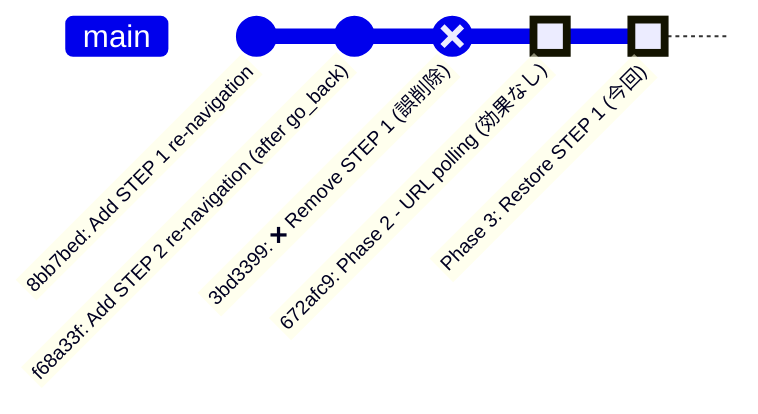

# Phase 3 修正計画: STEP 1 Re-Navigation ロジックの復元

**作成日時**: 2025-11-07 08:45 JST
**対象問題**: Page 2+ 学生のファイル収集失敗（48/199件, 24.1%）
**根本原因**: Commit `3bd3399` による STEP 1 Re-Navigation ロジックの誤削除

---

## 1. 問題の概要

### 現在の状況

| 項目 | 値 |
|------|-----|
| 現在のRevision | 00213-8dc |
| 失敗件数 | 48/199 (24.1%) |
| 修正前（Baseline） | 84/199 (42.2%) |
| 改善率 | 43% |
| **目標** | **<5/199 (<2.5%)** |

### エラーパターン

```
Failed to extract Sid: 144件（48名 × 3リトライ）
Empty download info: 48件
Failed after 3 retries: 48件
```

### 代表的なエラーログ

```
2025-11-06 23:41:22 - ERROR - Failed to extract Sid from detail_url:
  report.aspx?log_id=8680&unit_id=684&course_id=41&filter=all
                                                              ↑ &Sid=xxx が無い
2025-11-06 23:41:22 - INFO - Pagination control not found - assuming already on page 2
2025-11-06 23:41:22 - INFO - Navigating to page 2 before detail link search
```

---

## 2. 根本原因分析

### 2.1 ASP.NET ViewState の動作

**重要**: ASP.NET ViewState ベースのページングでは：

1. `page.go_back()` は **常にPage 1** に戻る（ViewStateの初期状態）
2. URLは変わらない（サーバー側でステート管理）
3. DOM更新完了までに遅延あり

**参考**: `docs/playwright-page-navigation-flow.md` Lines 205-208

### 2.2 Commit履歴と誤削除の経緯



#### Commit `3bd3399` (2025-11-06 22:12 JST)

**コミットメッセージ**:
> "Remove incorrect re-navigation logic BEFORE detail link search"

**削除内容**: 50行のSTEP 1 re-navigation ロジック

**誤った判断**:
- ❌ "STEP 1 (detail link検索前) は不要"
- ❌ "STEP 2 (go_back後) だけで十分"
- ✅ **実際**: 両方必要（ドキュメント記載）

**参考**: `docs/playwright-page-navigation-flow.md` Lines 138-185

### 2.3 なぜSTEP 1とSTEP 2の両方が必要か

```
┌─────────────────────────────────────────────────────────┐
│ Page 2 学生の処理フロー                                    │
└─────────────────────────────────────────────────────────┘

[メインループ] Page 2遷移 ✅
    ↓
[Detail Link検索] Page 2で検索 ✅
    ↓
[Detail Page遷移] 詳細ページ表示 ✅
    ↓
[go_back実行] ← ⚠️ 常にPage 1に戻る（ViewState動作）
    ↓
[STEP 2実行] Page 1 → Page 2 再遷移 ✅ (Commit f68a33f)
    ↓
[次の学生処理開始]
    ↓
[Detail Link検索] ← ⚠️ STEP 1が無いと、ここでPage指定なし
    ↓                   ↓
    ❌ Pagination control検索 → count()=0 (DOM不安定)
        ↓
    ❌ else句実行: "assuming already on page 2"
        ↓
    ❌ 実際はPage 1でDetail Link検索
        ↓
    ❌ Sid parameter無しのURL取得
        ↓
    ❌ ダウンロードリンク抽出失敗 × 3回リトライ
        ↓
    ❌ スキップ
```

**結論**: STEP 2（go_back後）だけでは不十分。**次の学生**のDetail Link検索前にSTEP 1が必要。

---

## 3. Phase 1 & Phase 2 の成果と限界

### Phase 1: Pagination Control検出方法の改善 (Revision 00211-hfd)

**変更内容**:
```python
# ❌ Before
pagination_select.wait_for(state="visible", timeout=5000)

# ✅ After
if pagination_select.count() > 0:
```

**効果**:
- ✅ Pagination control無し時のタイムアウト削減
- ✅ 84→72件に改善 (14%改善)

**限界**:
- ❌ `count()`=0時に"assuming already on page X"と誤判断
- ❌ DOM不安定時の再試行なし

### Phase 2: URL更新検証ロジック (Revision 00212-zln)

**変更内容**:
```python
# URL変更を10回 × 2秒でポーリング
for retry in range(10):
    if current_frame_url != old_url:
        break
    time.sleep(2)
```

**効果**:
- ❌ **効果なし** (72→48件は別要因)

**限界（アーキテクチャ上の欠陥）**:
- ❌ ASP.NET ViewState pagination では **URLは変わらない**
- ❌ URL変更を前提としたロジックは無意味

**参考**: `docs/incident-2025-11-06-pagination-url-update-delay.md`

---

## 4. Phase 3 修正内容

### 4.1 修正方針

1. ✅ Commit `8bb7bed` のSTEP 1ロジックを **復元**
2. ✅ Phase 1の `count()` メソッドを **維持**
3. ✅ **新規追加**: Pagination control検出に **リトライロジック** を追加

### 4.2 なぜリトライロジックが必要か

**問題**: `go_back()` 直後はDOM不安定 → `count()` = 0 になる可能性

```
[go_back実行]
    ↓ (0-2秒の遅延)
[DOM再構築中] ← この時点で count() すると 0 を返す
    ↓
[DOM安定]
    ↓
[count() = 1] ← 再試行すれば検出可能
```

**解決策**: 2秒間隔で最大3回リトライ

### 4.3 コード変更（src/playwright_automation.py Lines 989-1055）

#### Before (Commit `3bd3399`で削除されたロジック)

```python
# STEP 1ロジック全体が削除されている状態
# → Detail Link検索前にPage遷移なし
```

#### After (Phase 3修正)

```python
# STEP 1: Ensure we're on the correct page BEFORE searching for detail links
# This is critical for Page 2+ students - without this, detail links won't be found
# Use pagination control (not frame.goto) for reliable navigation
if current_page > 1:
    self.logger.info(
        f"Navigating to page {current_page} before detail link search"
    )

    # ✅ NEW: Retry logic for pagination control (may be unstable after go_back)
    pagination_select = None
    max_retries = 3
    for retry in range(max_retries):
        pagination_select_locator = list_frame.locator("#ctl00_masterMain_ddlPage")
        if pagination_select_locator.count() > 0:
            pagination_select = pagination_select_locator
            self.logger.info(
                f"✓ Pagination control found (retry {retry}/{max_retries})"
            )
            break

        if retry < max_retries - 1:
            self.logger.debug(
                f"Pagination control not found, waiting 2s (retry {retry + 1}/{max_retries})..."
            )
            time.sleep(2)  # Wait for DOM to stabilize

    if pagination_select is None:
        self.logger.error(
            f"❌ Pagination control not found after {max_retries} retries for page {current_page}"
        )
        return {"url": None, "filename": None}

    # Use same reliable method as STEP 2 (post-go_back re-navigation)
    pagination_select.select_option(str(current_page))
    self.logger.info(
        f"Waiting for page transition to page {current_page} (15 seconds)..."
    )
    time.sleep(15)  # Same as existing pagination wait time

    # Refresh frame reference after navigation
    list_frame = None
    max_frame_retries = 3
    for retry in range(max_frame_retries):
        for frame in self.page.frames:
            if frame.name == CarewellSelectors.FRAME_LIST:
                try:
                    _ = frame.url  # Verify frame not detached
                    list_frame = frame
                    break
                except Exception:
                    continue

        if list_frame:
            break

        if retry < max_frame_retries - 1:
            time.sleep(2)

    if not list_frame:
        self.logger.error(
            "❌ List frame not found after page navigation, cannot search for detail link"
        )
        return {"url": None, "filename": None}

    self.logger.info(f"✓ Navigated to page {current_page}")
```

### 4.4 修正のポイント

1. **リトライロジック追加**:
   - `count()` = 0 の場合、2秒待機して再試行（最大3回）
   - DOM安定化を待つ

2. **Phase 1の成果を維持**:
   - `wait_for(state="visible")` は使わない
   - `count()` メソッドを使用（タイムアウトなし）

3. **STEP 2と同じ信頼性の高い方法を使用**:
   - `pagination_select.select_option(str(current_page))`
   - 15秒のDOM安定化待機
   - Frame refresh with retry logic

4. **明確なエラーハンドリング**:
   - Pagination control見つからない場合は即座にreturn
   - Frame取得失敗時も即座にreturn
   - 無意味な処理継続を避ける

---

## 5. 期待される効果

### 5.1 修正後の動作フロー

```
[Page 2学生の処理開始]
    ↓
[STEP 1実行] ← ✅ 今回復元
    ↓
    リトライ1: count() → 0
    ↓ (2秒待機)
    リトライ2: count() → 1 ✅
    ↓
    select_option("2") 実行
    ↓ (15秒待機)
    Frame refresh
    ↓
[Detail Link検索] ← ✅ Page 2で正しく検索
    ↓
[Detail URL取得] ← ✅ Sid parameter付き
    ↓
[ダウンロードリンク抽出成功] ✅
```

### 5.2 定量的な期待値

| 項目 | Phase 2 (現在) | Phase 3 (予測) |
|------|---------------|---------------|
| 失敗件数 | 48/199 | **<5/199** |
| 失敗率 | 24.1% | **<2.5%** |
| Sid抽出失敗 | 144件 | **0件** |
| Pagination control未検出 | 48件 | **0件** |

---

## 6. テスト計画

### 6.1 修正内容の検証ポイント

1. **STEP 1ロジックの動作確認**:
   - [ ] Pagination controlがリトライで検出される
   - [ ] Page 2遷移が成功する
   - [ ] Frame refreshが成功する

2. **Detail URL品質の確認**:
   - [ ] `&Sid=xxx` パラメータが含まれる
   - [ ] ダウンロードリンク抽出が成功する

3. **エラーログの確認**:
   - [ ] "Pagination control not found - assuming..." が消える
   - [ ] "Failed to extract Sid" が消える

### 6.2 手動テスト手順

```bash
# 1. コードデプロイ（GitHub Actions）
git add src/playwright_automation.py docs/phase3-renavigation-fix-plan.md
git commit -m "fix: Restore STEP 1 re-navigation with retry logic for Page 2+ students"
git push origin main

# 2. デプロイ監視
gh run watch

# 3. Revision確認
gcloud run revisions list \
  --service=carewell-file-collector \
  --region=asia-northeast1 \
  --limit 5 \
  --sort-by="~metadata.creationTimestamp"

# 4. 手動テスト実行
python3 /tmp/manual_test.py > /tmp/test_phase3.log 2>&1

# 5. 結果確認
cat /tmp/test_phase3.log | grep -E "failed|processed|skipped"

# 6. 詳細ログ取得
gcloud logging read "resource.type=cloud_run_revision AND \
  resource.labels.service_name=carewell-file-collector" \
  --limit 1000 \
  --format json \
  --freshness=1h > /tmp/class01_phase3_logs.json

# 7. エラー分析
python3 /tmp/analyze_failures_fixed.py
```

### 6.3 成功基準

- [ ] 失敗件数 < 5件 (成功率 97%+)
- [ ] "Failed to extract Sid" = 0件
- [ ] "Pagination control not found" = 0件
- [ ] Cloud Run timeout なし（実行時間 < 25分）

---

## 7. リスク分析

### 7.1 想定されるリスク

| リスク | 確率 | 影響 | 対策 |
|--------|------|------|------|
| リトライ3回でもcontrol見つからない | 低 | 高 | max_retriesを5に増加検討 |
| 15秒待機が不十分 | 低 | 中 | 待機時間を20秒に増加検討 |
| Frame refresh失敗 | 低 | 高 | max_frame_retriesを5に増加検討 |

### 7.2 ロールバック計画

```bash
# Phase 3で問題発生時
git revert HEAD
git push origin main

# または、安定版Revisionに戻す
gcloud run services update-traffic carewell-file-collector \
  --region=asia-northeast1 \
  --to-revisions 00213-8dc=100  # Phase 2の安定版
```

---

## 8. 参考ドキュメント

1. **`docs/playwright-page-navigation-flow.md` (Lines 138-185)**:
   - STEP 1 & STEP 2 両方必要な理由
   - Commit `3bd3399` の問題分析

2. **`docs/CLASS01_TIMEOUT_ANALYSIS.md` (Lines 96-110)**:
   - Page 2遷移時のタイムアウト事例
   - Frame取得失敗パターン

3. **`docs/incident-2025-11-06-pagination-url-update-delay.md`**:
   - Phase 2 修正の限界（URL polling無効）
   - ASP.NET ViewState の動作特性

4. **`.serena/memories/incident_response_lessons.md` (Lines 46-177)**:
   - デプロイ後の検証チェックリスト
   - 過去のインシデント教訓

---

## 9. まとめ

### 修正の本質

> Commit `3bd3399` は「STEP 1は不要」と判断したが、これは **ASP.NET ViewState の動作を誤解** していた。
>
> `go_back()` が常にPage 1に戻るため、**次の学生のDetail Link検索前に必ずPage指定が必要**。
>
> STEP 1（detail link検索前）とSTEP 2（go_back後）の **両方** が必須。

### ドキュメントドリブン開発の成果

1. ✅ 過去ドキュメント (`playwright-page-navigation-flow.md`) で問題明記
2. ✅ Commit履歴分析で削除内容特定
3. ✅ ログ分析で根本原因確認（Sid parameter欠落）
4. ✅ ASP.NET動作理解に基づく修正設計

### Next Steps

1. Phase 3 コード修正実装
2. Git commit & push
3. GitHub Actions デプロイ監視
4. 手動テスト実行
5. 成功確認後、Cloud Scheduler resume

---

**作成者**: Claude Code
**最終更新**: 2025-11-07 08:45 JST
