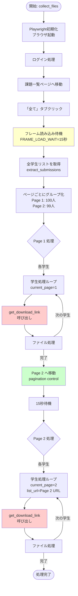
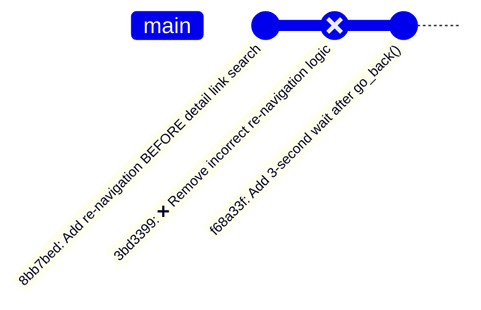
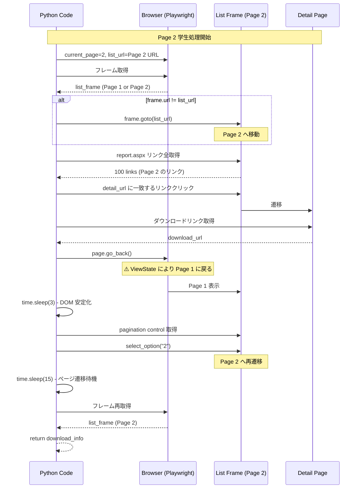

# Playwright ページナビゲーション処理フロー

## 概要

このドキュメントは、Carewell Webサービスからのファイル自動取得における、複雑なページナビゲーション処理フローを図解します。

特に、ASP.NET ViewState の特性（`page.go_back()` が常に Page 1 に戻る）を考慮した、Page 2+ の学生ファイル取得ロジックに焦点を当てます。

---

## 1. 全体処理フロー



---

## 2. get_download_link() 詳細フロー（現在の実装 - 問題あり）

```mermaid
flowchart TD
    Start([get_download_link 開始<br/>detail_url, list_url, current_page]) --> FrameGet[フレーム取得<br/>retry=3回]
    FrameGet --> FrameCheck{フレーム取得<br/>成功?}
    FrameCheck -->|失敗| ReturnNone1[return None]
    FrameCheck -->|成功| URLCheck{frame.url == list_url?}

    URLCheck -->|不一致| FrameGoto[frame.goto<wbr/>(list_url)<br/>正しいページへ移動]
    URLCheck -->|一致| SearchLink
    FrameGoto --> RefreshFrame[フレーム再取得]
    RefreshFrame --> SearchLink

    SearchLink[Detail Link 検索<br/>report.aspx リンクを全取得] --> SearchLoop{各リンクと<br/>detail_url 比較}
    SearchLoop -->|見つかった| ClickLink[detail link クリック]
    SearchLoop -->|見つからない| ReturnNone2[❌ return None<br/>ここで終了してしまう]

    ClickLink --> WaitDetail[detail ページ読み込み待機]
    WaitDetail --> GetDownload[ダウンロードリンク取得]
    GetDownload --> DownloadCheck{取得成功?}
    DownloadCheck -->|失敗| ReturnNone3[return None]
    DownloadCheck -->|成功| GoBack

    GoBack[page.go_back<wbr/>()] --> GoBackWait[❌ go_back timeout expected]
    GoBackWait --> DOMWait[✅ time.sleep<wbr/>(3)<br/>DOM安定化待機]
    DOMWait --> PageCheck{current_page > 1?}

    PageCheck -->|No<br/>Page 1| RefreshFrame2[フレーム再取得]
    PageCheck -->|Yes<br/>Page 2+| RenavLog[ログ: Re-navigating to page X]
    RenavLog --> FrameGetRenav[フレーム取得<br/>retry=3回]
    FrameGetRenav --> FrameCheckRenav{取得成功?}
    FrameCheckRenav -->|失敗| ReturnNone4[return None]
    FrameCheckRenav -->|成功| PaginationCheck{pagination control<br/>存在?}

    PaginationCheck -->|存在| SelectPage[select_option<wbr/>(current_page)]
    PaginationCheck -->|なし| WarnPagination[⚠️ Warning logged]
    SelectPage --> Wait15[time.sleep<wbr/>(15)<br/>ページ遷移待機]
    Wait15 --> RenavFrameGet[フレーム再取得<br/>retry=3回]
    RenavFrameGet --> RenavLog2[ログ: ✓ Re-navigated to page X]
    RenavLog2 --> RefreshFrame2
    WarnPagination --> RefreshFrame2

    RefreshFrame2 --> Return[return download_info]

    style ReturnNone2 fill:#ff6666,color:#fff
    style SearchLoop fill:#ffcccc
    style DOMWait fill:#ccffcc
    style RenavLog fill:#ccffcc
    style RenavLog2 fill:#ccffcc
```

---

## 3. 問題の図解

### 現在の問題フロー（Page 2 学生の場合）

```mermaid
flowchart LR
    Start([Page 2 学生処理開始<br/>list_url=Page 2 URL]) --> FrameGet[フレーム取得]
    FrameGet --> URLMismatch{frame.url != list_url?}
    URLMismatch -->|不一致| FrameGoto[frame.goto<wbr/>(list_url)<br/>Page 2 へ移動]
    URLMismatch -->|一致| SearchPage2
    FrameGoto --> SearchPage2

    SearchPage2[Page 2 でリンク検索] --> FoundPage2{リンク発見?}
    FoundPage2 -->|発見| DetailPage[detail ページへ]
    FoundPage2 -->|❌ 発見できず| ReturnNone[return None]

    DetailPage --> Download[ダウンロードリンク取得]
    Download --> GoBack[page.go_back<wbr/>()]
    GoBack --> Page1[常に Page 1 に戻る]
    Page1 --> DOMWait[DOM安定化待機 3秒]
    DOMWait --> Renavigation[再遷移ロジック実行<br/>Page 2 へ]
    Renavigation --> NextStudent[次の学生へ]

    ReturnNone --> Skip[❌ この学生スキップ]

    style ReturnNone fill:#ff6666,color:#fff
    style Skip fill:#ff6666,color:#fff
    style FrameGoto fill:#ffcccc
    style Renavigation fill:#ccffcc
```

**問題点**:
1. ❌ `frame.goto(list_url)` で Page 2 に移動しても、何らかの理由でリンクが見つからないケースがある
2. ❌ リンクが見つからないと `return None` で終了し、`go_back()` に到達しない
3. ❌ 再遷移ロジックが実行されない

---

## 4. 必要な修正（コミット 3bd3399 の問題）

### コミット履歴



**問題**: コミット `3bd3399` で削除したロジックが、実は正しい位置にあった可能性が高い。

### 修正案フロー

```mermaid
flowchart TD
    Start([get_download_link 開始]) --> FrameGet[フレーム取得]
    FrameGet --> Renav1{✅ STEP 1<br/>current_page > 1?}

    Renav1 -->|Yes| EnsurePage[✅ 正しいページに移動<br/>pagination control 使用]
    Renav1 -->|No| SearchLink
    EnsurePage --> Wait15[15秒待機]
    Wait15 --> SearchLink

    SearchLink[Detail Link 検索] --> Found{見つかった?}
    Found -->|Yes| DetailPage[detail ページへ]
    Found -->|No| ReturnNone

    DetailPage --> Download[ダウンロードリンク取得]
    Download --> GoBack[page.go_back<wbr/>()]
    GoBack --> DOMWait[DOM安定化 3秒]
    DOMWait --> Renav2{✅ STEP 2<br/>current_page > 1?}

    Renav2 -->|Yes| RenavAgain[✅ 再度正しいページへ<br/>pagination control 使用]
    Renav2 -->|No| Return
    RenavAgain --> Return[return download_info]

    style Renav1 fill:#ccffcc
    style EnsurePage fill:#ccffcc
    style Renav2 fill:#ccffcc
    style RenavAgain fill:#ccffcc
```

**修正ポイント**:
1. ✅ **STEP 1**: Detail link 検索の**前**に、current_page > 1 なら pagination control で正しいページに移動
2. ✅ **STEP 2**: `go_back()` の**後**に、current_page > 1 なら再度 pagination control で正しいページに移動
3. ✅ 両方のステップで pagination control を使用（frame.goto() は使わない）

---

## 5. ASP.NET ViewState の特性

```mermaid
flowchart LR
    Page2([Page 2 表示中]) --> DetailClick[detail リンククリック]
    DetailClick --> DetailPage[detail ページ]
    DetailPage --> GoBack[page.go_back<wbr/>()]
    GoBack --> Page1([❌ Page 1 に戻る<br/>ViewState のため])

    Page1 -.->|期待される動作| Page2Expected([Page 2 に戻る])
    Page1 -.->|実際の動作| Page1Actual([Page 1 に戻る])

    style Page1Actual fill:#ff6666,color:#fff
    style Page2Expected fill:#cccccc
```

**重要な仕様**:
- ASP.NET の ViewState 機能により、`page.go_back()` は**常に初期状態（Page 1）に戻る**
- ブラウザ履歴ではなく、サーバー側の状態管理に依存している
- そのため、Page 2+ の学生を処理する場合、`go_back()` 後に**必ず pagination control で再遷移**する必要がある

---

## 6. タイミング図



---

## 7. チェックリスト

### コード修正時の確認事項

- [ ] **STEP 1**: Detail link 検索の前に、current_page > 1 なら pagination control で移動
- [ ] **STEP 2**: `go_back()` 後に、current_page > 1 なら pagination control で再移動
- [ ] DOM 安定化待機（3秒）を `go_back()` 後に実行
- [ ] pagination control の存在確認（count() > 0）
- [ ] フレーム取得にリトライロジック（最大3回）
- [ ] 各ステップで適切なログ出力（INFO レベル）
- [ ] エラーハンドリング（TimeoutError, 要素が見つからない等）

### テスト時の確認事項

- [ ] Page 1 学生のファイル取得が正常に動作
- [ ] Page 2 学生のファイル取得が正常に動作
- [ ] ログに `Re-navigating to page 2 after go_back()` が出力される
- [ ] ログに `✓ Re-navigated to page 2` が出力される
- [ ] ログに `Pagination control not found` が出力されない
- [ ] `failed` カウントが 0 または大幅に減少

---

## 8. 参考情報

### 関連ドキュメント

- `docs/CLASS01_TIMEOUT_ANALYSIS.md` - フレーム取得タイミング問題の分析
- `docs/incident-2025-11-06-pagination-url-update-delay.md` - URL 更新遅延問題
- `CLAUDE.md` - Common Mistake #6, #7, #8

### 関連コミット

- `8bb7bed`: Add re-navigation to correct page BEFORE detail link search
- `3bd3399`: Remove incorrect re-navigation logic BEFORE detail link search (❌ 問題のコミット)
- `f68a33f`: Add 3-second wait after go_back() for DOM stabilization

### 重要な定数

```python
FRAME_LOAD_WAIT = 15000  # 15秒 - フレーム読み込み待機時間
PAGINATION_WAIT = 15  # 15秒 - ページ遷移待機時間
DOM_STABILIZATION_WAIT = 3  # 3秒 - go_back() 後の DOM 安定化待機時間
FRAME_RETRY_COUNT = 3  # フレーム取得リトライ回数
```

---

## 更新履歴

- **2025-11-06**: 初版作成 - Page 2+ ファイル取得失敗問題の分析とフロー図作成
