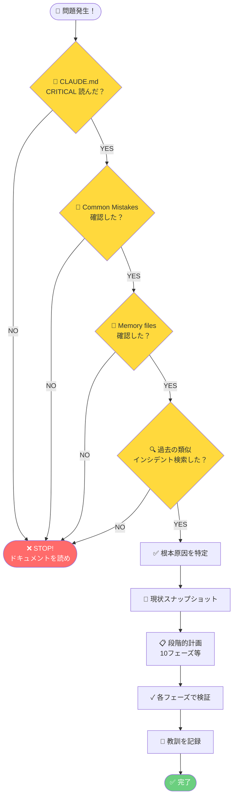
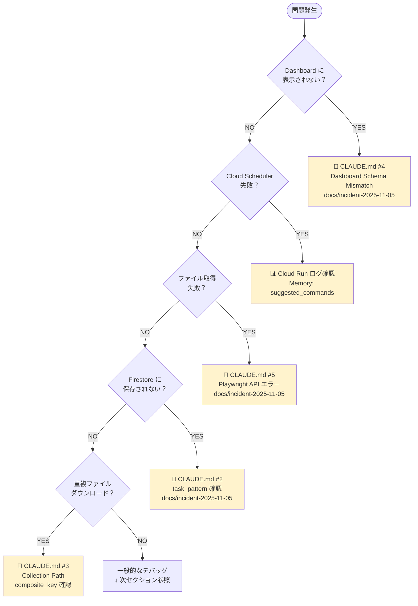
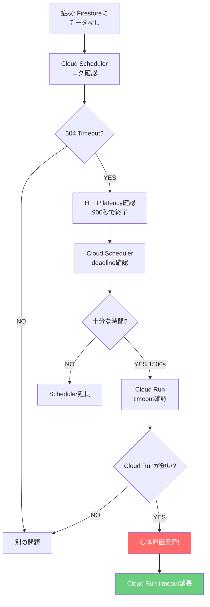

# 🔧 Carewell Automation - トラブルシューティングガイド

**問題解決の体系的なアプローチ**

---

## 📋 目次

1. [問題発生時の基本フロー](#問題発生時の基本フロー)
2. [症状別トラブルシューティング](#症状別トラブルシューティング)
3. [よくある問題と解決方法](#よくある問題と解決方法)
4. [診断コマンド集](#診断コマンド集)
5. [エスカレーション基準](#エスカレーション基準)

---

## 問題発生時の基本フロー

### 🚨 最初にやること（絶対に守る）



### 必須チェックリスト（調査前）

- [ ] **CLAUDE.md Lines 11-42**: CRITICAL セクション確認
- [ ] **CLAUDE.md Lines 224-308**: Common Mistakes 確認
- [ ] **Memory files**: incident_response_lessons 確認
- [ ] **過去インシデント**: `git log --grep="keyword"` で検索
- [ ] **設計ドキュメント**: Steering Document 確認

**❌ これらをスキップして調査開始すると、同じ失敗を繰り返す！**

---

## 症状別トラブルシューティング

### 診断フローチャート



---

## よくある問題と解決方法

### 1. Dashboard にデータが表示されない

**症状**:
- Dashboard https://carewell-automation.web.app/ でクラス・課題が空表示
- Firestore にはデータがある

**診断手順**:

```bash
# 1. Firestore データ確認
python3 scripts/check-all-classes-firestore.py

# 2. Dashboard がどのパスを読んでいるか確認
# dashboard/src/composables/useFirestore.ts:129 をチェック
```

**よくある原因**:

#### A. スキーマ不一致（CLAUDE.md #4）

```typescript
// ❌ 間違い: 旧スキーマ
const docRef = doc(db, className, taskId);

// ✅ 正しい: 新スキーマ
const docRef = doc(db, "submissions", className, "tasks", taskId);
```

**解決方法**: `docs/incident-2025-11-05-schema-migration-and-playwright-fix.md` 参照

#### B. Firestore Security Rules

```javascript
// firestore.rules を確認
allow read: if request.auth != null;  // 認証が必要な場合
```

**解決方法**: Security Rules を一時的に緩和してテスト

---

### 2. Cloud Scheduler が失敗する

**症状**:
- Cloud Scheduler の `status.code` が 0 以外
- `lastAttemptTime` が更新されない

**診断手順**:

```bash
# 1. Scheduler 状態確認
gcloud scheduler jobs describe carewell-class01-task01 \
  --location=asia-northeast1 \
  --format="value(state,lastAttemptTime,status.code,status.message)"

# 2. Cloud Run ログ確認（最重要）
gcloud logging read "resource.type=cloud_run_revision AND
  resource.labels.service_name=carewell-file-collector AND
  timestamp>=\"$(date -u -d '1 hour ago' '+%Y-%m-%dT%H:%M:%SZ')\"" \
  --limit 50 --format json
```

**よくある原因**:

#### A. タイムアウト (deadline exceeded)

```
status.code: 4
status.message: "Deadline Exceeded"
```

**解決方法**:
- Deadline を延長: `docs/CLASS01_TIMEOUT_ANALYSIS.md` 参照
- 現在の設定: 25分 (1500秒)

#### B. Cloud Run エラー

```
status.code: 14
status.message: "Unavailable"
```

**解決方法**:
- Cloud Run ログでスタックトレース確認
- Playwright エラーの可能性 → 次セクション参照

---

### 3. ファイル取得が失敗する

**症状**:
- Cloud Run ログに `Empty download info returned`
- 特定の学生だけスキップされる

**診断手順**:

```bash
# ログから Playwright エラーを抽出
gcloud logging read "resource.type=cloud_run_revision AND
  resource.labels.service_name=carewell-file-collector AND
  textPayload=~\"playwright\"" \
  --limit 100 --format json | \
  jq -r '.[] | .textPayload' | grep -i error
```

**よくある原因**:

#### A. Playwright API エラー（CLAUDE.md #5）

```python
# ❌ 間違い: 存在しないメソッド
link.wait_for_element_state("visible", timeout=10000)

# ✅ 正しい: Auto-waiting に任せる
link.click()  # 自動で待機
```

**解決方法**: `docs/incident-2025-11-05-schema-migration-and-playwright-fix.md` 参照

#### B. HTML 構造の変更

Carewell Web のHTML構造が変更された場合、セレクタが機能しなくなる。

**解決方法**:
- `src/playwright_automation.py` のセレクタを更新
- Phase 6 の動的リンク検出を参照: `docs/phase_6_dynamic_link_detection.md`

---

### 4. Firestore にデータが保存されない

**症状**:
- Cloud Run ログに成功メッセージ
- Firestore にデータがない

**診断手順**:

```bash
# 1. Firestore Database 名確認
grep -r "carewell-native" src/

# 2. Firestore ログ確認
gcloud logging read "resource.type=cloud_run_revision AND
  textPayload=~\"firestore\"" \
  --limit 50 --format json | \
  jq -r '.[] | .textPayload' | grep -i error
```

**よくある原因**:

#### A. Database 名が間違っている（CLAUDE.md #1）

```python
# ❌ 間違い
db = firestore.Client(database="(default)")

# ✅ 正しい
db = firestore.Client(database="carewell-native")
```

**解決方法**: `CLAUDE.md Lines 166-169` 参照

#### B. task_pattern が渡されていない（CLAUDE.md #2）

```python
# ❌ 間違い: task_pattern が欠落
record_upload(class_name, task_id, ...)

# ✅ 正しい: 全パラメータ必須
record_upload(
    class_name=...,
    task_id=...,
    task_pattern=...,  # ← これが必須
    ...
)
```

**解決方法**: Cloud Scheduler の HTTP body に `task_pattern` を追加

---

### 5. 重複ファイルがダウンロードされる

**症状**:
- 同じファイルが何度もダウンロードされる
- `file_count` が異常に増加

**診断手順**:

```bash
# Firestore で重複確認
python3 <<EOF
from google.cloud import firestore
db = firestore.Client(project="carewell-automation", database="carewell-native")
files = db.collection("submissions").document("令和7年度...").collection("tasks").document("課題①").collection("files").stream()
composite_keys = [f.id for f in files]
duplicates = [k for k in composite_keys if composite_keys.count(k) > 1]
print(f"Duplicates: {duplicates}")
EOF
```

**よくある原因**:

#### A. Collection Path が間違っている（CLAUDE.md #3）

```python
# ❌ 間違い: 旧パス
ref = db.collection(class_name).document(task_id).collection("documents")

# ✅ 正しい: 新パス
ref = db.collection("submissions").document(class_name).collection("tasks").document(task_id).collection("files")
```

**解決方法**: `src/firestore_service.py` のパスを修正

---

### 6. Cloud Run Timeout で処理が中断される

**症状**:
- Cloud Scheduler のログで `504 Gateway Timeout`
- Firestore/Drive/Spreadsheet にデータが一切保存されない
- Cloud Run ログで処理途中で終了

**診断手順**:

```bash
# 1. HTTP レスポンスでタイムアウト確認
gcloud logging read "resource.type=cloud_run_revision AND \
  resource.labels.service_name=carewell-file-collector AND \
  httpRequest.status>=500" \
  --limit 20 --format json | \
  jq -r '.[] | "\(.timestamp) - Status: \(.httpRequest.status) - Latency: \(.httpRequest.latency)"'

# 2. タイムアウト設定確認（2箇所）
# Cloud Scheduler
gcloud scheduler jobs describe JOB_NAME \
  --location=asia-northeast1 \
  --format="value(attemptDeadline)"

# Cloud Run
gcloud run services describe carewell-file-collector \
  --region=asia-northeast1 \
  --format="value(spec.template.spec.timeoutSeconds)"
```

**よくある原因**:

#### A. Cloud Run timeout が Cloud Scheduler deadline より短い（2025-11-06 インシデント）

```
Cloud Scheduler attemptDeadline: 1500秒 (25分) ✅
Cloud Run timeoutSeconds:        900秒 (15分)  ❌ ← 先にタイムアウト
```

**なぜ発生したか**:
- №01は180件（2ページ処理）で処理時間 > 15分
- Cloud Run が15分で強制終了 → 504 Gateway Timeout
- Firestore/Drive への保存処理に到達せず

**調査ステップ**（実際のインシデントから）:



**重要ポイント**:
1. タイムアウトは **2箇所** ある（両方を確認）
2. **短い方** が先にタイムアウトする
3. Cloud Run ログに `course_id` がない = タイムアウトで中断された可能性

**解決方法**:

```bash
# Cloud Run timeout を延長（両方を一致させる）
gcloud run services update carewell-file-collector \
  --region=asia-northeast1 \
  --timeout=1500 \
  --project carewell-automation

# 設定確認
gcloud run services describe carewell-file-collector \
  --region=asia-northeast1 \
  --format="value(spec.template.spec.timeoutSeconds)"
```

**チェックリスト**（タイムアウト変更時）:
- [ ] Cloud Scheduler `attemptDeadline` を確認
- [ ] Cloud Run `timeoutSeconds` を確認
- [ ] 両者が一致している（または Cloud Run ≥ Scheduler）
- [ ] 処理時間の最大値を考慮（2ページ処理 = 20-25分）
- [ ] **`.github/workflows/deploy.yml` の `--timeout` も更新**（重要！）

**参照**: `docs/incident-2025-11-06-cloud-run-timeout.md`

#### B. GitHub Actions ワークフローによる設定上書き（2025-11-06 インシデント追加発見）

**症状**:
- 手動で Cloud Run timeout を延長したのに、次回実行時に再びタイムアウト
- リビジョン履歴を見ると timeout が元の値に戻っている

**原因**:
`.github/workflows/deploy.yml` に古い timeout 値がハードコードされており、CI/CD デプロイ時に上書きされる。

**実際の例**（2025-11-06）:
```text
00:02 JST - 手動修正: timeout=1500（リビジョン 00173-5b6）✅
00:21 JST - GitHub Actions デプロイ: timeout=900 で上書き（リビジョン 00174-dnf）❌
00:30 JST - №01 実行: 再び 504 タイムアウト（180件中 7件のみ保存）
```

**診断手順**:

```bash
# 1. Cloud Run リビジョン履歴を確認
gcloud run revisions list \
  --service=carewell-file-collector \
  --region=asia-northeast1 \
  --format="table(metadata.name,spec.timeoutSeconds,metadata.creationTimestamp)" \
  --limit 10

# 2. GitHub Actions ワークフローファイルを確認
grep -n "timeout" .github/workflows/deploy.yml
```

**期待される確認結果**:
```yaml
# .github/workflows/deploy.yml Line 107付近
--timeout 1500 \  # ← この値が現在の Cloud Run 設定と一致すべき
```

**解決方法**:

```bash
# 1. GitHub Actions ワークフローファイルを修正
vim .github/workflows/deploy.yml
# Line 107: --timeout 1500 に変更

# 2. コミット＆プッシュ
git add .github/workflows/deploy.yml
git commit -m "fix: Update Cloud Run timeout to 1500s in CI/CD workflow"
git push origin main

# 3. 手動で即座に修正（次回デプロイまで待てない場合）
gcloud run services update carewell-file-collector \
  --region=asia-northeast1 \
  --timeout=1500 \
  --project carewell-automation
```

**重要な教訓**:
- ❌ **Cloud Run の手動設定変更だけでは不十分**
- ✅ **CI/CD ワークフローファイルも必ず更新**
- ✅ インフラ設定は IaC（Infrastructure as Code）で管理
- ✅ 設定変更後、次回デプロイで元に戻らないか検証必須

**チェックリスト**（Cloud Run 設定変更時）:
1. [ ] `gcloud run services update` で手動変更
2. [ ] `.github/workflows/deploy.yml` の対応する設定を更新
3. [ ] Git commit & push
4. [ ] GitHub Actions 成功を確認
5. [ ] 新リビジョンの設定値を確認

**参照**:
- `docs/incident-2025-11-06-cloud-run-timeout.md` (Section: GitHub Actions ワークフローによる設定上書き問題)
- `CLAUDE.md` (Common Mistake #6 - CRITICAL Follow-up)

---

### 7. フレーム取得タイミング問題でタイムアウト（大規模データセット）

**症状**:
- Cloud Run timeout を十分に延長したのにタイムアウト
- 「全て」タブクリック後、60秒タイムアウトが繰り返し発生
- エラー: `playwright._impl._errors.TimeoutError: Timeout 60000ms exceeded`
- Firestore にデータが一切保存されない（またはごく少数）

**診断手順**:

```bash
# 1. Playwrightタイムアウトエラーの確認
gcloud logging read 'resource.type=cloud_run_revision AND
  resource.labels.service_name=carewell-file-collector AND
  timestamp>="2025-11-05T16:00:00Z" AND
  severity>=ERROR' \
  --limit 50 --format json | \
  python3 -c "
import json, sys
data = json.load(sys.stdin)
for entry in sorted(data, key=lambda x: x['timestamp']):
    if 'textPayload' in entry:
        text = entry['textPayload']
        if 'TimeoutError' in text or 'wait_for_selector' in text:
            print(f\"{entry['timestamp']} - {text[:200]}\")
"

# 2. 「全て」タブクリック成功の確認
gcloud logging read 'resource.type=cloud_run_revision AND
  resource.labels.service_name=carewell-file-collector AND
  textPayload=~"全て" AND
  timestamp>="2025-11-05T16:00:00Z"' \
  --limit 20 --format json
```

**よくある原因**:

#### A. フレーム待機時間が不足（2025-11-06 インシデント）

**問題**: 大規模データセット（180+件）の場合、「全て」タブクリック後のサーバー応答に時間がかかる

```
「全て」タブクリック成功 ✅
  ↓
FRAME_LOAD_WAIT: 3秒待機（不足！）
  ↓
フレーム取得試行 → 失敗（フレームまだリロード中）
  ↓
wait_for_selector → 60秒タイムアウト ❌
  ↓
繰り返し...（25分間ループ）
```

**診断ポイント**:

```bash
# ログで確認すべきパターン
# 1. 「全て」タブクリック成功
16:01:36 - Clicked '全て tab' ✅

# 2. その直後にタイムアウト
16:01:50 - Could not extract total count: Timeout 10000ms ❌
16:03:05 - TimeoutError: Timeout 60000ms exceeded ❌

# 3. 繰り返しタイムアウト（約5分ごと）
16:08:01 - TimeoutError: Timeout 60000ms exceeded
16:17:54 - TimeoutError: Timeout 60000ms exceeded
```

**解決方法**:

```python
# src/playwright_automation.py

# 1. フレーム待機時間を延長（Line 70付近）
FRAME_LOAD_WAIT = 15000  # 15秒（従来の3秒から5倍）

# 2. フレーム取得にリトライロジック追加（Line 358-385, 402-430付近）
max_frame_retries = 5 if current_page == 1 else 3

for retry in range(max_frame_retries):
    for frame in self.page.frames:
        if frame.name == "list":
            try:
                _ = frame.url  # フレームがdetachedでないことを確認
                list_frame = frame
                break
            except Exception:
                continue  # 次のフレームを試行

    if list_frame:
        break

    time.sleep(2)  # 2秒待機して再試行
```

**重要な教訓**:
- ❌ **Cloud Run timeout だけ延長しても根本的解決にならない**
- ✅ **Playwright のタイムアウト箇所を特定して修正**
- ✅ **過去のトラブルシューティングドキュメント（CLASS01_TIMEOUT_ANALYSIS.md）を参照**
- ✅ **大規模データセット対応: 待機時間を長めに設定**

**チェックリスト**（フレーム関連問題の修正時）:
1. [ ] `FRAME_LOAD_WAIT` が十分な値か確認（大規模データセット: 15秒推奨）
2. [ ] フレーム取得にリトライロジックがあるか
3. [ ] フレームがdetachedでないことを確認しているか
4. [ ] ログで「全て」タブクリック成功を確認
5. [ ] ログでフレーム取得成功/失敗を確認

**参照**:
- `docs/incident-2025-11-06-cloud-run-timeout.md` (Section: 第3の問題発見 - フレーム取得タイミング問題)
- `docs/CLASS01_TIMEOUT_ANALYSIS.md` (過去の同様の問題記録)

---

## 診断コマンド集

### Cloud Run ログ確認（最優先）

```bash
# 直近50件のログ
gcloud logging read "resource.type=cloud_run_revision AND
  resource.labels.service_name=carewell-file-collector" \
  --limit 50 --format json | \
  jq -r '.[] | "\(.timestamp) [\(.severity)] \(.textPayload // .jsonPayload)"'

# エラーログのみ
gcloud logging read "resource.type=cloud_run_revision AND
  resource.labels.service_name=carewell-file-collector AND
  severity>=ERROR" \
  --limit 20 --format json

# 特定時刻以降のログ
gcloud logging read "resource.type=cloud_run_revision AND
  resource.labels.service_name=carewell-file-collector AND
  timestamp>=\"2025-11-05T12:00:00Z\"" \
  --limit 100 --format json
```

### Cloud Scheduler 状態確認

```bash
# 全ジョブの状態確認
gcloud scheduler jobs list --location=asia-northeast1 \
  --format="table(name,schedule,state,lastAttemptTime,status.code)"

# 特定ジョブの詳細
gcloud scheduler jobs describe carewell-class01-task01 \
  --location=asia-northeast1 \
  --format=json | jq '{
    name: .name,
    state: .state,
    schedule: .schedule,
    lastAttemptTime: .lastAttemptTime,
    status: .status,
    httpTarget: .httpTarget
  }'

# HTTP body の確認
gcloud scheduler jobs describe carewell-class01-task01 \
  --location=asia-northeast1 \
  --format="value(httpTarget.body)" | base64 -d | jq .
```

### Dashboard 確認

```bash
# ブラウザで開く
open https://carewell-automation.web.app/

# curlでステータス確認
curl -I https://carewell-automation.web.app/
```

### Firestore 確認スクリプト

```bash
# 全クラス・全課題のデータ状況確認
python3 scripts/check-all-classes-firestore.py

# 特定クラス・課題の詳細確認
python3 <<EOF
from google.cloud import firestore
db = firestore.Client(project="carewell-automation", database="carewell-native")

# 親ドキュメント確認
task_doc = db.collection("submissions").document("令和7年度 デジタル中核人材養成研修 №01").collection("tasks").document("課題①").get()
if task_doc.exists:
    print(f"Task metadata: {task_doc.to_dict()}")

# ファイル数確認
files = list(db.collection("submissions").document("令和7年度 デジタル中核人材養成研修 №01").collection("tasks").document("課題①").collection("files").stream())
print(f"File count: {len(files)}")
EOF
```

---

## エスカレーション基準

### 自己解決可能

以下の場合は、ドキュメントと過去のインシデント記録で解決可能：

- [ ] CLAUDE.md Common Mistakes に類似事例がある
- [ ] Memory files に解決方法が記載されている
- [ ] 過去のインシデント記録に同じ症状がある
- [ ] エラーメッセージが明確（スタックトレースあり）

### エスカレーション必要

以下の場合は、ユーザーに報告・相談が必要：

- [ ] 設計変更が必要（Steering Document の変更）
- [ ] 外部サービス（Carewell Web）の仕様変更
- [ ] セキュリティリスクが発見された
- [ ] データ損失の可能性がある
- [ ] 複数のシステムに影響する

---

## 対応後の必須作業

### ドキュメント化チェックリスト

- [ ] CLAUDE.md の Common Mistakes に追加
- [ ] Memory files 更新（incident_response_lessons）
- [ ] インシデント記録ドキュメント作成（`docs/incident-YYYY-MM-DD-*.md`）
- [ ] Git commit & push
- [ ] 教訓の共有

---

## 関連ドキュメント

### 必読

- **CLAUDE.md Lines 11-42**: CRITICAL セクション
- **CLAUDE.md Lines 81-126**: Incident Response Workflow
- **CLAUDE.md Lines 224-308**: Common Mistakes to Avoid

### 過去のインシデント記録

- **docs/incident-2025-11-06-cloud-run-timeout.md**: Cloud Run timeout 設定ミス（№01がデータ保存されない）
- **docs/incident-2025-11-05-schema-migration-and-playwright-fix.md**: Dashboard スキーマ移行 + Playwright エラー
- **docs/dashboard-firestore-schema-migration.md**: Dashboard 専用記録
- **docs/CLASS01_TIMEOUT_ANALYSIS.md**: タイムアウト問題分析

### メモリファイル

- **.serena/memories/incident_response_lessons.md**: 教訓とチェックリスト
- **.serena/memories/suggested_commands.md**: 推奨コマンド集
- **.serena/memories/task_completion_checklist.md**: 完了確認チェックリスト

### 設計ドキュメント

- **.kiro/steering/firestore-critical-config.md**: Firestore 公式仕様
- **.kiro/steering/dashboard-workflow.md**: Dashboard 開発ルール
- **.kiro/specs/**: 機能別詳細設計

---

**最終更新**: 2025/11/06
**バージョン**: 1.1
**メンテナー**: Claude Code
